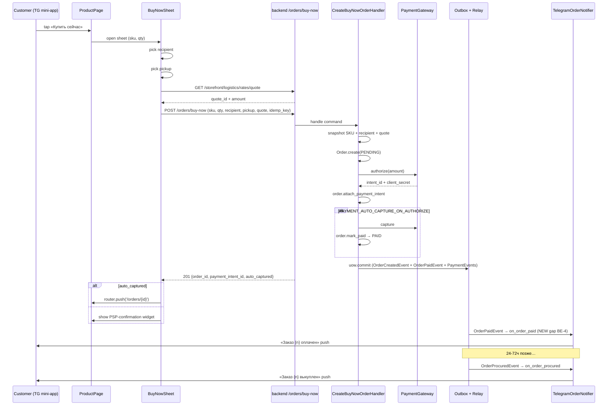

# Buy Now Flow — Audit & Punch List (2026-05-18)

> **Объём.** Покрыт сквозной путь покупки одного SKU без корзины: backend
> (handler → payment → FSM → outbox → downstream consumers), mini-app
> (UI + API integration + codegen), admin (не использует Buy Now —
> подтверждено), тесты (unit / integration / e2e) и документация
> (`apps/backend/docs/`, Obsidian vault).
>
> **Контекст коммита.** `1c2a8a5d feat(order): Buy Now flow — one-shot
> SKU checkout without cart` (2026-05-17). Backend-handler, schemas,
> router, unit-suite добавлены в одном коммите. Frontend, codegen и
> документация в этот коммит не вошли.
>
> **Ссылки на актуальные артефакты:**
> - Handler: `apps/backend/src/modules/order/application/commands/create_buy_now_order.py`
> - Router: `apps/backend/src/modules/order/presentation/router_orders.py:147-187` (`POST /api/v1/orders/buy-now`)
> - Schemas: `apps/backend/src/modules/order/presentation/schemas.py:69-92`
> - Тесты: `apps/backend/tests/unit/modules/order/test_buy_now_handler.py`,
>   `apps/backend/tests/e2e/api/v1/order/test_orders_api.py:36-86`
> - Frontend (PDP-кнопка): `apps/frontend/mini-app/src/widgets/ProductPage/ProductPage.jsx:416`
> - Frontend (QuickAddSheet): `apps/frontend/mini-app/src/features/add-to-cart/ui/QuickAddSheet.jsx:396`
> - Smaller TZ (другой архитектурный подход): `apps/backend/backend-tz-partial-checkout.md`

---

## 1. Текущее состояние

### 1.1 Backend

| Компонент | Файл | Статус |
| --- | --- | --- |
| HTTP endpoint `POST /api/v1/orders/buy-now` | `router_orders.py:147` | ✅ зарегистрирован, защищён `Auth`, выдаёт 201 + `CreateOrderResponse` |
| Pydantic schema `BuyNowOrderRequest` (sku/qty/recipient/pickup/quote/idempotency/provider) | `schemas.py:69-92` | ✅ camelCase, `quantity` 1..99, `idempotency_key` 8..128 |
| Команда `CreateBuyNowOrderCommand` + `Handler` | `create_buy_now_order.py` | ✅ DI-инжектится через `OrderProvider` (`provider.py:245`) |
| Shared helper `resolve_delivery_quote` | `application/_delivery.py` | ✅ переиспользуется cart-flow и Buy Now — единая точка ownership / currency / expiry проверки |
| ACL: `ICatalogSkuPriceReader` (`get_many`) | `catalog_sku_reader.py` | ✅ JOIN `skus + products + product_variants + suppliers`, отдаёт `supplier_type` |
| ACL: `IRecipientLookup`, `IDeliveryQuoteLookup`, `IPaymentGateway` | `recipient_lookup.py`, `delivery_quote_adapter.py`, `payment_gateway.py` | ✅ переиспользуется с cart-flow |
| Шаги хендлера | `create_buy_now_order.py:117-320` | ✅ (1) idempotency replay → (2) snapshot SKU → (3) recipient + ownership → (4) build `OrderItem` → (5) delivery quote → (6) `Order.create` (phantom `cart_id`, `is_walk_in=False`) → (7) payment authorize → (8) skip-payment short-circuit (`PAYMENT_AUTO_CAPTURE_ON_AUTHORIZE`) → (9) idempotency commit → uow.commit |
| FSM-переход | `Order.create` → `PENDING`, опционально `mark_paid` → `PAID` | ✅ совпадает с cart-flow; `is_walk_in=False` → `refresh_recipient_snapshot` остаётся доступен |
| Outbox события | `OrderCreatedEvent` (всегда), `OrderPaidEvent` (при auto-capture), `PaymentIntentInitiatedEvent` / `PaymentAuthorizedEvent` / `PaymentCapturedEvent` через `PaymentGateway` | ✅ записываются атомарно в `outbox_messages` |
| Idempotency | `IIdempotencyStore` scope `"order.create_buy_now"`, TTL 24h, повторный запрос возвращает тот же order_id + перевыпускает payment ticket | ✅ |
| Cross-border / local развилка | DobroPost booking триггерится `OrderProcuredEvent → OrderProcuredConsumer` независимо от `supplier_type` | ⚠ См. gap **BE-3** ниже |

### 1.2 Frontend — mini-app

| Компонент | Файл | Статус |
| --- | --- | --- |
| Кнопка «Купить сейчас» на PDP | `widgets/ProductPage/ProductPage.jsx:416-469` | ⚠ **НЕ дёргает `/orders/buy-now`** — кладёт SKU в корзину через `addCartItem` и `router.push('/cart')` |
| Кнопка «Купить сейчас» в QuickAddSheet (PLP) | `features/add-to-cart/ui/QuickAddSheet.jsx:396-402` | ⚠ Аналогично: `performAdd()` (add-to-cart) → `router.push(CART_ROUTE)` |
| Wrapper `<ProductAddToCart onBuyNow={...} />` | `features/add-to-cart/ui/ProductAddToCart.jsx` | ✅ UI-обёртка с stepper; callback `onBuyNow(qty)` экспонируется родительскому виджету |
| TypeScript codegen (`api.ts`, `schema.d.ts`) | `src/shared/api/codegen/api.ts` | ❌ **НЕ содержит** ни `buyNow*` мутации, ни `BuyNowOrderRequest` типа — codegen устарел (последняя регенерация в commit `3ac93ea3` FSD-migration, бэкенд-openapi обновлён позже) |
| Mini-checkout sheet (recipient + pickup + delivery_quote selection в одном bottom-sheet) | — | ❌ отсутствует; checkout-flow живёт только на `/cart` |
| Использование `auto_captured` для skip-PSP UX | `entities/order/api/hooks.js` + `features/checkout-flow/` | ❌ нет специальной ветки для Buy Now (cart-flow тоже не явно её обрабатывает, см. gap **FE-5**) |

### 1.3 Frontend — admin

- В `apps/frontend/admin/src/**` нет ни одного упоминания `buy-now` / `buyNow`.
- Admin использует **walk-in** flow (`POST /api/v1/admin/orders` →
  `AdminCreateWalkInOrderHandler`) для аналогичной задачи «создать заказ
  без корзины».
- Это корректное разделение: `walk_in` ≠ `buy_now`
  (`is_walk_in=True/False`, разные FSM-инварианты). Доделок по admin
  для Buy Now не требуется.

### 1.4 Тесты

| Уровень | Файл | Покрытие |
| --- | --- | --- |
| Unit | `tests/unit/modules/order/test_buy_now_handler.py` (802 LOC) | ✅ happy-path с/без auto-capture, delivery_quote in total, SKU 422 (not found / inactive / unpriced), recipient (missing / archived / ownership mismatch), quote (ownership / currency / expiry / admin opt-out), idempotency replay (same order, no double-spend; replay с missing order / missing payment_intent → `IdempotencyKeyConflictError`), phantom `cart_id` distinct |
| Unit | `tests/unit/modules/order/test_delivery_helper.py` | ✅ покрытие `resolve_delivery_quote` (общий хелпер) |
| Integration | `tests/integration/modules/order/` | ❌ Buy Now не покрыт — есть только DobroPost client / mapping repo тесты |
| E2E | `tests/e2e/api/v1/order/test_orders_api.py:36-86` | ⚠ только auth-gating (401) + 422 на unknown SKU + 422 на quantity=0. Нет happy-path e2e с реальным SKU / Recipient / DeliveryQuote / outbox-проверкой |
| Architecture | `tests/architecture/test_router_audience.py` | ✅ `/orders/buy-now` под `/orders/` prefix — соответствует конвенции (customer-router) |

### 1.5 Документация

| Слой | Артефакт | Статус |
| --- | --- | --- |
| Project docs (`apps/backend/docs/`) | — | ❌ нет dedicated FRD / ADR / SPEC по Buy Now |
| TZ partial-checkout | `apps/backend/backend-tz-partial-checkout.md` (2026-04-29) | ⚠ Описывает **альтернативную** архитектуру (расширение `/cart/checkout` через `selectedSkuIds`), которая **НЕ** была реализована. Текущая реализация выбрала другой путь (отдельный endpoint, минующий корзину) — расхождение не зафиксировано в ADR |
| Obsidian vault (`Projects/loyality/`) | — | ❌ ни одного дока с упоминанием Buy Now. Single hit в `Research - Order (5) Payment Integration.md` — это про BNPL (Buy Now **Pay Later**), не наша тема |
| Audit chains | `apps/backend/docs/audit-order-event-chains-2026-05.md` | ⚠ описывает общий order-flow (cart-based); Buy Now-специфичные пути не упомянуты |

---

## 2. Gap-анализ

Severity: **blocker** = без этого Buy Now физически не работает в проде;
**major** = работает, но с регрессиями / silent failures; **minor** =
полировка, не влияет на основной сценарий.

### Backend

> **Note.** Gap'ы **BE-2** (real CDEK/Yandex last-mile), **BE-3**
> (supplier-type branching) и **BE-7** (inventory pre-check) вынесены в
> отдельный SPEC `apps/backend/docs/order-procurement-production-grade-2026-05.md`
> — это общая «order-procurement to production» дорожка (2-3 недели), не
> Buy Now-специфика. Для запуска Buy Now они не блокеры: cross-border
> path работает через DobroPost-stub, на LOCAL-supplier'е Buy Now всегда
> 1 SKU → real risk минимален.

| ID | Severity | Где | Что не так | Почему блокирует «100%» |
| --- | --- | --- | --- | --- |
| **BE-4** | major | `application/consumers/telegram_notifications.py` (нет `on_order_paid`), `infrastructure/tasks.py:509-515` | `OrderPaidEvent` зарегистрирован в outbox, но никто его не консьюмит. Push в Telegram стартует только с `OrderProcuredEvent` (через 1+ дней после оплаты). Customer не получает подтверждения «оплата принята / ждите выкупа» | Это deal-breaker для customer UX на cross-border заказах: между оплатой и procurement может пройти 24-72 часа без единого сигнала клиенту |
| **BE-5** | minor | `infrastructure/adapters/catalog_sku_reader.py:73` | Reader возвращает `SKU.currency` (legacy/base column), а не `SKU.selling_currency` (ADR-005). Если PRICED SKU имеет другую selling-валюту, Order создаст mismatch между `total_amount` (в `selling_price`) и `currency` (в `SKU.currency`) | На сегодня все SKU в RUB → не воспроизводится. При появлении multi-currency-pricing-context (planned) сломается тихо. Не блокер для запуска MVP |
| **BE-6** | minor | `application/commands/create_buy_now_order.py:225-242` | Phantom `cart_id` (UUID4) попадает в `OrderCreatedEvent.cart_id` и в `Order.cart_id`. Discriminator «Buy Now vs cart-flow» только через `is_walk_in` (всегда False для buy-now) — невозможно отличить от cart-flow в analytics | Docstring сам признаёт: «analytics that need to tell the two flows apart should rely on a future ``Order.creation_source`` discriminator». Без него BI-reports «buy now conversion rate» построить нельзя |
| **BE-8** | major | весь `_delivery.py` + `create_buy_now_order.py` | `delivery_quote_id` опционален. Если фронт его не передаст, `delivery_amount=0` и payment authorize пройдёт без shipping-цены. На последнем шаге (procure → arrived_in_ru) shipping всё равно посчитается у carrier, но customer уже оплатил без него → split-state / manual reconciliation | Для cross-border (DobroPost тариф 1) фиксированная shipping включена в SKU-цену → опциональность OK. Для last-mile (CDEK/Yandex) — нет; clients должны быть форсированы на quote. Это блокер для production launch последнего mile flow |

### Frontend (mini-app)

| ID | Severity | Где | Что не так | Почему блокирует «100%» |
| --- | --- | --- | --- | --- |
| **FE-1** | **blocker** | `widgets/ProductPage/ProductPage.jsx:416-469`, `features/add-to-cart/ui/QuickAddSheet.jsx:396-402` | Кнопка «Купить сейчас» **не вызывает `POST /api/v1/orders/buy-now`**. Вместо этого `addCartItem({skuId, quantity})` + `router.push('/cart')`. То есть Buy Now backend ready, frontend им не пользуется | Buy Now flow физически не работает с точки зрения customer'а: button label лжёт, customer всё равно попадает в обычный cart-checkout |
| **FE-2** | **blocker** | `src/shared/api/codegen/api.ts`, `src/shared/api/codegen/schema.d.ts` | Codegen НЕ содержит ни `buyNowOrderApiV1OrdersBuyNowPost` мутации, ни `BuyNowOrderRequest` / `CreateOrderResponse` типов. Backend `openapi.json` содержит (см. `apps/backend/openapi.json:17644-21758`) — codegen не перегенерирован после Buy Now merge | Без типов фронт не сможет вызывать endpoint безопасно. RTK Query-обёртка над rate-limited `fetchBaseQuery` тоже не появится автоматически |
| **FE-3** | **blocker** | нет файла | Отсутствует **mini-checkout sheet** — UI-компонент, который на PDP / QuickAdd собирает: (a) recipient (existing или новый через `/recipients`), (b) pickup carrier+point (`/storefront/logistics/pickup-points`), (c) delivery quote (`/storefront/logistics/rates/quote`), (d) idempotency_key, (e) confirm button | Без него не из чего собрать `BuyNowOrderRequest`. Можно временно reuse `/cart/checkout` flow, но это съедает весь смысл «buy now == one tap» |
| **FE-4** | major | `features/checkout-flow/model/useCheckoutFlow.js:450-538` | Текущая `useCheckoutFlow` зашита под cart (cartId + snapshotId + delivery quote). Нужен либо отдельный `useBuyNowCheckout`, либо обобщение | Иначе либо дублирование логики (recipient ensure, quote refresh on 410, payment provider selection), либо тестовая регрессия по обоим путям |
| **FE-5** | major | `entities/order/api/hooks.js:23-28`, `features/checkout-flow/` | Backend возвращает `auto_captured: true` при `PAYMENT_AUTO_CAPTURE_ON_AUTHORIZE` (текущий prod-state — нет real PSP). Frontend не имеет ветки «order уже PAID, не показывай PSP-redirect, иди на /orders/{id}» | Сегодня customer увидит intermediate "redirect to payment" widget с пустым `client_secret` → ошибка. Это касается и cart-flow тоже; для Buy Now критичнее, потому что весь UX-смысл «одна кнопка → PAID» |
| **FE-6** | minor | `widgets/ProductPage/ProductPage.jsx:416` | `handleBuyNow` пишет в localStorage `loyaltymarket_cart_meta_v1` для cart-UI — этот код переедет на Buy Now path с copy-paste; нужно убедиться, что cart-meta не дёргается, иначе залогируется ghost-item | Не блокер, но требует аккуратности при переписывании |
| **FE-7** | minor | `app/profile/reviews/[brand]/page.jsx:421` | `console.log('buyNow', { brand })` — мёртвый stub. Удалить или вынести в реальный CTA «купить ещё раз у бренда» | Мусор в коде; не блокер |
| **FE-8** | major | везде | Нет E2E/Playwright теста на Buy Now happy-path mini-app → backend → DB | Любая регрессия фронта (например замена `addCartItem` обратно на cart) не отловится |

### Admin

| ID | Severity | Где | Что не так | Почему |
| --- | --- | --- | --- | --- |
| **AD-1** | minor (info) | admin codebase | Admin Buy Now намеренно отсутствует, потому что admin'у соответствует **walk-in flow** (`POST /admin/orders`). Это правильное разделение; никакой работы не требуется. Документировать решение в ADR имеет смысл (см. **DOC-1**) | Снижение confusion у будущих разработчиков |

### Тесты

| ID | Severity | Где | Что не так | Почему блокирует «100%» |
| --- | --- | --- | --- | --- |
| **T-1** | major | `tests/integration/modules/order/` | Нет integration-теста, который через реальную DB поднимает SKU + Recipient + DeliveryQuote, вызывает `CreateBuyNowOrderHandler`, проверяет: (a) `orders` row created, (b) `outbox_messages` содержит `OrderCreatedEvent` + `OrderPaidEvent`, (c) `payment_intents` в CAPTURED, (d) idempotency_keys row reserved | Unit-тесты используют fakes; реальный SQL-edge (например IntegrityError на `incoming_declaration` UNIQUE при race) не покрыт |
| **T-2** | major | `tests/e2e/api/v1/order/test_orders_api.py` | E2E покрывает только auth + 422 на bad payload. Нет happy-path: POST с реальным SKU/Recipient/Quote → проверка 201 + payload + последующего `GET /orders/{id}` | Невозможно гарантировать совместимость wire-format'ов между mini-app и backend без e2e-теста |
| **T-3** | minor | `tests/architecture/` | Нет фитнес-теста, проверяющего, что `BuyNowOrderRequest.idempotency_key` (Pydantic min_length=8) совпадает по правилам валидации с cart-flow `CreateOrderRequest.idempotency_key` | Без него легко рассинхронить min_length между двумя путями (хоть это и одно поле) |

### Документация

| ID | Severity | Где | Что не так | Почему блокирует «100%» |
| --- | --- | --- | --- | --- |
| **DOC-1** | major | vault `Projects/loyality/backend/` | Нет ADR, фиксирующего решение «Buy Now реализован как отдельный `/orders/buy-now`, минующий корзину, вместо TZ-предложенного `cart/checkout?selectedSkuIds=[]`» (см. `backend-tz-partial-checkout.md`) | Будущие читатели увидят TZ proposal, не найдут реализации того, что в TZ описано, и потратят день на recon. Зафиксировать выбор + причины (UX latency, нет race-conflict с frozen cart) |
| **DOC-2** | major | vault | Нет FRD / SPEC, описывающего полный Buy Now flow: PDP-кнопка → mini-checkout sheet → endpoint → FSM → outbox → notification | Frontend и backend могут разойтись по wire-формату; QA не может построить test plan |
| **DOC-3** | minor | `apps/backend/docs/audit-order-event-chains-2026-05.md` | В таблицу event-chains не добавлено упоминание Buy Now-emitted `OrderCreatedEvent` (он идентичен cart-emitted) | Косметика, для полноты картины |
| **DOC-4** | minor | `apps/backend/CLAUDE.md` | Раздел про order-модуль не упоминает Buy Now как один из 3 путей создания заказа (cart-flow / buy-now / walk-in) | Помогло бы новому контрибьютору сориентироваться |

---

## 3. Punch list — упорядочено по приоритету

> **Easter-egg:** `S = 0.5–1 чел-день`, `M = 2–3 чел-дня`, `L = 1
> неделя+`. Везде ниже — backend и frontend выполняются параллельно,
> где не указано иначе.

### Sprint 1 — закрыть blocker'ы + добавить «оплата принята» push (Buy Now становится «нажимаемой кнопкой»)

| # | Задача | Размер | Зависит от | Слой |
| --- | --- | --- | --- | --- |
| 1 | **DOC-1** ADR-010 «Buy Now = standalone endpoint». Зафиксировать: (a) нет блокировки корзины, (b) идемпотентность по `idempotency_key`, (c) переиспользование `resolve_delivery_quote`. Включить инварианты Q1 (Buy Now не модифицирует корзину) и Q2 (recipient inline через frontend, без combined endpoint). Архивировать TZ `backend-tz-partial-checkout.md` | S | — | docs |
| 2 | **FE-2** Перегенерировать mini-app codegen. Команды (из `apps/frontend/mini-app/package.json`): `cd apps/frontend/mini-app && npm run api:gen && npm run api:types` (или `npm run api:check` — generate + diff fail для CI). Под капотом: `rtk-query-codegen-openapi` + `openapi-typescript`. Закоммитить обновлённые `api.ts` / `schema.d.ts` / `index.ts`. Verify, что `BuyNowOrderRequest` + соответствующая RTK-мутация появились | S | — | frontend |
| 3 | **BE-4** Telegram push на `OrderPaidEvent`. Добавить `on_order_paid` в `TelegramOrderNotifier`, зарегистрировать handler в `order/infrastructure/tasks.py`. Текст: «Спасибо! Заказ {n} оплачен. Менеджер выкупит товар в ближайшие 24 часа.» Покрыть unit-тестом. Поднят из Sprint 2 — закрывает deal-breaker «оплатил → тишина 24-72ч» уже к запуску Buy Now | S | — | backend |
| 4 | **FE-3** Mini-checkout sheet (`features/buy-now-checkout/ui/BuyNowSheet.jsx`): bottom-sheet, открывается из ProductPage / QuickAddSheet, шаги: (1) показать SKU + цена, (2) выбрать recipient (existing list + «новый» через `features/recipient-form`), (3) выбрать pickup carrier + point (reuse `features/pickup-selection`), (4) автоматически запросить `/storefront/logistics/rates/quote` для выбранного pickup, (5) показать total с shipping, (6) confirm | L | #2 | frontend |
| 5 | **FE-1** Переключить `handleBuyNow` в `ProductPage.jsx` и `QuickAddSheet.jsx` на open `<BuyNowSheet />`. Удалить `addCartItem` + `router.push('/cart')` из buy-now пути; cart-flow остаётся отдельно для «В корзину». Убрать `localStorage cart_meta` запись из buy-now пути | M | #4 | frontend |
| 6 | **FE-5** Branch в response handler: если `auto_captured === true`, сразу `router.push('/orders/' + orderId)`, иначе показать PSP-confirmation. Распространить ту же ветку на cart-flow (текущий gap) | S | #2 | frontend |
| 7 | **T-2** E2E (`tests/e2e/api/v1/order/test_orders_api_buy_now_happy.py`): зарегистрировать customer → создать recipient → создать SKU + supplier + delivery_quote через test fixtures → `POST /orders/buy-now` → assert 201 + payload + `GET /orders/{id}` показывает `PAID` | M | — | backend tests |
| 8 | **T-1** Integration (`tests/integration/modules/order/test_buy_now_handler_integration.py`): то же что unit, но с реальной DB; assert `outbox_messages` содержит `OrderCreatedEvent + OrderPaidEvent`, `payment_intents` row в CAPTURED, `idempotency_keys` row reserved | M | #7 | backend tests |

**Definition of done Sprint 1:** customer на mini-app может tap «Купить
сейчас» → mini-checkout → confirm → видит «Заказ оформлен, ожидается
выкуп» → получает Telegram-push «оплачено». Backend ведёт корректный
outbox-fan-out. CI catches regressions.

### Sprint 2 — Buy Now-специфичные major'ы

| # | Задача | Размер | Зависит от | Слой |
| --- | --- | --- | --- | --- |
| 9 | **BE-8** Сделать `delivery_quote_id` required для local-suppliers (когда подключится `creation_source` discriminator или supplier-type branching из SPEC `order-procurement-production-grade-2026-05`). На сегодня DobroPost-only Buy Now → опциональность OK; задача активируется после первого LOCAL Buy Now use-case | S | SPEC `order-procurement` готов | backend |
| 10 | **FE-8** Playwright happy-path: PDP → tap buy-now → mini-checkout → confirm → orders/{id} page. Запускать в CI nightly (не каждый PR — слишком тяжело) | M | #5 | frontend tests |
| 11 | **BE-6** Добавить `Order.creation_source` enum {`CART_CHECKOUT`, `BUY_NOW`, `WALK_IN`}; миграция со заполнением existing rows по эвристике (`is_walk_in=true` → WALK_IN, else CART). Buy Now handler пишет `BUY_NOW`. Обновить admin order detail UI + analytics queries | M | — | backend |

### Sprint 3 — minor / полировка / docs

| # | Задача | Размер | Зависит от | Слой |
| --- | --- | --- | --- | --- |
| 12 | **BE-5** В `CatalogSkuPriceReader` использовать `COALESCE(SKU.selling_currency, SKU.currency)` чтобы поддержать multi-currency-pricing-context | S | — | backend |
| 13 | **DOC-2** FRD «Buy Now Flow» в Obsidian vault: PDP → mini-checkout → backend FSM → outbox → notification. Включить sequence-diagram (mermaid), wire-format example, error envelope cases | M | #1 | docs |
| 14 | **DOC-3** Обновить `audit-order-event-chains-2026-05.md`: добавить Buy Now-source `OrderCreatedEvent`. Зафиксировать, что событие идентично cart-emitted | S | — | docs |
| 15 | **DOC-4** В `apps/backend/CLAUDE.md` order-section перечислить 3 пути создания заказа (cart / buy-now / walk-in) с их триггерами | S | #1 | docs |
| 16 | **FE-7** Удалить мёртвый `console.log('buyNow', { brand })` в `app/profile/reviews/[brand]/page.jsx:421` или заменить на реальный CTA | S | — | frontend |
| 17 | **FE-6** Code-review buy-now path: убедиться, что localStorage `loyaltymarket_cart_meta_v1` не пишется в buy-now сценарии | S | #5 | frontend |
| 18 | **T-3** Architecture fitness test: assert `BuyNowOrderRequest.idempotency_key` валидация == `CreateOrderRequest.idempotency_key` (одинаковые min/max length, regex) | S | — | tests |
| 19 | **AD-1** Однострочный комментарий в `apps/frontend/admin/CLAUDE.md` (если есть) или в admin order-router: «Admin не использует Buy Now — используется walk-in» | S | #1 | docs |

### Out of scope (вынесено в SPEC `order-procurement-production-grade-2026-05.md`)

- **BE-2** Реальный CDEK / Yandex last-mile booking (вместо stub).
- **BE-3** Supplier-type branching (CROSS_BORDER / LOCAL / mixed) в procurement / arrival.
- **BE-7** Inventory pre-check (`available_stock` в `CatalogSkuSnapshot`).
- Открытые вопросы Q3 (LOCAL skip cross-border), Q6 (DobroPost rate-limit), Q7 (carrier readiness), Q8 (stock tracking готовность).

Эти задачи не блокируют запуск Buy Now: cross-border path работает через
DobroPost-stub, LOCAL Buy Now всегда 1 SKU (real risk минимален).
Полная production-grade дорожка живёт в отдельном SPEC.

---

## 4. Риски и открытые вопросы

> Ничего из перечисленного ниже не блокирует Sprint 1.
> **Решённые** вопросы оставлены здесь для трассировки.

### 4.1 Решено продуктом (2026-05-18)

| # | Решение | Действие в коде |
| --- | --- | --- |
| **Q1** | Buy Now **игнорирует** корзину customer'а. Обе сущности живут параллельно. Идемпотентность Buy Now не связана с состоянием cart | Backend без изменений (current state корректен). Инвариант зафиксирован в ADR-010. UI-copy («Ваша корзина не затронута») — решение FE-команды |
| **Q2** | Recipient указывается inline на каждом оформлении заказа (cart + buy-now одинаково). Атомарность «recipient+order» обеспечивается клиентом: `POST /recipients` → `POST /orders/buy-now` | Backend без изменений (`recipient_id` остаётся required, 422 на отсутствие). FE интегрирует `features/recipient-form` в mini-checkout sheet. ADR-010 фиксирует: **никакого combined endpoint** — нарушит DDD-границы между bounded contexts |

### 4.2 Ждут ответа от продукта (не блокируют backend-часть Sprint 1)

| # | Вопрос |
| --- | --- |
| **Q4** | Buy Now + auto-capture (`PAYMENT_AUTO_CAPTURE_ON_AUTHORIZE=true`): хотим ли мы оставлять «skip-payment» режим в проде, или это временный shim до подключения real PSP? Влияет на frontend `auto_captured` branch (FE-5) — нужна ли постоянная поддержка обоих mode'ов |
| **Q11** | Срок Sprint 1: укладываемся в 1 неделю при 1 FE-инженере или splittуем (a) MVP без новых компонентов (redirect на /cart-flow с pre-selected SKU) → (b) полноценный mini-checkout sheet? |

### 4.3 Перенесено в SPEC `order-procurement-production-grade-2026-05.md`

- **Q3** — Buy Now + LOCAL supplier: skip cross-border или нет.
- **Q6** — DobroPost rate-limit / circuit-breaker под mass-load.
- **Q7** — Real CDEK / Yandex last-mile carrier readiness.
- **Q8** — Inventory / stock tracking готовность в catalog.

### 4.4 Технические — побочные

| # | Вопрос |
| --- | --- |
| **Q5** | Codegen tooling — текущие команды (`npm run api:gen / api:types / api:check`) использовать в pre-commit / CI step, чтобы рассинхрон больше не случался |
| **Q9** | Test data в e2e: для buy-now happy-path нужны fixtures (SKU + Supplier + DeliveryQuote + PricingContext + Recipient). Переиспользуем ли существующие `tests/factories/*` или нужны новые? Решение по ходу T-2 |
| **Q10** | Buy Now за feature-flag (canary): нужен ли opt-in в Settings + Telegram-bot роллаут? Решение продукта; запускать Buy Now без флага можно (риск минимален — отдельный endpoint, легко выключить роутер) |

---

## Приложения

### A. Sequence diagram (план для DOC-2)



### B. Wire-format (от 2026-05-18, актуально)

```jsonc
// POST /api/v1/orders/buy-now
// Authorization: Bearer <jwt>
// Content-Type: application/json
{
  "skuId": "01970000-0000-0000-0000-000000000001",
  "quantity": 1,
  "recipientId": "01970000-0000-0000-0000-000000000010",
  "pickupCarrier": "cdek",
  "pickupPointId": "MSK-1",
  "deliveryQuoteId": "01970000-0000-0000-0000-000000000020", // nullable
  "idempotencyKey": "buy-now-2026-05-18-abc12345",
  "paymentProvider": "fake"
}
// 201 Created
{
  "orderId":          "01970000-0000-0000-0000-000000000100",
  "paymentIntentId":  "01970000-0000-0000-0000-000000000200",
  "clientSecret":     "secret_xyz",  // null when auto_captured
  "totalAmount":      125000,        // в smallest unit (kopecks)
  "currency":         "RUB",
  "autoCaptured":     true
}
```

### C. Error envelopes (текущие)

| HTTP | error_code | Когда |
| --- | --- | --- |
| 401 | `MISSING_TOKEN` / `INVALID_TOKEN_PAYLOAD` | нет/некорректный JWT |
| 422 | `BUY_NOW_SKU_NOT_FOUND` | sku_id не найден в catalog |
| 422 | `BUY_NOW_SKU_INACTIVE` | `SKU.is_active=False` |
| 422 | `BUY_NOW_SKU_UNPRICED` | ADR-005 selling_price=None (recompute не отработал) |
| 422 | `ORDER_RECIPIENT_INVALID` | recipient_id не найден / archived |
| 422 | `ORDER_RECIPIENT_OWNERSHIP_MISMATCH` | recipient принадлежит другому identity |
| 422 | `ORDER_DELIVERY_QUOTE_NOT_FOUND` / `_OWNERSHIP_MISMATCH` / `_EXPIRED` | quote checks |
| 400 | `ORDER_DELIVERY_QUOTE_CURRENCY_MISMATCH` | quote.currency != sku.currency |
| 409 | `IDEMPOTENCY_KEY_CONFLICT` | replay с broken state (order missing / payment_intent_id missing) |
| 422 | Pydantic schema | quantity outside 1..99, idempotency_key < 8 chars, etc. |

---

*Аудит выполнил Claude на основе git-tree state ``main@HEAD`` от
2026-05-18. Ссылки на файлы / строки актуальны на эту дату — при
последующих merge'ах номера строк могут сдвинуться.*
