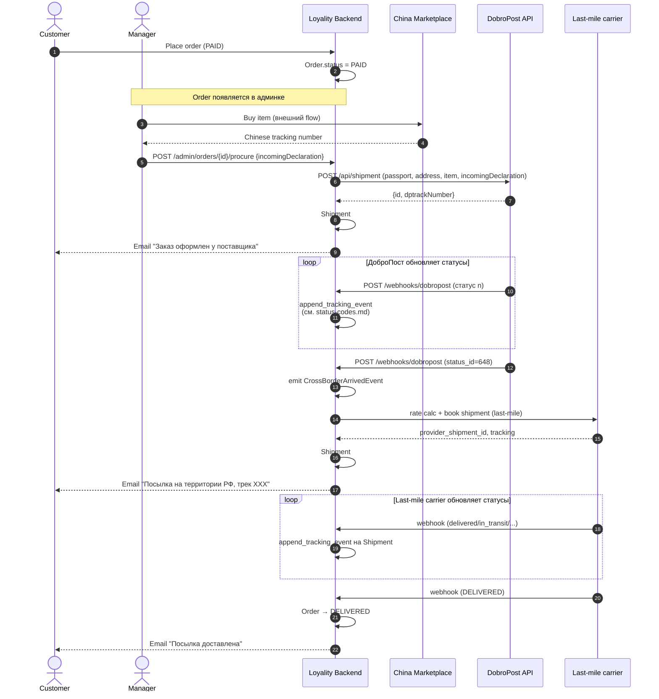

---
tags:
  - project/loyality
  - backend
  - logistics
  - dobropost
  - order
  - spec
type: spec
date: 2026-04-30
aliases: [DobroPost Integration, ДоброПост интеграция]
status: active
parent: "[[DobroPost Shipment API]]"
project: "[[Loyality Project]]"
component: backend
---

# DobroPost — интеграция в Loyality

> **Зачем этот файл:** ДоброПост — не «один из карьеров наравне с CDEK». В Loyality он покрывает **только cross-border сегмент** (Китай → таможня → склад ДоброПост в РФ). Доставка customer'у выполняется **другим карьером** (CDEK / Yandex Delivery) на отдельном Shipment'е. Поэтому интеграция отличается от CDEK архитектурно.
>
> Этот документ фиксирует **Loyality-specific** решения: `Order : Shipment = 1 : 2`, lifecycle через 2 carrier'а, manager actions, edge-cases. Голый ДоброПост-контракт — в [`reference.md`](./reference.md).

## TL;DR — ключевые принципы

- **Order : Shipment = 1 : 2 минимум, всегда.** Один Order рождает (минимум) два Shipment'а: cross-border (ДоброПост) + last-mile (CDEK / Yandex).
- **Shipment #2 создаётся не на checkout'е**, а **на event'е `CrossBorderArrived`** (status_id ∈ {648, 649} от ДоброПост).
- Customer на странице tracking'а видит **3 трек-номера**: китайский (`incomingDeclaration`), ДоброПост (`dptrackNumber`), последняя миля (`trackingNumber` российского carrier'а).
- ДоброПост в Loyality — **booking + tracking** только. Никаких rate calculation, pickup-points, intake. Никаких queries для customer'а напрямую.

## Жизненный цикл — sequence



## Структура Order ↔ Shipment

```text
Order (id=ord-001, status=IN_LAST_MILE)
├── Shipment #1 (provider="dobropost", status=BOOKED, latest_tracking_status=IN_TRANSIT)
│   ├── provider_shipment_id = "12345"  (DobroPost id)
│   ├── tracking_number = "DP123456789"  (dptrackNumber)
│   ├── provider_payload.incomingDeclaration = "LK123456789CN"  (China track)
│   └── tracking_events[] (от webhook'ов ДоброПост: 648, 530, 8, 7, 6, ...)
│
└── Shipment #2 (provider="cdek", status=BOOKED, latest_tracking_status=OUT_FOR_DELIVERY)
    ├── provider_shipment_id = "abcd-ef01-..."  (CDEK uuid)
    ├── tracking_number = "1064123456"  (CDEK номер)
    └── tracking_events[] (от CDEK webhook'ов)
```

> **Важно:** оба Shipment ссылаются на один `order_id`. Loyality-side это типичная история «один Order — много Shipment'ов» — текущий `ShipmentModel` уже поддерживает (`order_id` индексирован, не уникален). Order агрегат (когда модуль появится) будет агрегатором lifecycle.

## FSM Order (cross-border + dropship)

```text
PENDING ──► PAID ──► PROCURED ──► ARRIVED_IN_RU ──► IN_LAST_MILE ──► DELIVERED
   │          │          │              │                 │
   ▼          ▼          ▼              ▼                 ▼
CANCELLED  CANCELLED  CANCELLED   CANCELLED + REFUND    NOT_DELIVERED
                      + REFUND   + RECALL/RESHIP        (refusal at pickup)
```

| Статус         | Триггер перехода                                                          | Что происходит                                                            |
| -------------- | ------------------------------------------------------------------------- | ------------------------------------------------------------------------- |
| `PENDING`      | Cart checkout initiated                                                   | DeliveryQuote freeze, snapshot.                                           |
| `PAID`         | Payment confirmed                                                         | Order появляется в admin queue.                                           |
| `PROCURED`     | Manager: `POST /admin/orders/{id}/procure`                                | Loyality → ДоброПост `POST /api/shipment` → Shipment #1 (BOOKED).         |
| `ARRIVED_IN_RU`| Webhook ДоброПост: status_id ∈ {648, 649}                                 | Создаётся Shipment #2 (rate calc + book у last-mile carrier).             |
| `IN_LAST_MILE` | Shipment #2 → BOOKED                                                      | Customer получает email с last-mile tracking.                              |
| `DELIVERED`    | Last-mile webhook: `DELIVERED`                                            | Final state. Доступен RMA.                                                 |
| `CANCELLED`    | Из `PENDING/PAID`: customer cancel; из `PROCURED+`: только refund-flow.   | Всё после `PROCURED` обязательно сопровождается refund.                    |
| `NOT_DELIVERED`| Last-mile webhook: refusal / истёк срок хранения                          | Reverse last-mile shipment → reverse cross-border (rare, см. edge-cases). |

> Полная FSM специфицирована в [[Research - Order (2) State Machine FSM]] §15. Module `order/` ещё не реализован (планы Q3 2026).

## FSM Shipment (cross-border специфика)

`Shipment` aggregate (`src/modules/logistics/domain/entities.py:113`) общий для всех carrier'ов; cross-border специфика — только в **automatic transitions** при ingest webhook'а:

```python
# entities.py:490-505
if event.status in TERMINAL_FAILURE_TRACKING_STATUSES:  # LOST, EXCEPTION
    self.mark_failed_from_tracking(reason=...)
elif event.status in TERMINAL_CANCEL_TRACKING_STATUSES:  # CANCELLED
    self.mark_cancelled_from_tracking(reason=...)
```

ДоброПост `status_id ∈ {541, 542, 543, 544, 545, 546, 590xxx, 600}` маппится на `TrackingStatus.EXCEPTION` / `LOST` (см. [`status-codes.md`](./status-codes.md)) → автоматически Shipment #1 → `FAILED`. Order должен соответственно перейти в `CANCELLED + REFUND` через consumer на `ShipmentDeliveryFailedEvent`.

## Shipment #2 (last-mile) creation

Точка ветвления — webhook ДоброПост со `status_id ∈ {648, 649}`.

### Псевдо-flow

```python
# В DobroPostWebhookAdapter.parse_events после ingest TrackingEvent
if mapped_status_id in (648, 649):
    # Shipment #1 не должен закрываться — last-mile это новый shipment.
    shipment.add_domain_event(
        CrossBorderArrivedEvent(
            order_id=shipment.order_id,
            cross_border_shipment_id=shipment.id,
        )
    )
    # Сохраняется в outbox в общей tx с tracking_event'ом.
```

```python
# Consumer (TaskIQ) на CrossBorderArrivedEvent
@event_handler("CrossBorderArrivedEvent")
async def create_last_mile_shipment(event: ...) -> None:
    order = await order_repo.get_by_id(event.order_id)  # TBD
    quote = await get_or_request_last_mile_quote(order)  # CDEK / Yandex
    shipment2 = await create_shipment_handler.handle(
        CreateShipmentCommand(
            quote_id=quote.id,
            recipient=order.recipient,
            order_id=order.id,
            cod=None,  # Loyality предоплачен онлайн
        )
    )
    await book_shipment_handler.handle(
        BookShipmentCommand(shipment_id=shipment2.shipment_id)
    )
```

### Идемпотентность

Webhook 648 и 649 могут прийти **оба** последовательно. Consumer должен:

1. Idempotency-check: если у Order уже есть Shipment #2 → log + skip.
2. UNIQUE индекс на `(order_id, provider_kind="last_mile")` — TBD при добавлении order модуля.

## Manager actions — admin-панель

В админке менеджер выполняет **4 ручных действия** в типовом cross-border flow:

| #   | Действие                                                                | Loyality endpoint                            | Side effect                                                       |
| --- | ----------------------------------------------------------------------- | -------------------------------------------- | ----------------------------------------------------------------- |
| 1   | Открыть Order в `PAID`                                                  | `GET /admin/orders?status=PAID`              | —                                                                 |
| 2   | Перейти на китайский маркетплейс (внешняя ссылка из карточки товара) и купить | внешний flow                              | —                                                                 |
| 3   | Вставить китайский трек после выкупа                                     | `POST /admin/orders/{id}/procure` body `{incomingDeclaration}` | Order → `PROCURED`; async `POST /api/shipment` в ДоброПост → Shipment #1. |
| 4   | (Опционально) изменить ПВЗ доставки если customer запросил              | `PATCH /admin/orders/{id}/pickup-point`      | Только до status_id=648 (last-mile ещё не создан). После — менять напрямую у carrier'а через edit task. |

Всё остальное автоматизируется по carrier-вебхукам:

- **DobroPost webhook (status-update)** → tracking event + автосоздание Shipment #2 при 648/649.
- **DobroPost webhook (passport-validation)** → если `false`, escalation в CS (см. [`webhooks.md`](./webhooks.md#формат-1--passport-validation)).
- **Russian carrier webhook** → tracking event на Shipment #2 → Order → `DELIVERED`.

## Edge cases

| #   | Сценарий                                                                                | Решение                                                                                                                                                       |
| --- | --------------------------------------------------------------------------------------- | ------------------------------------------------------------------------------------------------------------------------------------------------------------- |
| 1   | Менеджер не нашёл товар в Китае (sold out)                                              | Order → `CANCELLED` с reason `OUT_OF_STOCK_AT_SUPPLIER`, **refund customer'у**. Не вызываем `POST /api/shipment` в ДоброПост.                                  |
| 2   | Китайский маркетплейс прислал не тот товар, поставщик не отгружает                       | Order остаётся в `PROCURED`, китайский трек никогда не получит status. **Nightly job** алертит «застрявшие в `PROCURED` > 14 дней» — operator review.        |
| 3   | Таможня вернула посылку (статус 541–546 у ДоброПост)                                    | Order → `CANCELLED + REFUND` (auto через `ShipmentDeliveryFailedEvent → OrderCompensation` consumer). DobroPost-возврат закрывается **вручную** через CS.    |
| 4   | Customer передумал после `PROCURED`                                                     | **До получения отказаться нельзя** — товар уже выкуплен и едет. Возврат **только после получения** (через RMA в last-mile).                                    |
| 5   | Customer хочет сменить ПВЗ во время cross-border                                         | До создания Shipment #2 (status_id < 648) — `PATCH /admin/orders/{id}/pickup-point` (меняем destination на Order). После создания #2 — через `IEditProvider` last-mile carrier'а. |
| 6   | Failed delivery в ПВЗ (срок хранения истёк)                                              | Last-mile webhook `RETURNED` / `EXCEPTION` → Shipment #2 `FAILED` → reverse last-mile shipment → товар возвращается на склад ДоброПост → reverse cross-border (rare; чаще списание). |
| 7   | Passport validation failed (DaData webhook от ДоброПост)                                 | Order остаётся в `PROCURED`, шипмент **зависает** перед таможней. CS запрашивает у customer корректные паспорт-данные → `PUT /api/shipment` обновляет шипмент. Если не получили → ДоброПост шлёт 544/545 → terminal failure flow.   |

> Каждый edge-case в идеале → integration test в `tests/e2e/modules/logistics/test_dobropost_*.py` (TBD).

## Что НЕ интегрируется через ДоброПост

| Capability                          | Почему НЕ ДоброПост                                       |
| ----------------------------------- | --------------------------------------------------------- |
| Rate calculation (`/rates`)         | Тарифы ДоброПост фиксированные на договоре партнёрства; рассчитываются на стороне Loyality (margin-aware). Customer видит финальную цену из pricing module. |
| Pickup point search                 | Customer выбирает ПВЗ **российского** carrier'а (CDEK / Yandex), не ДоброПост.   |
| Intake (courier pickup)             | Не релевантно — товар уже в Китае, ДоброПост его получает на своём складе.    |
| Document/label generation           | Этикетки печатает ДоброПост сам (`comment` поле появляется на этикетке).      |
| Edit operations (Yandex-style)      | Только `PUT /api/shipment` для исправления паспорта.                          |

## DI registration (Done)

```python
# src/modules/logistics/infrastructure/bootstrap.py
_FACTORY_MAP: dict[str, type[IProviderFactory]] = {
    PROVIDER_CDEK: CdekProviderFactory,
    PROVIDER_YANDEX_DELIVERY: YandexDeliveryProviderFactory,
    PROVIDER_DOBROPOST: DobroPostProviderFactory,
}

# src/modules/logistics/domain/value_objects.py
PROVIDER_DOBROPOST: ProviderCode = "dobropost"
DOBROPOST_CROSS_BORDER_ARRIVED_CODES: frozenset[str] = frozenset({"648", "649"})
```

**ДоброПост намеренно отсутствует в `_PROVIDER_COVERAGE`** (`services/routing.py:22`):

- `routing.py` фильтрует только `list_rate_providers()`. `DobroPostProviderFactory.create_rate_provider() → None`, поэтому DobroPost вообще не попадает в `list_rate_providers()` и любой fan-out в `CalculateRatesHandler` его не увидит.
- Этого достаточно: добавлять row в `_PROVIDER_COVERAGE` вредно (создаст ложную видимость, что carrier участвует в customer-facing pipe).
- Если в будущем потребуется второй cross-border провайдер — расширяется `factory.create_rate_provider() → None` тем же паттерном; routing трогать не нужно.

## Admin command

Procurement-flow реализован в:

```
src/modules/logistics/application/commands/create_cross_border_shipment.py
```

`CreateCrossBorderShipmentHandler` (3-фазный):
1. UoW: `Shipment.create_admin_managed` → `mark_booking_pending` → persist.
2. Outside UoW: `DobroPostBookingProvider.book_shipment(BookingRequest)` (provider_payload = `DobroPostShipmentPayload.to_json()`).
3. UoW: `mark_booked` (provider_shipment_id = DobroPost id, tracking_number = dptrackNumber).

Error mapping (Deep Code Review C3 fix):
- `4xx` от ДоброПост → `ValidationError` (HTTP 400, operator-correctable: bad passport / phone).
- `5xx` / транспорт / auth → `ProviderUnavailableError` (HTTP 503, transient).
- 200 OK без `id` → `ProviderHTTPError` 502 (provider contract violation).
- В каждой ветке local FSM → FAILED (через `_mark_shipment_failed`).

## Связанное

- [[DobroPost Shipment API]] — index папки.
- [`reference.md`](./reference.md) — голая ДоброПост spec.
- [`status-codes.md`](./status-codes.md) — 40 status_id + маппинг.
- [`webhooks.md`](./webhooks.md) — webhook-контракт со стороны Loyality.
- [[Research - Order (2) State Machine FSM]] §15 — детальная FSM Order для cross-border + dropship.
- [[Research - Order (6) Logistics Integration]] — общая архитектура multi-carrier.
- [[Research - Order (1) Domain-Driven Design]] — Order aggregate (TBD реализация).
- `src/modules/logistics/domain/entities.py:113` — Shipment aggregate (общий для всех carrier'ов).
- `src/modules/logistics/infrastructure/bootstrap.py:33` — `_FACTORY_MAP`, точка регистрации.
