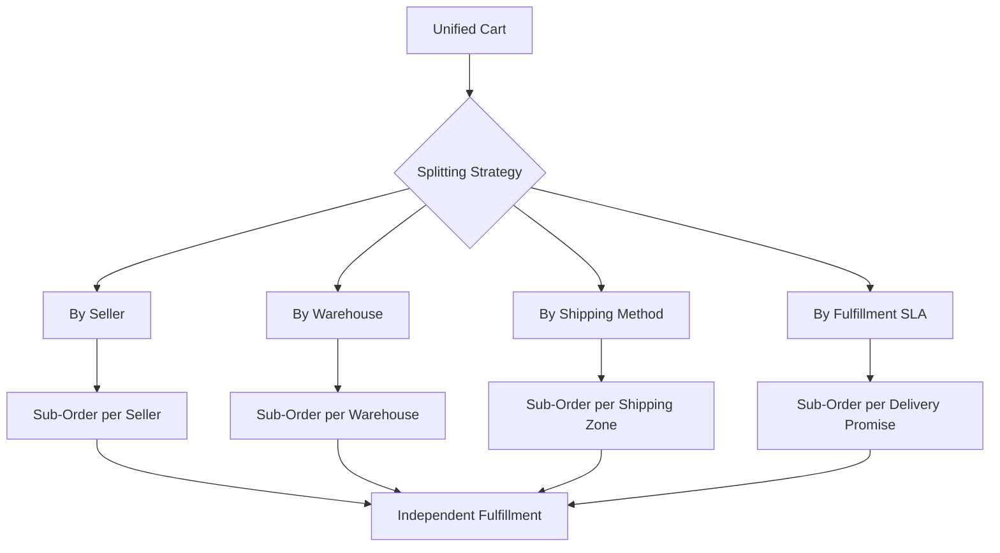
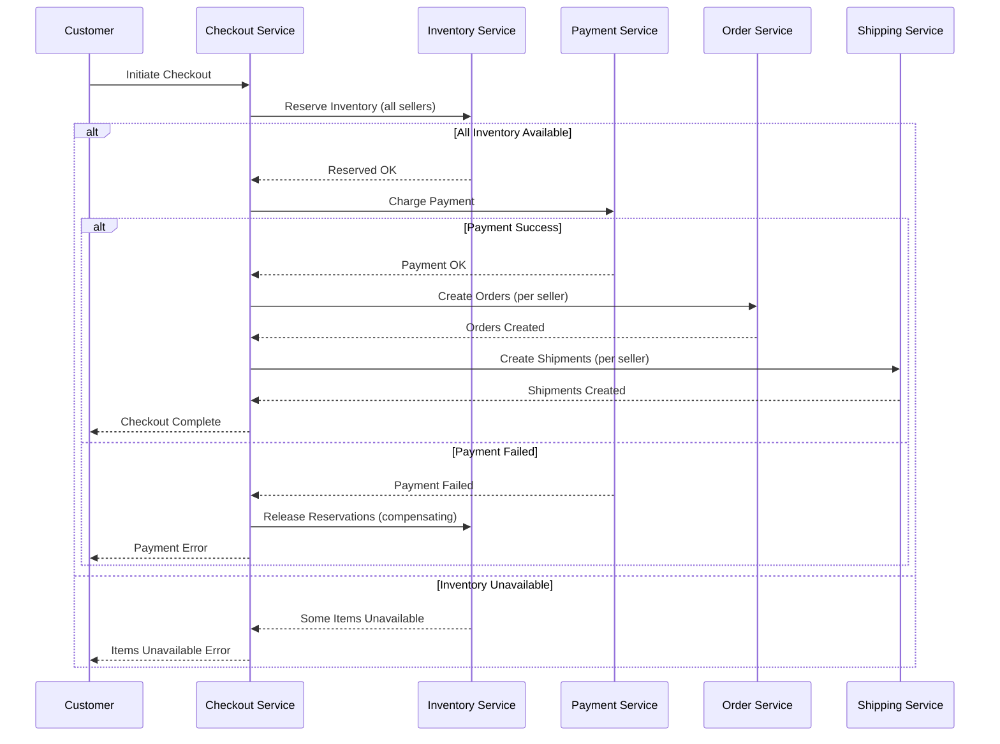
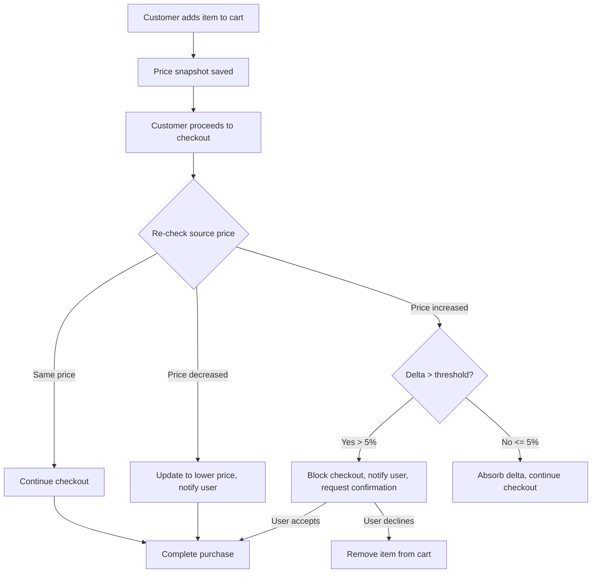
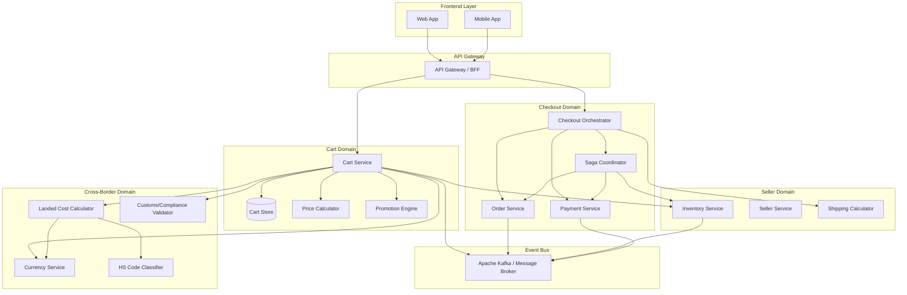
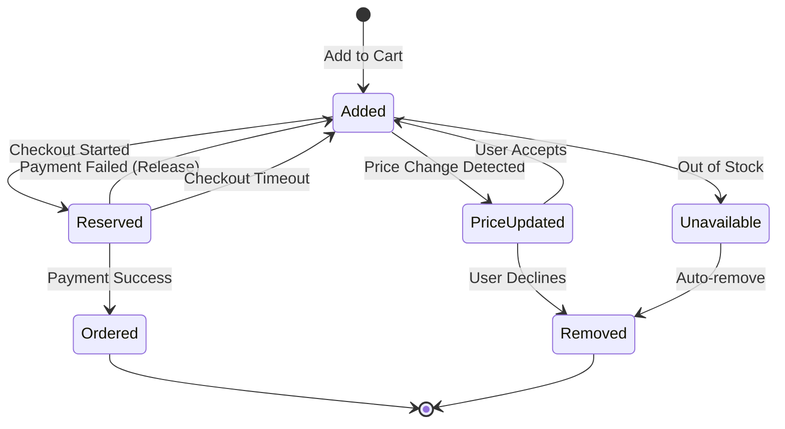
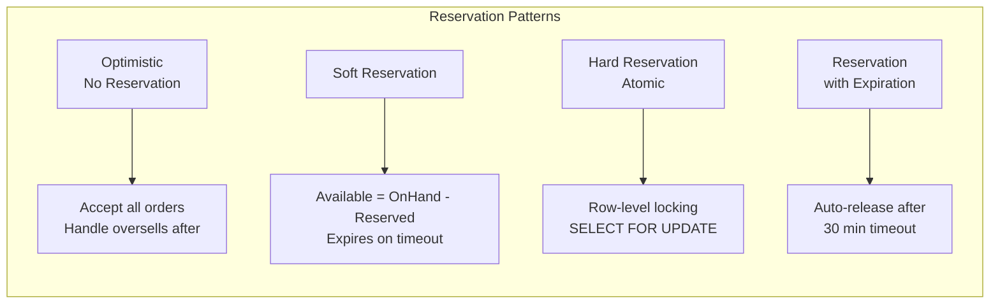
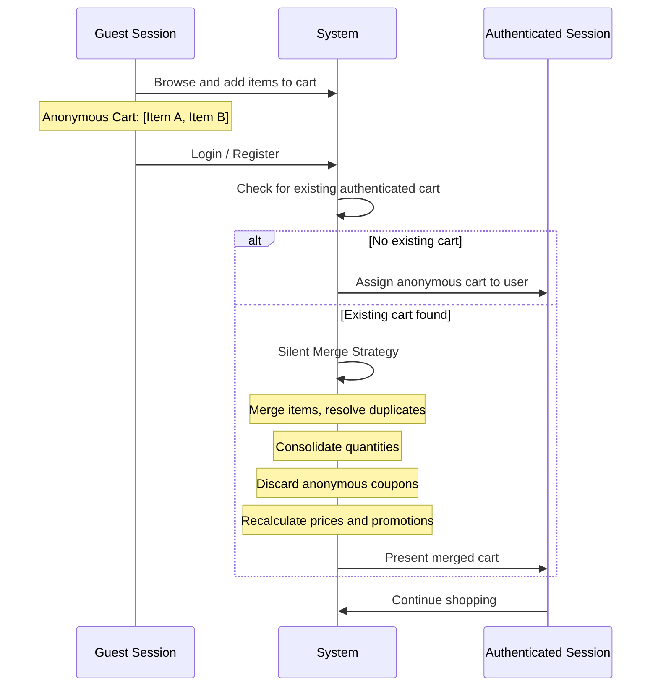

# Архитектура корзины для кросс-бордер маркетплейсов и мультивендорных платформ

**Дата исследования:** 2026-03-25
**Статус:** Глубокое исследование
**Платформы:** Farfetch, ASOS, Zalando, Wish, Coupang, Mercado Libre, Poizon (Dewu), StockX/GOAT, агрегаторные модели

---

## Резюме (Executive Summary)

Настоящее исследование представляет собой глубокий анализ архитектурных решений корзины покупок, применяемых ведущими кросс-бордерными маркетплейсами и мультивендорными платформами мира. Ключевые выводы:

1. **Единый чекаут с декомпозицией заказа** -- доминирующий паттерн: покупатель видит одну корзину и проходит один чекаут, но за кулисами заказ разбивается на суб-заказы по продавцам (Farfetch, Mercado Libre, Zalando).

2. **DDP (Delivered Duty Paid)** стал стандартом де-факто для luxury и premium-сегмента: Farfetch включает все пошлины и налоги в цену на этапе чекаута для 190+ стран.

3. **Аутентификация товара как часть flow корзины** -- уникальная модель Poizon/StockX/GOAT, где корзина запускает не прямую доставку, а процесс верификации через warehouse.

4. **Event-Driven Architecture с Kafka** -- Farfetch обрабатывает 150k+ сообщений/сек через KafkaFlow (.NET), что критично для синхронизации инвентаря между тысячами бутиков.

5. **Saga Pattern** -- необходим для управления распределенными транзакциями при мультивендорном чекауте с компенсирующими транзакциями при частичных сбоях.

---

## Содержание

1. [Farfetch: Мульти-бутиковая корзина](#1-farfetch)
2. [Poizon/Dewu: Модель с аутентификацией](#2-poizon-dewu)
3. [Zalando: Checkout-as-a-Service](#3-zalando)
4. [ASOS: Cosmos DB и Event Sourcing](#4-asos)
5. [Coupang: Rocket Direct кросс-бордер](#5-coupang)
6. [Mercado Libre: Pack-система](#6-mercado-libre)
7. [Wish: Дропшиппинг-модель](#7-wish)
8. [StockX/GOAT: Bid-Ask аутентификация](#8-stockx-goat)
9. [Кросс-бордерные паттерны](#9-crossborder-patterns)
10. [Мультивендорная декомпозиция корзины](#10-multivendor-decomposition)
11. [Агрегаторные/прокси-модели](#11-aggregator-models)
12. [Архитектурные диаграммы](#12-diagrams)
13. [Ключевые рекомендации для нашей платформы](#13-recommendations)
14. [Источники](#14-sources)

---

## 1. Farfetch: Мульти-бутиковая корзина {#1-farfetch}

### 1.1 Обзор модели

Farfetch -- ближайший аналог нашей модели. Платформа агрегирует инвентарь тысяч luxury-бутиков из 50+ стран, при этом покупатель видит единую корзину и проходит один чекаут.

**Ключевые характеристики:**
- **Distributed Inventory Model**: инвентарь агрегируется в реальном времени из множества точек хранения
- **Single checkout, multi-shipment**: один чекаут порождает множество отправок
- **Flat fee shipping**: единая стоимость доставки для покупателя, скрывающая сложность мульти-отправки
- **DDP модель**: пошлины и налоги включены в цену для большинства стран

### 1.2 Архитектура корзины

#### Единый Cart -> Множественные Orders

```
Покупатель добавляет товары из разных бутиков
           |
    [Единая Корзина]
    - Item A (Boutique Milan)
    - Item B (Boutique Paris)
    - Item C (Boutique London)
           |
    [Single Checkout]
    - Единая оплата
    - Единая стоимость доставки (flat fee)
    - Пошлины включены (DDP)
           |
    [Order Decomposition]
           |
    +------+-------+-------+
    |      |       |       |
 Order1  Order2  Order3
 (Milan) (Paris) (London)
    |      |       |
  Ship1  Ship2   Ship3
```

#### Алгоритм аллокации продаж

Farfetch разработал **проприетарный алгоритм** для ситуаций, когда один и тот же товар доступен у нескольких продавцов. Алгоритм определяет, какой именно бутик получит конкретную продажу, учитывая:
- Географическую близость к покупателю (для ускорения доставки)
- Уровень запасов у продавца
- Историю выполнения заказов
- Балансировку нагрузки между продавцами

### 1.3 Система доставки и расчёт стоимости

**Модель реимбурсации продавцам:**

| Метод                   | Описание                               |
| ----------------------- | -------------------------------------- |
| Фиксированный per-order | Фиксированная сумма за каждый заказ    |
| Variable banded         | Зависит от зоны отправления/назначения |
| Negotiated net terms    | Индивидуальные условия по договору     |

**Принцип для покупателя:** Покупатель платит единую flat-fee за доставку. Если суммарные реимбурсации продавцам превышают собранную с покупателя плату, Farfetch субсидирует разницу. Если наоборот -- платформа удерживает surplus.

### 1.4 DDP (Delivered Duty Paid) для 190+ стран

Farfetch **включает все import duties и налоги** в финальную цену на этапе чекаута для основных рынков: EU, UK, US, Canada, Australia, Japan, Brazil, Hong Kong и др.

**"The price you see is the price you pay"** -- ключевой принцип UX.

Для регионов с DAP (Delivered At Place) покупатель предупреждается на этапе чекаута о необходимости оплаты пошлин при получении.

### 1.5 Технологический стек

- **Backend:** .NET/C# (основной язык для сервисов)
- **Event-Driven:** Apache Kafka с KafkaFlow (собственный open-source фреймворк)
- **Пропускная способность:** 150k+ сообщений/сек в одном регионе
- **API-first:** Весь контент на основе API для интеграции бутиков
- **Open Source:** KafkaFlow (github.com/Farfetch/kafkaflow)

### 1.6 Post-Purchase Experience

- Все split-shipments отображаются в одном месте
- Real-time обновления на каждом этапе (включая таможню)
- Единое окно отслеживания для мульти-бутикового заказа
- Перевозчики: DHL, UPS, FedEx

---

## 2. Poizon/Dewu: Модель с аутентификацией {#2-poizon-dewu}

### 2.1 Уникальная модель "Authenticate First, Ship Later"

Poizon (Dewu/得物) представляет радикально отличающуюся модель корзины, где **верификация подлинности** товара является частью order flow.

**Ключевой принцип:** Каждый заказанный товар проходит через физическую инспекцию в warehouse Poizon перед отправкой покупателю.

### 2.2 Order Flow с аутентификацией

```
[Покупатель]
     |
  Добавляет в корзину
     |
  [Checkout / Payment]
     |
  Покупатель оплачивает полную стоимость
     |
  [Seller получает уведомление]
     |
  Seller отправляет товар в → [Poizon Warehouse]
     |
  [Multi-step Authentication]
  - Проверка подлинности
  - Проверка состояния
  - Проверка упаковки
  - Проверка соответствия описанию
     |
  +---------+---------+
  |                   |
  [PASS]           [FAIL]
  |                   |
  Отправка          Возврат продавцу
  покупателю        + Refund покупателю
```

### 2.3 Модель ценообразования: Bid/Ask

Poizon использует модель, аналогичную StockX:

- **Ask Price:** Продавец выставляет минимальную цену продажи
- **Bid Price:** Покупатель предлагает максимальную цену покупки
- **Matching:** Сделка происходит автоматически при пересечении bid и ask
- **Multiple sellers per SKU:** Конкуренция продавцов на уровне конкретного размера/конфигурации

### 2.4 Прокси-покупка (Proxy Purchasing)

Для международных покупателей Poizon требует посредников:

1. **Посредник в Китае** покупает товар на платформе
2. **Консолидация** нескольких заказов в один пакет
3. **Международная доставка** через proxy-сервис
4. **Экономия на доставке** через объединение отправок

### 2.5 API интеграция

Poizon недавно открыл **официальный API** через партнёров (например, 4Partners):
- Автоматическая синхронизация каталога
- Мониторинг цен в реальном времени
- Получение данных о товарах, ценах, конфигурациях
- Два варианта: Poizon API (US) и Dewu API (China)

**Важное ограничение:** Работа с Poizon без китайских посредников невозможна -- кто-то должен физически купить и отправить товар через китайскую логистическую сеть.

---

## 3. Zalando: Checkout-as-a-Service {#3-zalando}

### 3.1 Архитектура чекаута

Zalando эволюционировал от монолита к ~10,000 микросервисов. Чекаут -- один из ключевых сервисов.

**Компоненты:**

| Компонент                  | Описание                         | Технология            |
| -------------------------- | -------------------------------- | --------------------- |
| Checkout Service           | Бизнес-правила чекаута           | Java/Scala, Cassandra |
| BFF (Backend-for-Frontend) | Агрегация данных                 | Node.js               |
| Tailor                     | Компоновка страниц из фрагментов | Open-source           |
| Skipper                    | HTTP-роутер                      | Open-source           |

### 3.2 Backend-for-Frontend Pattern

```
[Browser]
    |
[Skipper HTTP Router]
    |
[Tailor - Page Composition]
    |
    +--- Header Fragment (Team A)
    +--- Checkout Body Fragment (Team B)
    +--- Footer Fragment (Team C)
    |
[BFF Microservice]
    |
    +--- Checkout Service (Cassandra)
    +--- Product Service
    +--- Payment Service
    +--- Shipping Service
```

BFF агрегирует данные из checkout-сервиса и других Zalando-сервисов, которые предоставляют информацию, не принадлежащую домену чекаута (например, детальная информация о товарах).

### 3.3 Connected Retail: Мульти-продавцы

Zalando поддерживает **Connected Retail** -- программу, позволяющую физическим магазинам продавать через платформу:

- Синхронизация стока через CSV каждые 15-60 минут
- Заказы назначаются магазинам и поступают в Connected Retail Tool (CRT)
- При подборе и упаковке система генерирует событие "fulfilled"
- Управление через платформу zDirect

### 3.4 Partner Program

- Партнёры сохраняют полный контроль над ассортиментом, ценами и стоком
- Продают напрямую на платформе
- Независимо управляют своими предложениями и коммерческими стратегиями

---

## 4. ASOS: Cosmos DB и Event Sourcing {#4-asos}

### 4.1 Архитектура на Azure Cosmos DB

ASOS использует **Azure Cosmos DB** как основу для microservices-архитектуры, включая инвентарь, ордера, профили и рекомендации.

**Ключевые метрики:**
- 23 млн активных покупателей
- 3+ млрд фунтов продаж
- 99.9% availability
- Black Friday: 167 млн запросов за 24 часа
- 3,500 запросов и 33 заказа в секунду
- Среднее время отклика: 48 мс

### 4.2 Event-Driven Order Workflow

```
[Customer Action]
    |
[Azure Cosmos DB - Event Store]
    |
[Change Feed] ─── triggers ──→ [Downstream Microservices]
    |                                    |
    +── Order Created Event          Inventory Update
    +── Order Updated Event          Notification Service
    +── Order Shipped Event          Analytics Pipeline
```

Cosmos DB выступает как **persistent event store**, а Change Feed обеспечивает инкрементальное чтение обновлений нижестоящими микросервисами.

### 4.3 Marketplace: 700+ бутиков

ASOS Marketplace -- отдельная платформа для независимых брендов и vintage-продавцов. Более 700 бутиков и брендов представлены на маркетплейсе с уникальным ассортиментом.

---

## 5. Coupang: Rocket Direct кросс-бордер {#5-coupang}

### 5.1 Архитектура

- **Инфраструктура:** AWS Cloud, микросервисная архитектура
- **AI/ML:** Предиктивный инвентарь, рекомендации
- **Масштаб:** 50,000+ заказов в минуту в пиковые периоды
- **Автомасштабирование:** Независимое масштабирование checkout, search, delivery

### 5.2 Rocket Direct: Кросс-бордер модель

Rocket Direct упрощает международные покупки, беря на себя:
1. Доставку из-за рубежа
2. Таможенное оформление
3. Финальную доставку до покупателя

### 5.3 Таможенная система в корзине

При чекауте кросс-бордерных товаров Coupang:
- Показывает значок "фиолетовая ракета" (로켓직구) рядом с иностранными товарами
- Запрашивает **Personal Custom Code** покупателя
- Применяет **тирированную систему таможенной очистки**:

| Уровень          | Стоимость посылки | Тип очистки                           |
| ---------------- | ----------------- | ------------------------------------- |
| List Clearance   | < $200            | Упрощённая, по транспортной накладной |
| Simple Customs   | $200 - $2,000     | Стандартная таможенная очистка        |
| Full Declaration | > $2,000          | Полная декларация                     |

**Ограничение:** List Clearance -- 1 отправка на человека в день.

### 5.4 Логистика Rocket Delivery

- **Spatial Index:** Зоны доставки разделены на гексагональные группы
- **Goods-to-Person:** Роботы-полки доставляют товар к работнику
- **Sorting Robots:** Классификация товаров по регионам за секунды после сканирования

---

## 6. Mercado Libre: Pack-система {#6-mercado-libre}

### 6.1 Масштаб платформы

- Крупнейший маркетплейс Латинской Америки
- 30,000+ микросервисов на 100,000 инстансах
- 20 млн+ запросов в минуту (на Go)
- 15,000+ инженеров

### 6.2 Архитектура Pack-системы

Mercado Libre использует уникальную **Pack-систему** для управления мульти-продавцовыми корзинами:

```
[Shopping Cart]
    |
    +── Item A (Seller 1) → Order #001
    +── Item B (Seller 1) → Order #002
    +── Item C (Seller 2) → Order #003
    |
    ALL linked by PackId = "PACK-XYZ"
```

**Ключевые атрибуты:**

| Атрибут               | Описание                | Поведение                   |
| --------------------- | ----------------------- | --------------------------- |
| `PackId`              | Текущий ID пака/корзины | Может изменяться при сплите |
| `SourcePackId`        | Оригинальный ID корзины | Не меняется никогда         |
| `IsCompletePackOrder` | Все ли товары получены  | true/false                  |
| `template_pack_id`    | ID родительского пака   | null если не сплитован      |

### 6.3 Логика разделения паков

1. **Каждый товар** в корзине генерирует **индивидуальный order** с собственным номером
2. Все orders в одной корзине **разделяют общую информацию** (покупатель, оплата, стоимость доставки)
3. **PackId может меняться** при разделении на отдельные отправки
4. При разделении создаются **дочерние паки**, хранящие `template_pack_id` родителя

### 6.4 Технологическая эволюция

```
1999: Монолит (Java, Oracle, 200 разработчиков)
  |
2010: MeliCloud (17,500 инстансов, 1,200 пулов трафика)
  |
2015: Fury IDP (containerized, CI/CD, multicloud)
  |
2026: 30k+ микросервисов (Go + Java, AWS + GCP)
```

---

## 7. Wish: Дропшиппинг-модель {#7-wish}

### 7.1 Модель корзины

Wish работает как **чистый маркетплейс-дропшиппинг**:
- 1+ млн мерчантов
- ~94% товаров произведено в Китае
- Платформа не держит сток и не обрабатывает возвраты
- Выступает как payment service provider

### 7.2 Особенности доставки

- **Flat rate shipping:** $2.99 за практически любой товар (минимальный заказ $10)
- **Консолидация:** Несколько товаров от разных продавцов могут быть объединены в одну посылку
- **ePacket:** Основной метод доставки для кросс-бордера из Китая
- **Сроки:** Express 5-8 дней, Standard 2-3 недели

### 7.3 Отличие от luxury-маркетплейсов

Wish оптимизирован на **низкую цену**, а не на премиум-опыт. Это отражается в архитектуре корзины:
- Нет DDP модели (покупатель платит пошлины)
- Минимальный контроль качества
- Простая модель checkout без сложной декомпозиции

---

## 8. StockX/GOAT: Bid-Ask с аутентификацией {#8-stockx-goat}

### 8.1 Модель (аналогична Poizon)

StockX и GOAT используют **биржевую модель** для торговли аутентифицированными товарами:

```
[Seller]                    [Buyer]
   |                           |
  Places ASK              Places BID
  (min sell price)        (max buy price)
   |                           |
   +─────── MATCHING ──────────+
              |
    [Transaction Created]
              |
    Buyer payment held in ESCROW
              |
    Seller ships to → [Authentication Center]
              |
         +---------+----------+
         |                    |
      [PASS]              [FAIL]
         |                    |
    Ship to Buyer       Return to Seller
    Release payment     Refund Buyer
    to Seller
```

### 8.2 Эскроу-модель

- Платёж покупателя удерживается в **escrow** до завершения аутентификации
- Продавец получает оплату **только после** успешной верификации
- Комиссия рассчитывается автоматически
- Управление refunds при провале аутентификации

### 8.3 Отличия от традиционной корзины

- **Нет классической "корзины"** -- каждый товар покупается индивидуально
- **Нет мульти-селлер checkout** -- каждая транзакция P2P через платформу
- **Price discovery** -- цена определяется рынком, а не продавцом
- **Отложенная доставка** -- 3-12 дней на верификацию + доставку

---

## 9. Кросс-бордерные паттерны {#9-crossborder-patterns}

### 9.1 Мульти-валютность в корзине

**Архитектурный подход:**

```
[Product Price]          [Display Price]         [Settlement Price]
EUR 500 (base)    →    USD 547.50 (display)  →   EUR 500 (settlement)
                        @ rate 1.095                to seller
                        + real-time FX
```

**Ключевые решения:**
- **Display currency:** Валюта, в которой покупатель видит цены
- **Settlement currency:** Валюта, в которой продавец получает оплату
- **Base/catalog currency:** Валюта каталога товаров
- **Real-time FX rates:** Обновление курсов для точности расчётов

**Практика Farfetch:** Цены отображаются в локальной валюте покупателя, settlement -- в валюте продавца.

### 9.2 Расчёт таможенных пошлин на уровне корзины

#### Landed Cost = Product + Shipping + Insurance + Duties + Taxes + Fees

**Компоненты расчёта:**

| Компонент      | Источник данных                      |
| -------------- | ------------------------------------ |
| HS Code        | AI-классификация или ручная разметка |
| Duty Rate      | По HS-коду + страна назначения       |
| VAT/GST        | Ставка страны назначения             |
| De Minimis     | Порог беспошлинного ввоза            |
| Clearance Fees | Таможенные сборы                     |
| Brokerage Fees | Брокерские услуги                    |

#### Архитектура расчёта (на примере Zonos)

```
[Cart Items]
    |
    +── Item 1: HS Code 6403.51, $500, Italy → USA
    +── Item 2: HS Code 4202.21, $1200, France → USA
    |
[Landed Cost API]
    |
    +── Duty Calculation (per HS code, per country)
    +── Tax Calculation (country + region specific)
    +── Fee Calculation (clearance, brokerage)
    +── Currency Conversion
    |
[Cart Total with Landed Cost]
    Subtotal:  $1,700.00
    Shipping:    $25.00
    Duties:      $85.00
    Taxes:       $0.00 (US de minimis for personal imports)
    Fees:        $12.50
    ─────────────────────
    Total:    $1,822.50
```

**API-провайдеры для расчёта:**
- **Zonos** -- 235 стран, до 10-digit HS codes, AI-классификация
- **Avalara AvaTax Cross-Border** -- интеграция с ERP
- **Hurricane Commerce** -- duty/tax + prohibited goods screening

### 9.3 DDP vs DAP модели

| Параметр           | DDP (Delivered Duty Paid) | DAP (Delivered At Place) |
| ------------------ | ------------------------- | ------------------------ |
| Кто платит пошлины | Продавец/платформа        | Покупатель               |
| Когда оплата       | На этапе checkout         | При получении (курьеру)  |
| UX                 | "Цена = финальная цена"   | Неожиданные расходы      |
| Сложность          | Высокая (для продавца)    | Низкая (для продавца)    |
| Abandon rate       | Низкий                    | Высокий                  |
| Используют         | Farfetch, luxury          | Budget маркетплейсы      |

### 9.4 Валидация запрещённых товаров

```
[Add to Cart]
    |
[Product Validation Pipeline]
    |
    +── HS Code Classification
    +── Origin Country Check
    +── Destination Country Check
    +── Prohibited Items Database
    +── Restricted Items + License Check
    +── Sanctions/Denied Parties Screening
    |
    +── ALLOWED → Add to cart
    +── RESTRICTED → Warning + documentation requirement
    +── PROHIBITED → Block + user notification
```

**Providers:**
- Glopal -- автоматическая идентификация restricted/prohibited товаров
- Hurricane Aura API -- screening запрещённых товаров + denied parties
- Avalara -- MCP-серверы для автоматической классификации

### 9.5 Weight-based vs Value-based доставка

**Weight-based:**
- Расчёт по суммарному весу корзины + вес упаковки по умолчанию
- Тарифные сетки по зонам (origin → destination)
- Применяется для стандартных товаров

**Value-based:**
- Расчёт как процент от стоимости товара
- Часто для luxury/high-value товаров
- Farfetch: стоимость зависит от размера, веса и точки отправки

**Hybrid:**
- Комбинация весовых и стоимостных параметров
- Volumetric weight (ДхШхВ / делитель)
- Максимум из фактического и объёмного веса

---

## 10. Мультивендорная декомпозиция корзины {#10-multivendor-decomposition}

### 10.1 Стратегии разделения корзины



#### Стратегия 1: По продавцу (наиболее распространённая)

```
Cart:
├── Seller A Items → Sub-Order A → Ship from Seller A warehouse
├── Seller B Items → Sub-Order B → Ship from Seller B warehouse
└── Seller C Items → Sub-Order C → Ship from Seller C warehouse
```

**Используют:** Farfetch, Zalando, Mercado Libre, ASOS Marketplace

#### Стратегия 2: По складу/локации

```
Cart:
├── Items in Warehouse EU → Sub-Order EU → Ship from EU
├── Items in Warehouse US → Sub-Order US → Ship from US
└── Items in Warehouse Asia → Sub-Order Asia → Ship from Asia
```

**Используют:** Coupang (Rocket Fulfillment), Amazon

#### Стратегия 3: По методу доставки

```
Cart:
├── Express Items → Sub-Order Express → Priority shipping
├── Standard Items → Sub-Order Standard → Standard shipping
└── Pre-order Items → Sub-Order Preorder → Ship when available
```

#### Стратегия 4: Гибридная (Farfetch)

```
Cart:
├── Boutique Milan (IT) + Express → Sub-Order 1
├── Boutique Paris (FR) + Standard → Sub-Order 2
└── Brand Direct (UK) + Express → Sub-Order 3
```

### 10.2 Паттерн Sub-Cart / Cart-Group

**Визуальная модель:**

```
┌─────────────────────────────────────┐
│           UNIFIED CART              │
│                                     │
│ ┌─────────────────────────────────┐ │
│ │ Products sold by: Seller A      │ │
│ │ ├── Product 1    $500           │ │
│ │ ├── Product 2    $300           │ │
│ │ ├── Shipping:    $15            │ │
│ │ └── Subtotal:    $815           │ │
│ └─────────────────────────────────┘ │
│ ┌─────────────────────────────────┐ │
│ │ Products sold by: Seller B      │ │
│ │ ├── Product 3    $1200          │ │
│ │ ├── Shipping:    $25            │ │
│ │ └── Subtotal:    $1225          │ │
│ └─────────────────────────────────┘ │
│                                     │
│ Cart Total:          $2,040         │
│ [CHECKOUT]                          │
└─────────────────────────────────────┘
```

### 10.3 Модель данных корзины

```
Cart (Aggregate Root)
├── id: UUID
├── customer_id: UUID
├── status: CartStatus (ACTIVE, MERGED, CHECKED_OUT, EXPIRED)
├── currency: CurrencyCode
├── created_at: DateTime
├── updated_at: DateTime
├── expires_at: DateTime
│
├── cart_groups: List<CartGroup>
│   ├── CartGroup
│   │   ├── id: UUID
│   │   ├── seller_id: UUID
│   │   ├── seller_name: String
│   │   ├── warehouse_id: UUID (optional)
│   │   ├── shipping_method: ShippingMethod (optional)
│   │   ├── shipping_cost: Money
│   │   ├── estimated_delivery: DateRange
│   │   │
│   │   └── items: List<CartItem>
│   │       ├── CartItem
│   │       │   ├── id: UUID
│   │       │   ├── product_id: UUID
│   │       │   ├── variant_id: UUID
│   │       │   ├── sku: String
│   │       │   ├── quantity: Integer
│   │       │   ├── unit_price: Money
│   │       │   ├── total_price: Money
│   │       │   ├── weight: Weight
│   │       │   ├── hs_code: String (optional)
│   │       │   ├── origin_country: CountryCode
│   │       │   └── custom_fields: Map<String, Any>
│   │       └── ...
│   └── ...
│
├── promotions: List<AppliedPromotion>
│   ├── platform_promotions: List<Promotion>
│   └── seller_promotions: Map<SellerId, List<Promotion>>
│
├── pricing: CartPricing
│   ├── subtotal: Money
│   ├── total_shipping: Money
│   ├── total_duties: Money (if DDP)
│   ├── total_taxes: Money
│   ├── total_discount: Money
│   ├── platform_fee: Money
│   └── grand_total: Money
│
└── metadata: CartMetadata
    ├── shipping_address: Address
    ├── billing_address: Address
    ├── delivery_country: CountryCode
    └── is_cross_border: Boolean
```

### 10.4 Промо-акции: Seller-level vs Platform-level

**Типы промо-акций в мультивендорной корзине:**

| Тип             | Область           | Пример                       | Кто оплачивает |
| --------------- | ----------------- | ---------------------------- | -------------- |
| Platform-wide   | Вся корзина       | "10% на заказ от 2+ товаров" | Платформа      |
| Seller-specific | Товары продавца   | "$5 при заказе от $20"       | Продавец       |
| Category        | Категория товаров | "15% на обувь"               | По договору    |
| Shipping        | Доставка          | "Бесплатная доставка от $50" | По договору    |

**Алгоритм распределения скидок при сплите заказа (паттерн MarketKing):**
1. **Product-specific coupon** -- привязывается к конкретному sub-order
2. **General cart discount** -- распределяется **пропорционально** доле каждого sub-order в общей сумме
3. **Shipping discount** -- применяется к соответствующему sub-order

### 10.5 Saga Pattern для мультивендорного чекаута



**Компенсирующие транзакции:**
- Оплата не прошла → Релиз резервации инвентаря
- Создание shipment не удалось → Отмена заказа + возврат средств + релиз инвентаря
- Частичный сбой → Создание заказов для успешных seller + уведомление о проблемных

---

## 11. Агрегаторные/прокси-модели {#11-aggregator-models}

### 11.1 Отличие агрегатора от маркетплейса

| Параметр          | Маркетплейс         | Агрегатор            |
| ----------------- | ------------------- | -------------------- |
| Бренд продажи     | Продавец            | Агрегатор            |
| Ценообразование   | Определяет продавец | Определяет агрегатор |
| Контроль качества | Минимальный         | Стандартизированный  |
| Модель дохода     | Комиссия            | Markup на цену       |

### 11.2 Расчёт цены в корзине агрегатора

```
Source Price (от поставщика):     $100.00
+ Platform Markup (20%):           $20.00
+ Cross-border Shipping:           $15.00
+ Customs Duties (estimated):       $8.50
+ Platform Service Fee:             $5.00
──────────────────────────────────────────
Display Price to Customer:        $148.50
```

### 11.3 Синхронизация цен в реальном времени

**Проблема:** Цена на источнике может измениться между моментом добавления в корзину и моментом чекаута.

**Решения:**

| Стратегия                     | Описание                                  | Trade-off                  |
| ----------------------------- | ----------------------------------------- | -------------------------- |
| **Price Lock**                | Фиксация цены на N минут после добавления | Риск потерь при росте цены |
| **Real-time Sync**            | Проверка цены при каждом действии         | Высокая нагрузка на API    |
| **Pre-checkout Validation**   | Проверка перед финальной оплатой          | Фрустрация покупателя      |
| **Delta Notification**        | Уведомление о изменении цены              | Хороший UX + защита        |
| **Optimistic + Compensation** | Принять заказ, компенсировать при разнице | Сложная бухгалтерия        |

### 11.4 Проверка наличия (Sync vs Async)

**Synchronous Approach:**
```
[Add to Cart] → [Real-time API Call to Source] → [Confirm/Deny]
```
- Плюс: Актуальная информация
- Минус: Высокая latency, зависимость от uptime источника

**Asynchronous Approach:**
```
[Periodic Sync Job] → [Local Cache] → [Add to Cart from Cache]
                                         |
                                    [Pre-checkout: Verify with Source]
```
- Плюс: Быстрый UX, tolerant к downtime
- Минус: Возможны "фантомные" товары

### 11.5 Обработка изменения цены между cart-add и checkout



---

## 12. Архитектурные диаграммы {#12-diagrams}

### 12.1 Общая архитектура кросс-бордер мультивендорной корзины



### 12.2 Cart Item Lifecycle



### 12.3 Модель резервации инвентаря



**Рекомендуемый подход для нашей платформы:** **Soft Reservation с Expiration**

```
Available Quantity = Physical Stock - Soft Reservations - Hard Reservations

При добавлении в корзину: Soft Reservation (TTL: 30 минут)
При начале чекаута: Hard Reservation (TTL: 15 минут)
При успешной оплате: Decrement Physical Stock, Remove Reservation
При timeout/отмене: Release Reservation
```

### 12.4 Cart Merge (Anonymous → Authenticated)



**Стратегия Silent Merge (как у Amazon, eBay):**
- Объединение уникальных товаров из обеих корзин
- Суммирование количества для дублирующихся SKU
- Пересчёт всех цен, промо и доставки
- Удаление анонимных купонов

---

## 13. Ключевые рекомендации для нашей платформы {#13-recommendations}

### 13.1 Архитектурные решения

#### R1: Единая корзина с группировкой по продавцам (паттерн Farfetch)

**Обоснование:** Покупатель работает с одной корзиной и проходит один чекаут. За кулисами корзина разделена на CartGroup по продавцам. Это обеспечивает лучший UX (как у Farfetch) при сохранении независимости fulfillment.

```python
class Cart:  # Aggregate Root
    id: UUID
    customer_id: UUID
    groups: List[CartGroup]  # Grouped by seller
    pricing: CartPricing

class CartGroup:
    seller_id: UUID
    items: List[CartItem]
    shipping: ShippingOption

class CartItem:
    product_variant_id: UUID
    quantity: int
    unit_price: Money
    origin_country: str
    hs_code: Optional[str]
```

#### R2: DDP модель как приоритет

**Обоснование:** Farfetch доказал, что "цена = финальная цена" критически снижает abandon rate. Для luxury/premium сегмента DDP обязателен.

**Реализация:**
1. Интеграция с Zonos или Avalara для расчёта landed cost
2. HS-code классификация при создании товара (AI + ручная верификация)
3. Включение duties/taxes в цену на этапе отображения в корзине
4. Реимбурсация разницы продавцам

#### R3: Event-Driven Architecture с Kafka

**Обоснование:** Farfetch обрабатывает 150k msg/sec. Для синхронизации инвентаря, цен и статусов между продавцами и платформой event-driven подход критичен.

**Ключевые events:**
- `CartItemAdded` / `CartItemRemoved`
- `CartPriceRecalculated`
- `InventoryReserved` / `InventoryReleased`
- `CheckoutInitiated` / `CheckoutCompleted` / `CheckoutFailed`
- `OrderCreated` / `OrderSplit`
- `PriceChangedOnSource` (для агрегаторной модели)

#### R4: Saga Pattern для мультивендорного чекаута

**Обоснование:** Распределённые транзакции при чекауте с несколькими продавцами требуют координации с компенсирующими транзакциями.

**Рекомендуемый подход:** Orchestration-based saga с Checkout Orchestrator как центральным координатором.

#### R5: Soft Reservation с TTL для инвентаря

**Обоснование:** Баланс между защитой от overselling и availability для других покупателей.

```
Add to Cart:     Soft Reserve (TTL: 30 min, auto-refresh on activity)
Start Checkout:  Hard Reserve (TTL: 15 min)
Payment OK:      Confirm & Decrement Stock
Timeout/Cancel:  Release Reservation
```

#### R6: Модель аутентификации товара (если применимо)

**Обоснование:** Для luxury-сегмента модель Poizon/StockX может быть применима. Встраивание authentication step в order flow.

### 13.2 Приоритизация реализации

| Фаза | Компонент                               | Приоритет |
| ---- | --------------------------------------- | --------- |
| MVP  | Единая корзина с группировкой по seller | P0        |
| MVP  | Базовый cart → order decomposition      | P0        |
| MVP  | Single currency support                 | P0        |
| V1   | Soft reservation с TTL                  | P1        |
| V1   | Shipping per seller calculation         | P1        |
| V1   | Platform + Seller promotions            | P1        |
| V2   | Multi-currency support                  | P2        |
| V2   | DDP / Landed cost calculation           | P2        |
| V2   | HS Code classification                  | P2        |
| V2   | Prohibited items validation             | P2        |
| V3   | Bid/Ask pricing model                   | P3        |
| V3   | Authentication flow (Poizon model)      | P3        |
| V3   | Anonymous → Auth cart merge             | P3        |
| V3   | Price sync для агрегаторной модели      | P3        |

### 13.3 Ключевые метрики для мониторинга

| Метрика                    | Target  | Источник            |
| -------------------------- | ------- | ------------------- |
| Cart-to-Order Conversion   | > 15%   | Farfetch benchmark  |
| Checkout Completion Rate   | > 70%   | Industry standard   |
| Oversell Rate              | < 0.1%  | Stoa Logistics      |
| Reservation Timeout Rate   | < 5%    | Internal            |
| Cart Abandonment Rate      | < 70%   | Industry avg ~69.8% |
| Cross-border Duty Accuracy | > 98%   | Zonos benchmark     |
| Average Cart Load Time     | < 200ms | ASOS: 48ms avg      |
| Inventory Sync Latency     | < 5 sec | Real-time target    |

---

## 14. Источники {#14-sources}

### Farfetch
- [Farfetch Tech Blog - Architecture](https://www.farfetchtechblog.com/en/blog/post/architecture-farfetch/)
- [Farfetch Tech Blog - From First Line of Code to Platform](https://medium.com/farfetch-tech-blog/from-the-first-line-of-code-to-a-platform-d48b1812966b)
- [KafkaFlow - Farfetch Open Source](https://github.com/Farfetch/kafkaflow)
- [KafkaFlow at Farfetch - InfoQ](https://www.infoq.com/articles/kafkaflow-dotnet-framework/)
- [How Farfetch Became Leading Multi-Brand Platform](https://www.getvendo.com/b/how-farfetch-became-the-leading-multi-brand-ecommerce-platform-for-luxury-fashion)
- [Farfetch Multi-Vendor Success](https://www.getvendo.com/b/farfetch-multi-vendor-marketplace-success)
- [Farfetch Flat Fee Shipping](https://www.quora.com/How-does-FarFetch-flat-fee-shipping-work-revenue-and-margin-wise)
- [International Shopping on Farfetch](https://www.topbubbleindex.com/blog/international-shopping-on-farfetch/)
- [Farfetch Orders & Shipping](https://www.farfetch.com/orders-and-shipping/)
- [Farfetch Post-Purchase Tracking - parcelLab](https://parcellab.com/case-studies/farfetch/)
- [Farfetch Global Fashion - HBS](https://rctom.hbs.org/submission/farfetch-global-fashion-online-in-store/)
- [Farfetch Business Model](https://fourweekmba.com/farfetch-business-model/)
- [Farfetch Technology Stack](https://stackshare.io/farfetch/farfetch)

### Poizon/Dewu
- [Poizon Authentication Flow](https://www.poizon.com/authentication/flow)
- [How to Buy from Poizon App - Leeline](https://leelinesourcing.com/poizon-app/)
- [Poizon API on 4Partners](https://4partners.io/en/journal/cases/poizon)
- [Poizon/Dewu API - OpenTrade](https://otcommerce.com/poizon-and-dewu-api-of-popular-chinese-marketplace/)
- [Dewu in China - Daxue Consulting](https://daxueconsulting.com/dewu-in-china/)
- [Poizon Terms of Service](https://www.poizon.com/protocol/terms-of-service)
- [Poizon Price Analytics - Actowiz](https://www.actowizmetrics.com/dewu-poizon-price-inventory-analytics.php)

### Zalando
- [Building and Running at Scale - InfoQ](https://www.infoq.com/presentations/scalability-zalando/)
- [Zalando Engineering Blog - Microservices](https://engineering.zalando.com/tags/microservices.html)
- [Zalando Frontend Microservices](https://engineering.zalando.com/posts/2018/12/front-end-micro-services.html)
- [Tailor - Zalando Open Source](https://github.com/zalando/tailor)
- [Zalando Partner Program](https://partner.zalando.com/partnership/partnership-models)
- [Connected Retail Documentation](https://docs.partner-solutions.zalan.do/en/oea/index.html)
- [Zalando Quality Engineering Journey](https://medium.com/qe-unit/zalandos-quality-engineering-journey-from-monolith-to-microservices-5a7288a3759f)

### ASOS
- [ASOS + Azure Cosmos DB](https://devblogs.microsoft.com/cosmosdb/how-walmart-asos-and-chipotle-power-real-time-ecommerce-at-scale-with-azure-cosmos-db/)
- [ASOS Azure Case Study](https://www.microsoft.com/en/customers/story/718983-asos-retail-and-consumer-goods-azure)
- [ASOS Microservices - Ensono](https://www.ensono.com/results/client-stories/delivering-global-identity-loyalty-and-microservices-solutions-for-asos/)
- [ASOS Marketplace](https://www.getvendo.com/b/asos-multi-vendor-marketplace-success)
- [ASOS Software Modernisation - Codurance](https://info.codurance.com/en/asos-case-study)

### Coupang
- [Coupang Spatial Index Delivery](https://medium.com/coupang-engineering/coupang-rocket-deliverys-spatial-index-based-delivery-management-system-26940eaaee63)
- [Coupang Business Model](https://miracuves.com/blog/what-is-coupang-and-how-does-it-work/)
- [Coupang Cross-Border Taiwan](https://www.kedglobal.com/e-commerce/newsView/ked202210260019)
- [Coupang Global Marketplace](https://kathrynread.com/entering-the-korean-market-by-selling-on-coupang-global-marketplace/)
- [Personal Custom Code Korea](https://blog.digitalnomad-korea.com/personal-custom-code-korea)

### Mercado Libre
- [Mercado Libre Shopping Cart Orders - Alephee](https://developers.alephee.com/v2/orders/logical-model/shopping-cart-orders/mercado-libres-shopping-cart-orders)
- [Mercado Libre Packs Management](https://developers.mercadolibre.com.ar/en_us/packs-management)
- [ML Technology Evolution](https://medium.com/mercadolibre-tech/the-technological-evolution-at-mercado-libre-fb269776a4e8)
- [ML Spanner Foundation - Google Cloud](https://cloud.google.com/blog/topics/retail/inside-mercado-libres-multi-faceted-spanner-foundation-for-scale-and-ai)
- [ML Internal Developer Platform](https://platformengineering.org/blog/unveiling-the-secrets-of-a-successful-journey-mercado-libres-internal-developer-platform)
- [MercadoLibre Grows with Go](https://go.dev/solutions/mercadolibre)

### StockX/GOAT
- [StockX vs GOAT Comparison](https://www.topbubbleindex.com/blog/stockx-vs-goat-comparison/)
- [How to Build Marketplace Like StockX](https://www.dittofi.com/learn/how-to-build-marketplace-like-stockx)
- [Build Marketplace for Sneakers](https://www.sharetribe.com/create/how-to-build-marketplace-for-sneakers/)

### Мультивендорная корзина
- [Multi-Vendor Shopping Cart - Sharetribe](https://www.sharetribe.com/academy/multivendor-shopping-cart/)
- [Multi-Vendor Shopping Cart - Nautical/Traide](https://www.thetraide.com/blog/multi-vendor-shopping-cart)
- [MarketKing Split Orders](https://woocommerce-multivendor.com/docs/how-marketking-splits-orders-composite-orders-sub-orders/)
- [Spree Commerce Multi-Vendor](https://spreecommerce.org/marketplace-ecommerce/)
- [Spree Multi-Vendor Extension](https://github.com/spree-contrib/spree_multi_vendor)
- [commercetools Carts API](https://docs.commercetools.com/api/carts-orders-overview)

### DDD и Cart Microservice
- [Cart Service with DDD - Walmart Tech](https://medium.com/walmartglobaltech/implementing-cart-service-with-ddd-hexagonal-port-adapter-architecture-part-2-d9c00e290ab)
- [Inventory Reservation Patterns - Stoa Logistics](https://stoalogistics.com/blog/inventory-reservation-patterns)
- [Saga Pattern - microservices.io](https://microservices.io/patterns/data/saga.html)
- [Cart Merging Strategies - hybrismart](https://hybrismart.com/2019/02/24/merging-carts-when-a-customer-logs-in-problems-solutions-and-recommendations/)

### Кросс-бордер
- [Zonos Landed Cost API](https://zonos.com/docs/global-ecommerce/landed-cost/calculate)
- [Zonos Duties Calculator](https://zonos.com/cross-border-ecommerce-tools-calculators/duties-and-taxes-calculator)
- [Avalara Cross-Border](https://www.avalara.com/us/en/products/global-commerce-offerings/avatax-cross-border.html)
- [Hurricane Commerce](https://hurricanecommerce.com/solutions/duty-tax-calculation/)
- [CBP E-Commerce FAQ](https://www.cbp.gov/trade/basic-import-export/e-commerce/faqs)
- [Cross-Border Duties Guide - Seko](https://www.sekologistics.com/emea-en/resource-hub/knowledge-hub/a-guide-to-managing-duties-and-taxes-in-cross-border-ecommerce-shipping/)
- [Trade Restrictions for E-commerce - Avalara](https://www.avalara.com/blog/en/north-america/2021/08/what-ecommerce-sellers-need-to-know-about-trade-restrictions-and-prohibitions.html)

---

*Документ подготовлен на основе глубокого анализа публичных технических материалов, инженерных блогов, API-документации и архитектурных обзоров ведущих кросс-бордерных маркетплейсов мира.*
