# Корзина покупок как ограниченный контекст в DDD

## Исследование архитектурных паттернов Domain-Driven Design для модуля корзины

**Дата:** 2026-03-25
**Стек:** Python / FastAPI / PostgreSQL / Redis
**Автор:** Архитектурное исследование

---

## Резюме (Executive Summary)

Корзина покупок (Shopping Cart / Basket) — один из ключевых ограниченных контекстов (Bounded Context) в e-commerce системах. Данное исследование охватывает все аспекты проектирования корзины по канонам DDD: от стратегического дизайна (Context Mapping, Ubiquitous Language) до тактического (агрегаты, сущности, объекты-значения, доменные события). Рассмотрены паттерны Event Sourcing, CQRS, Saga, Outbox, а также интеграционные паттерны для микросервисной архитектуры.

### Ключевые выводы

1. **Cart — агрегат с жёстким контролем инвариантов**: Все операции (добавление, удаление, изменение количества) проходят через корень агрегата
2. **CartItem — сущность внутри агрегата**, а не value object, т.к. имеет идентичность и жизненный цикл внутри корзины
3. **Цены не хранятся в агрегате** — используется паттерн Domain Service для расчёта через внешний Pricing-контекст
4. **Event Sourcing для корзины — избыточен** в большинстве случаев; рекомендуется state-based persistence + доменные события
5. **Redis — для кэша и read-модели**, PostgreSQL — для write-модели и transactional outbox
6. **Saga (оркестрация)** — оптимальный паттерн для перехода Cart → Order при checkout

---

## Содержание

1. [Стратегический дизайн: Cart как Bounded Context](#1-стратегический-дизайн-cart-как-bounded-context)
2. [Context Mapping: связи с другими контекстами](#2-context-mapping-связи-с-другими-контекстами)
3. [Тактический дизайн: агрегат Cart](#3-тактический-дизайн-агрегат-cart)
4. [Доменные события и Event-Driven архитектура](#4-доменные-события-и-event-driven-архитектура)
5. [CQRS для корзины](#5-cqrs-для-корзины)
6. [Event Sourcing: анализ применимости](#6-event-sourcing-анализ-применимости)
7. [Saga-паттерн для Checkout](#7-saga-паттерн-для-checkout)
8. [Outbox-паттерн для надёжной доставки событий](#8-outbox-паттерн-для-надёжной-доставки-событий)
9. [Персистенция: PostgreSQL + Redis](#9-персистенция-postgresql--redis)
10. [Слияние гостевой и авторизованной корзины](#10-слияние-гостевой-и-авторизованной-корзины)
11. [Отслеживание брошенных корзин](#11-отслеживание-брошенных-корзин)
12. [BFF и API Gateway для корзины](#12-bff-и-api-gateway-для-корзины)
13. [Референсные реализации](#13-референсные-реализации)
14. [Рекомендации для нашего стека](#14-рекомендации-для-нашего-стека)

---

## 1. Стратегический дизайн: Cart как Bounded Context

### 1.1 Определение контекста

Корзина покупок — это отдельный ограниченный контекст, отвечающий за:
- Управление содержимым корзины (добавление/удаление/изменение товаров)
- Валидацию бизнес-правил (лимиты, доступность)
- Расчёт стоимости (делегирование Pricing-контексту)
- Переход к оформлению заказа (checkout)

### 1.2 Ubiquitous Language (единый язык)

| Термин                 | Определение                                              | Примечание                        |
| ---------------------- | -------------------------------------------------------- | --------------------------------- |
| **Cart** (Корзина)     | Агрегат, содержащий набор товаров, выбранных покупателем | Корень агрегата                   |
| **CartItem** (Позиция) | Товар в корзине с количеством и вариантом                | Сущность внутри агрегата          |
| **CartPrice**          | Рассчитанная стоимость корзины                           | Value Object                      |
| **Checkout**           | Процесс оформления заказа из корзины                     | Доменное событие / команда        |
| **CartAbandoned**      | Корзина, брошенная покупателем                           | Доменное событие                  |
| **LineTotal**          | Стоимость одной позиции (цена × количество)              | Value Object                      |
| **CartOwner**          | Владелец корзины (авторизованный или гостевой)           | Value Object                      |
| **Variant**            | Конкретный вариант товара (размер, цвет)                 | Ссылка по ID из Catalog-контекста |

> **Важно:** Слово "Item" имеет разное значение в разных контекстах. В Catalog — это полное описание товара. В Cart — это позиция с количеством и ссылкой на каталожный товар. Anti-Corruption Layer транслирует между этими моделями (Walmart Engineering Blog).

### 1.3 Границы контекста

```
┌─────────────────────────────────────────────────┐
│               Cart Bounded Context              │
│                                                 │
│  ┌──────────┐  ┌───────────┐  ┌─────────────┐   │
│  │   Cart   │  │ CartItem  │  │  CartPrice  │   │
│  │ (Root)   │──│ (Entity)  │  │ (Value Obj) │   │
│  └──────────┘  └───────────┘  └─────────────┘   │
│                                                 │
│  ┌──────────────┐  ┌─────────────────────────┐  │
│  │CartRepository│  │ PricingDomainService    │  │
│  │ (Port)       │  │ (Domain Service)        │  │
│  └──────────────┘  └─────────────────────────┘  │
│                                                 │
│  Инварианты:                                    │
│  • max_items_limit (макс. 100 позиций)          │
│  • quantity > 0 для каждой позиции              │
│  • cart_total = sum(line_totals)                │
│  • нельзя checkout пустую корзину               │
└─────────────────────────────────────────────────┘
```

---

## 2. Context Mapping: связи с другими контекстами

### 2.1 Карта контекстов

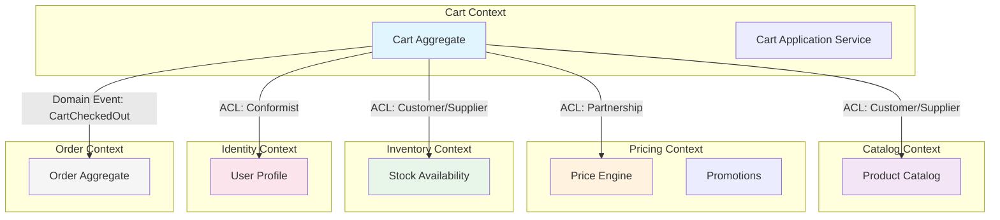

### 2.2 Типы отношений

| Связь                  | Тип отношения                  | Описание                                                                   |
| ---------------------- | ------------------------------ | -------------------------------------------------------------------------- |
| Cart → Catalog         | **Customer/Supplier** + ACL    | Cart — downstream consumer. ACL преобразует CatalogItem → CartItemSnapshot |
| Cart → Pricing         | **Partnership**                | Тесная кооперация. PriceDomainService делегирует расчёт через Gateway      |
| Cart → Inventory       | **Customer/Supplier**          | Cart запрашивает доступность; Inventory — upstream                         |
| Cart → Identity        | **Conformist**                 | Cart принимает модель пользователя as-is (user_id)                         |
| Cart → Order           | **Published Language**         | CartCheckedOut → доменное событие для Order context                        |
| Cart → Marketplace API | **ACL** (Anticorruption Layer) | Защитный слой от внешних API маркетплейсов                                 |

### 2.3 Anti-Corruption Layer (ACL)

ACL защищает доменную модель корзины от проникновения чужих концепций:

```python
# domain/interfaces.py — Порт (контракт домена)
from abc import ABC, abstractmethod
from dataclasses import dataclass
from decimal import Decimal
from uuid import UUID


@dataclass(frozen=True)
class CatalogItemSnapshot:
    """Value Object — снимок данных из Catalog-контекста.

    Это НЕ CatalogItem из Catalog BC. Это представление
    в языке Cart-контекста.
    """
    product_id: UUID
    variant_id: UUID
    name: str
    image_url: str
    max_quantity: int
    is_available: bool


class CatalogGateway(ABC):
    """Порт для взаимодействия с Catalog-контекстом."""

    @abstractmethod
    async def get_item_snapshot(
        self, product_id: UUID, variant_id: UUID
    ) -> CatalogItemSnapshot:
        ...

    @abstractmethod
    async def check_availability(
        self, variant_id: UUID, quantity: int
    ) -> bool:
        ...
```

```python
# infrastructure/adapters/catalog_adapter.py — Адаптер (ACL)
from domain.interfaces import CatalogGateway, CatalogItemSnapshot


class HttpCatalogAdapter(CatalogGateway):
    """Anti-Corruption Layer: преобразует внешнюю модель
    Catalog API в доменную модель Cart-контекста."""

    def __init__(self, http_client, base_url: str):
        self._client = http_client
        self._base_url = base_url

    async def get_item_snapshot(
        self, product_id, variant_id
    ) -> CatalogItemSnapshot:
        # Вызов внешнего API Catalog-сервиса
        response = await self._client.get(
            f"{self._base_url}/products/{product_id}/variants/{variant_id}"
        )
        data = response.json()

        # ACL: Трансляция из Catalog-модели в Cart-модель
        return CatalogItemSnapshot(
            product_id=product_id,
            variant_id=variant_id,
            name=data["title"],            # "title" → "name"
            image_url=data["images"][0],    # первое изображение
            max_quantity=data["stock_qty"], # "stock_qty" → "max_quantity"
            is_available=data["status"] == "active",
        )
```

---

## 3. Тактический дизайн: агрегат Cart

### 3.1 Правила проектирования агрегатов (по Vaughn Vernon)

Vaughn Vernon в серии статей "Effective Aggregate Design" сформулировал 4 ключевых правила:

| #   | Правило                                                        | Применение к Cart                                                             |
| --- | -------------------------------------------------------------- | ----------------------------------------------------------------------------- |
| 1   | **Моделируйте истинные инварианты в границах согласованности** | Cart отвечает за: total = sum(items), qty > 0, max items                      |
| 2   | **Проектируйте маленькие агрегаты**                            | Cart + CartItems — минимальный кластер. ~70% агрегатов = root + value objects |
| 3   | **Ссылайтесь на другие агрегаты по ID**                        | CartItem хранит `product_id`, `variant_id` — НЕ объекты Product               |
| 4   | **Используйте eventual consistency за пределами агрегата**     | Обновление Inventory, Pricing — через доменные события                        |

### 3.2 Диаграмма агрегата

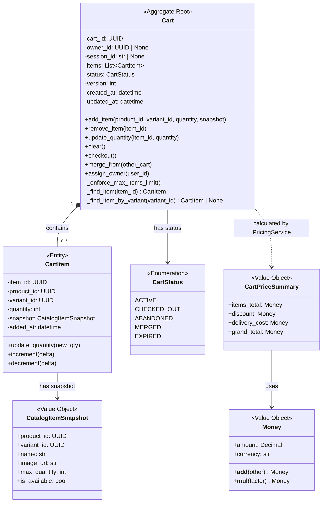

### 3.3 Реализация агрегата на Python

```python
# domain/entities.py
from __future__ import annotations

import uuid
from dataclasses import dataclass, field
from datetime import datetime, timezone
from enum import Enum
from typing import Optional
from decimal import Decimal

from domain.events import (
    DomainEvent,
    ItemAddedToCart,
    ItemRemovedFromCart,
    ItemQuantityChanged,
    CartCleared,
    CartCheckedOut,
    CartAbandoned,
    CartsMerged,
    CartOwnerAssigned,
)
from domain.value_objects import CatalogItemSnapshot, Money
from domain.exceptions import (
    CartItemNotFoundError,
    MaxItemsLimitExceededError,
    InvalidQuantityError,
    EmptyCartCheckoutError,
    CartAlreadyCheckedOutError,
    QuantityExceedsStockError,
)


class CartStatus(str, Enum):
    ACTIVE = "active"
    CHECKED_OUT = "checked_out"
    ABANDONED = "abandoned"
    MERGED = "merged"
    EXPIRED = "expired"


MAX_CART_ITEMS = 100
MAX_ITEM_QUANTITY = 99


@dataclass
class CartItem:
    """Сущность внутри агрегата Cart.

    Имеет собственную идентичность (item_id), но доступна
    только через корень агрегата Cart.
    """
    item_id: uuid.UUID
    product_id: uuid.UUID
    variant_id: uuid.UUID
    quantity: int
    snapshot: CatalogItemSnapshot
    added_at: datetime = field(
        default_factory=lambda: datetime.now(timezone.utc)
    )

    def update_quantity(self, new_qty: int) -> None:
        if new_qty < 1:
            raise InvalidQuantityError(
                f"Количество должно быть >= 1, получено: {new_qty}"
            )
        if new_qty > MAX_ITEM_QUANTITY:
            raise InvalidQuantityError(
                f"Количество не может превышать {MAX_ITEM_QUANTITY}"
            )
        if new_qty > self.snapshot.max_quantity:
            raise QuantityExceedsStockError(
                f"Запрошено {new_qty}, доступно {self.snapshot.max_quantity}"
            )
        self.quantity = new_qty


class Cart:
    """Корневая сущность (Aggregate Root) для корзины покупок.

    Все операции с CartItem проходят только через Cart.
    Cart контролирует все инварианты и генерирует
    доменные события.
    """

    def __init__(
        self,
        cart_id: uuid.UUID | None = None,
        owner_id: uuid.UUID | None = None,
        session_id: str | None = None,
        status: CartStatus = CartStatus.ACTIVE,
        version: int = 0,
    ):
        self.cart_id = cart_id or uuid.uuid4()
        self.owner_id = owner_id
        self.session_id = session_id
        self.status = status
        self.version = version
        self._items: list[CartItem] = []
        self._events: list[DomainEvent] = []
        self.created_at = datetime.now(timezone.utc)
        self.updated_at = self.created_at

    # ── Свойства ───────────────────────────────────────────

    @property
    def items(self) -> tuple[CartItem, ...]:
        """Иммутабельное представление позиций для внешнего мира."""
        return tuple(self._items)

    @property
    def item_count(self) -> int:
        return len(self._items)

    @property
    def total_quantity(self) -> int:
        return sum(item.quantity for item in self._items)

    @property
    def is_empty(self) -> bool:
        return len(self._items) == 0

    @property
    def events(self) -> list[DomainEvent]:
        return list(self._events)

    def clear_events(self) -> None:
        self._events.clear()

    # ── Команды (Command Methods) ──────────────────────────

    def add_item(
        self,
        product_id: uuid.UUID,
        variant_id: uuid.UUID,
        quantity: int,
        snapshot: CatalogItemSnapshot,
    ) -> CartItem:
        """Добавить товар в корзину.

        Если товар с таким variant_id уже есть —
        увеличить количество (merge).
        """
        self._ensure_active()

        if quantity < 1:
            raise InvalidQuantityError("Количество должно быть >= 1")

        # Проверяем, есть ли уже такой вариант в корзине
        existing = self._find_item_by_variant(variant_id)
        if existing is not None:
            new_qty = existing.quantity + quantity
            existing.update_quantity(new_qty)
            self._touch()
            self._record_event(ItemQuantityChanged(
                cart_id=self.cart_id,
                item_id=existing.item_id,
                old_quantity=existing.quantity - quantity,
                new_quantity=new_qty,
            ))
            return existing

        # Проверяем лимит позиций
        if len(self._items) >= MAX_CART_ITEMS:
            raise MaxItemsLimitExceededError(
                f"В корзине не может быть более {MAX_CART_ITEMS} позиций"
            )

        item = CartItem(
            item_id=uuid.uuid4(),
            product_id=product_id,
            variant_id=variant_id,
            quantity=quantity,
            snapshot=snapshot,
        )
        self._items.append(item)
        self._touch()

        self._record_event(ItemAddedToCart(
            cart_id=self.cart_id,
            item_id=item.item_id,
            product_id=product_id,
            variant_id=variant_id,
            quantity=quantity,
        ))
        return item

    def remove_item(self, item_id: uuid.UUID) -> None:
        """Удалить позицию из корзины."""
        self._ensure_active()
        item = self._find_item(item_id)
        self._items.remove(item)
        self._touch()

        self._record_event(ItemRemovedFromCart(
            cart_id=self.cart_id,
            item_id=item_id,
            product_id=item.product_id,
            variant_id=item.variant_id,
        ))

    def update_quantity(
        self, item_id: uuid.UUID, quantity: int
    ) -> None:
        """Изменить количество товара в позиции."""
        self._ensure_active()
        item = self._find_item(item_id)
        old_qty = item.quantity
        item.update_quantity(quantity)
        self._touch()

        self._record_event(ItemQuantityChanged(
            cart_id=self.cart_id,
            item_id=item_id,
            old_quantity=old_qty,
            new_quantity=quantity,
        ))

    def clear(self) -> None:
        """Очистить корзину."""
        self._ensure_active()
        self._items.clear()
        self._touch()
        self._record_event(CartCleared(cart_id=self.cart_id))

    def checkout(self) -> None:
        """Перевести корзину в состояние 'оформлен'.

        Инвариант: нельзя оформить пустую корзину.
        """
        self._ensure_active()
        if self.is_empty:
            raise EmptyCartCheckoutError(
                "Невозможно оформить пустую корзину"
            )
        self.status = CartStatus.CHECKED_OUT
        self._touch()
        self._record_event(CartCheckedOut(
            cart_id=self.cart_id,
            owner_id=self.owner_id,
            item_count=self.item_count,
            total_quantity=self.total_quantity,
        ))

    def mark_abandoned(self) -> None:
        """Пометить корзину как брошенную."""
        if self.status != CartStatus.ACTIVE:
            return  # Идемпотентность
        self.status = CartStatus.ABANDONED
        self._touch()
        self._record_event(CartAbandoned(
            cart_id=self.cart_id,
            owner_id=self.owner_id,
            item_count=self.item_count,
        ))

    def merge_from(self, other: Cart) -> None:
        """Слить содержимое другой корзины в эту.

        Используется при переходе guest → authenticated.
        """
        self._ensure_active()
        for other_item in other.items:
            self.add_item(
                product_id=other_item.product_id,
                variant_id=other_item.variant_id,
                quantity=other_item.quantity,
                snapshot=other_item.snapshot,
            )
        self._record_event(CartsMerged(
            target_cart_id=self.cart_id,
            source_cart_id=other.cart_id,
        ))

    def assign_owner(self, user_id: uuid.UUID) -> None:
        """Привязать корзину к авторизованному пользователю."""
        self.owner_id = user_id
        self._touch()
        self._record_event(CartOwnerAssigned(
            cart_id=self.cart_id,
            owner_id=user_id,
        ))

    # ── Приватные методы ───────────────────────────────────

    def _find_item(self, item_id: uuid.UUID) -> CartItem:
        for item in self._items:
            if item.item_id == item_id:
                return item
        raise CartItemNotFoundError(
            f"Позиция {item_id} не найдена в корзине {self.cart_id}"
        )

    def _find_item_by_variant(
        self, variant_id: uuid.UUID
    ) -> CartItem | None:
        for item in self._items:
            if item.variant_id == variant_id:
                return item
        return None

    def _ensure_active(self) -> None:
        if self.status != CartStatus.ACTIVE:
            raise CartAlreadyCheckedOutError(
                f"Корзина {self.cart_id} не активна "
                f"(status={self.status.value})"
            )

    def _touch(self) -> None:
        self.updated_at = datetime.now(timezone.utc)
        self.version += 1

    def _record_event(self, event: DomainEvent) -> None:
        self._events.append(event)
```

### 3.4 Value Objects

```python
# domain/value_objects.py
from dataclasses import dataclass
from decimal import Decimal
from uuid import UUID


@dataclass(frozen=True)
class CatalogItemSnapshot:
    """Неизменяемый снимок данных из Catalog-контекста."""
    product_id: UUID
    variant_id: UUID
    name: str
    image_url: str
    max_quantity: int
    is_available: bool


@dataclass(frozen=True)
class Money:
    """Value Object для денежных сумм."""
    amount: Decimal
    currency: str = "RUB"

    def __post_init__(self):
        if self.amount < 0:
            raise ValueError(f"Сумма не может быть отрицательной: {self.amount}")

    def __add__(self, other: "Money") -> "Money":
        if self.currency != other.currency:
            raise ValueError("Нельзя складывать разные валюты")
        return Money(self.amount + other.amount, self.currency)

    def __sub__(self, other: "Money") -> "Money":
        if self.currency != other.currency:
            raise ValueError("Нельзя вычитать разные валюты")
        return Money(self.amount - other.amount, self.currency)

    def __mul__(self, factor: int | Decimal) -> "Money":
        return Money(self.amount * Decimal(str(factor)), self.currency)

    @classmethod
    def zero(cls, currency: str = "RUB") -> "Money":
        return cls(Decimal("0"), currency)


@dataclass(frozen=True)
class CartPriceSummary:
    """Value Object — итоговая стоимость корзины."""
    items_total: Money
    discount: Money
    delivery_cost: Money

    @property
    def grand_total(self) -> Money:
        return self.items_total - self.discount + self.delivery_cost
```

### 3.5 Оптимистичная блокировка (Optimistic Concurrency)

Агрегат Cart содержит поле `version`, которое инкрементируется при каждом изменении состояния. Это обеспечивает защиту от конкурентных обновлений (Cosmic Python, Chapter 7).

```python
# infrastructure/repositories/cart_repository.py
from sqlalchemy import select, update
from sqlalchemy.exc import StaleDataError

from domain.entities import Cart


class SqlAlchemyCartRepository:
    """Репозиторий с оптимистичной блокировкой."""

    def __init__(self, session):
        self.session = session
        self.seen: set[Cart] = set()

    async def get(self, cart_id) -> Cart | None:
        result = await self.session.execute(
            select(CartModel).where(
                CartModel.id == cart_id
            )
        )
        row = result.scalar_one_or_none()
        if row is None:
            return None
        cart = self._to_domain(row)
        self.seen.add(cart)
        return cart

    async def save(self, cart: Cart) -> None:
        """Сохранение с проверкой версии (optimistic lock)."""
        expected_version = cart.version
        result = await self.session.execute(
            update(CartModel)
            .where(
                CartModel.id == cart.cart_id,
                CartModel.version == expected_version - 1,  # предыдущая версия
            )
            .values(
                status=cart.status.value,
                owner_id=cart.owner_id,
                version=expected_version,
                updated_at=cart.updated_at,
                items=self._serialize_items(cart.items),
            )
        )
        if result.rowcount == 0:
            raise StaleDataError(
                f"Cart {cart.cart_id} was modified concurrently "
                f"(expected version {expected_version - 1})"
            )
        self.seen.add(cart)
```

**Альтернатива — SELECT FOR UPDATE (пессимистичная блокировка):**

```python
async def get_for_update(self, cart_id) -> Cart | None:
    """Пессимистичная блокировка для критичных операций (checkout)."""
    result = await self.session.execute(
        select(CartModel)
        .where(CartModel.id == cart_id)
        .with_for_update()  # блокировка строки
    )
    row = result.scalar_one_or_none()
    if row is None:
        return None
    return self._to_domain(row)
```

| Подход                             | Плюсы                                                 | Минусы                                       |
| ---------------------------------- | ----------------------------------------------------- | -------------------------------------------- |
| Оптимистичная блокировка (version) | Высокая конкурентность, лучшая пропускная способность | Нужна логика retry при конфликтах            |
| Пессимистичная (SELECT FOR UPDATE) | Предотвращает конфликты                               | Снижение конкурентности, возможные deadlocks |

**Рекомендация:** Оптимистичная блокировка для обычных операций (add/remove/update), пессимистичная — для checkout.

---

## 4. Доменные события и Event-Driven архитектура

### 4.1 Определение доменных событий

```python
# domain/events.py
from dataclasses import dataclass, field
from datetime import datetime, timezone
from uuid import UUID, uuid4


@dataclass(frozen=True)
class DomainEvent:
    """Базовый класс для всех доменных событий."""
    event_id: UUID = field(default_factory=uuid4)
    occurred_at: datetime = field(
        default_factory=lambda: datetime.now(timezone.utc)
    )


@dataclass(frozen=True)
class ItemAddedToCart(DomainEvent):
    cart_id: UUID = None
    item_id: UUID = None
    product_id: UUID = None
    variant_id: UUID = None
    quantity: int = 0


@dataclass(frozen=True)
class ItemRemovedFromCart(DomainEvent):
    cart_id: UUID = None
    item_id: UUID = None
    product_id: UUID = None
    variant_id: UUID = None


@dataclass(frozen=True)
class ItemQuantityChanged(DomainEvent):
    cart_id: UUID = None
    item_id: UUID = None
    old_quantity: int = 0
    new_quantity: int = 0


@dataclass(frozen=True)
class CartCleared(DomainEvent):
    cart_id: UUID = None


@dataclass(frozen=True)
class CartCheckedOut(DomainEvent):
    """Ключевое интеграционное событие.
    Инициирует Saga для создания заказа."""
    cart_id: UUID = None
    owner_id: UUID | None = None
    item_count: int = 0
    total_quantity: int = 0


@dataclass(frozen=True)
class CartAbandoned(DomainEvent):
    cart_id: UUID = None
    owner_id: UUID | None = None
    item_count: int = 0


@dataclass(frozen=True)
class CartsMerged(DomainEvent):
    target_cart_id: UUID = None
    source_cart_id: UUID = None


@dataclass(frozen=True)
class CartOwnerAssigned(DomainEvent):
    cart_id: UUID = None
    owner_id: UUID = None
```

### 4.2 Message Bus (шина сообщений)

Реализация по паттерну из Cosmic Python:

```python
# application/message_bus.py
from typing import Callable, Type

from domain.events import DomainEvent


class MessageBus:
    """Внутренняя шина сообщений для обработки доменных событий."""

    def __init__(self):
        self._handlers: dict[Type[DomainEvent], list[Callable]] = {}

    def register(
        self,
        event_type: Type[DomainEvent],
        handler: Callable,
    ) -> None:
        self._handlers.setdefault(event_type, []).append(handler)

    async def handle(self, event: DomainEvent) -> None:
        for handler in self._handlers.get(type(event), []):
            await handler(event)

    async def publish_all(self, events: list[DomainEvent]) -> None:
        for event in events:
            await self.handle(event)
```

### 4.3 Unit of Work с публикацией событий

```python
# application/unit_of_work.py
from __future__ import annotations

from abc import ABC, abstractmethod

from application.message_bus import MessageBus


class AbstractUnitOfWork(ABC):
    cart_repo: AbstractCartRepository
    message_bus: MessageBus

    async def __aenter__(self) -> AbstractUnitOfWork:
        return self

    async def __aexit__(self, exc_type, exc_val, exc_tb):
        if exc_type:
            await self.rollback()

    async def commit(self) -> None:
        await self._commit()
        await self._publish_domain_events()

    async def _publish_domain_events(self) -> None:
        """Собирает и публикует события со всех tracked агрегатов."""
        for cart in self.cart_repo.seen:
            while cart.events:
                event = cart.events.pop(0)
                await self.message_bus.handle(event)

    @abstractmethod
    async def _commit(self) -> None: ...

    @abstractmethod
    async def rollback(self) -> None: ...


class SqlAlchemyUnitOfWork(AbstractUnitOfWork):
    def __init__(self, session_factory, message_bus: MessageBus):
        self._session_factory = session_factory
        self.message_bus = message_bus

    async def __aenter__(self):
        self.session = self._session_factory()
        self.cart_repo = SqlAlchemyCartRepository(self.session)
        return self

    async def _commit(self):
        await self.session.commit()

    async def rollback(self):
        await self.session.rollback()
```

### 4.4 Диаграмма потока событий

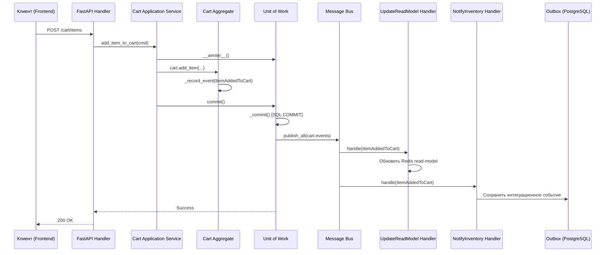

---

## 5. CQRS для корзины

### 5.1 Разделение команд и запросов

CQRS (Command Query Responsibility Segregation) разделяет операции записи и чтения. Для корзины это особенно актуально: запросы на чтение (показ корзины) происходят гораздо чаще, чем команды (изменение корзины).

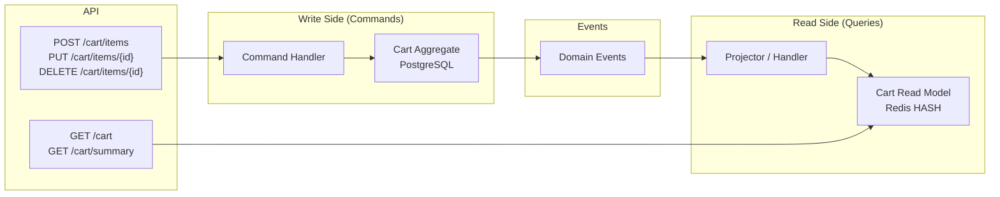

### 5.2 Write Side: команды

```python
# application/commands.py
from dataclasses import dataclass
from uuid import UUID


@dataclass(frozen=True)
class AddItemToCart:
    cart_id: UUID
    product_id: UUID
    variant_id: UUID
    quantity: int


@dataclass(frozen=True)
class RemoveItemFromCart:
    cart_id: UUID
    item_id: UUID


@dataclass(frozen=True)
class UpdateItemQuantity:
    cart_id: UUID
    item_id: UUID
    quantity: int


@dataclass(frozen=True)
class CheckoutCart:
    cart_id: UUID
    owner_id: UUID


@dataclass(frozen=True)
class ClearCart:
    cart_id: UUID
```

```python
# application/command_handlers.py

class CartCommandHandler:
    def __init__(
        self,
        uow: AbstractUnitOfWork,
        catalog_gateway: CatalogGateway,
    ):
        self._uow = uow
        self._catalog = catalog_gateway

    async def handle_add_item(self, cmd: AddItemToCart) -> None:
        async with self._uow as uow:
            cart = await uow.cart_repo.get(cmd.cart_id)
            if cart is None:
                cart = Cart(cart_id=cmd.cart_id)
                await uow.cart_repo.add(cart)

            # Получаем снимок через ACL
            snapshot = await self._catalog.get_item_snapshot(
                cmd.product_id, cmd.variant_id
            )

            cart.add_item(
                product_id=cmd.product_id,
                variant_id=cmd.variant_id,
                quantity=cmd.quantity,
                snapshot=snapshot,
            )
            await uow.commit()

    async def handle_checkout(self, cmd: CheckoutCart) -> None:
        async with self._uow as uow:
            # SELECT FOR UPDATE для checkout
            cart = await uow.cart_repo.get_for_update(cmd.cart_id)
            if cart is None:
                raise CartNotFoundError(cmd.cart_id)

            cart.checkout()
            await uow.commit()
            # CartCheckedOut событие будет опубликовано через UoW
```

### 5.3 Read Side: денормализованная модель в Redis

```python
# application/read_model.py
import json
from uuid import UUID
from redis.asyncio import Redis

from domain.events import (
    ItemAddedToCart,
    ItemRemovedFromCart,
    ItemQuantityChanged,
    CartCleared,
)


class CartReadModelProjector:
    """Обновляет денормализованную read-модель в Redis
    на основе доменных событий."""

    def __init__(self, redis: Redis):
        self._redis = redis

    async def on_item_added(self, event: ItemAddedToCart) -> None:
        key = f"cart:{event.cart_id}"
        item_data = json.dumps({
            "item_id": str(event.item_id),
            "product_id": str(event.product_id),
            "variant_id": str(event.variant_id),
            "quantity": event.quantity,
        })
        await self._redis.hset(key, str(event.item_id), item_data)
        await self._redis.expire(key, 7 * 24 * 3600)  # TTL: 7 дней

    async def on_item_removed(self, event: ItemRemovedFromCart) -> None:
        key = f"cart:{event.cart_id}"
        await self._redis.hdel(key, str(event.item_id))

    async def on_quantity_changed(
        self, event: ItemQuantityChanged
    ) -> None:
        key = f"cart:{event.cart_id}"
        raw = await self._redis.hget(key, str(event.item_id))
        if raw:
            data = json.loads(raw)
            data["quantity"] = event.new_quantity
            await self._redis.hset(
                key, str(event.item_id), json.dumps(data)
            )

    async def on_cart_cleared(self, event: CartCleared) -> None:
        key = f"cart:{event.cart_id}"
        await self._redis.delete(key)


class CartQueryService:
    """Сервис запросов — читает из Redis read-модели."""

    def __init__(self, redis: Redis):
        self._redis = redis

    async def get_cart_view(self, cart_id: UUID) -> dict:
        key = f"cart:{cart_id}"
        items_raw = await self._redis.hgetall(key)
        items = [json.loads(v) for v in items_raw.values()]
        return {
            "cart_id": str(cart_id),
            "items": items,
            "item_count": len(items),
            "total_quantity": sum(i["quantity"] for i in items),
        }
```

### 5.4 API Layer: разделение endpoints

```python
# presentation/cart_router.py
from fastapi import APIRouter, Depends, status

router = APIRouter(prefix="/cart", tags=["cart"])


# ── Write endpoints (Commands) ──────────────────────

@router.post("/items", status_code=status.HTTP_201_CREATED)
async def add_item(
    body: AddItemRequest,
    handler: CartCommandHandler = Depends(get_command_handler),
):
    await handler.handle_add_item(
        AddItemToCart(
            cart_id=body.cart_id,
            product_id=body.product_id,
            variant_id=body.variant_id,
            quantity=body.quantity,
        )
    )
    return {"status": "ok"}


@router.delete("/items/{item_id}", status_code=status.HTTP_204_NO_CONTENT)
async def remove_item(
    item_id: UUID,
    cart_id: UUID = Query(...),
    handler: CartCommandHandler = Depends(get_command_handler),
):
    await handler.handle_remove_item(
        RemoveItemFromCart(cart_id=cart_id, item_id=item_id)
    )


@router.post("/checkout", status_code=status.HTTP_202_ACCEPTED)
async def checkout(
    body: CheckoutRequest,
    handler: CartCommandHandler = Depends(get_command_handler),
):
    await handler.handle_checkout(
        CheckoutCart(cart_id=body.cart_id, owner_id=body.owner_id)
    )
    return {"status": "processing"}


# ── Read endpoints (Queries) ────────────────────────

@router.get("/")
async def get_cart(
    cart_id: UUID = Query(...),
    query_service: CartQueryService = Depends(get_query_service),
):
    """Читает из Redis read-модели — быстро и без нагрузки на БД."""
    return await query_service.get_cart_view(cart_id)


@router.get("/summary")
async def get_cart_summary(
    cart_id: UUID = Query(...),
    query_service: CartQueryService = Depends(get_query_service),
):
    return await query_service.get_cart_summary(cart_id)
```

---

## 6. Event Sourcing: анализ применимости

### 6.1 Что такое Event Sourcing для корзины

В Event Sourcing вместо хранения текущего состояния корзины хранится последовательность неизменяемых событий. Состояние восстанавливается путём "проигрывания" всех событий.

```python
# Пример: Event-Sourced Cart (если бы использовали ES)

class EventSourcedCart:
    """Агрегат с Event Sourcing."""

    def __init__(self, events: list[DomainEvent] | None = None):
        self.cart_id = None
        self._items: list[CartItem] = []
        self.status = CartStatus.ACTIVE
        self._changes: list[DomainEvent] = []

        # Replay stored events to rebuild state
        if events:
            for event in events:
                self._apply(event)

    def add_item(self, product_id, variant_id, qty, snapshot):
        # Бизнес-логика...
        event = ItemAddedToCart(
            cart_id=self.cart_id,
            item_id=uuid4(),
            product_id=product_id,
            variant_id=variant_id,
            quantity=qty,
        )
        self._apply(event)
        self._changes.append(event)  # Новые (несохранённые) события

    def _apply(self, event: DomainEvent):
        """Применение события к состоянию (мутация)."""
        match event:
            case ItemAddedToCart():
                self._items.append(CartItem(
                    item_id=event.item_id,
                    product_id=event.product_id,
                    variant_id=event.variant_id,
                    quantity=event.quantity,
                    snapshot=...,
                ))
            case ItemRemovedFromCart():
                self._items = [
                    i for i in self._items
                    if i.item_id != event.item_id
                ]
            case CartCheckedOut():
                self.status = CartStatus.CHECKED_OUT
```

### 6.2 Анализ: когда ES оправдан для корзины?

| Критерий              | ES подходит                             | ES избыточен           |
| --------------------- | --------------------------------------- | ---------------------- |
| **Аудит**             | Нужна полная история изменений          | Достаточно логирования |
| **Временные запросы** | "Что было в корзине час назад?"         | Не требуется           |
| **Аналитика**         | Глубокий анализ поведения пользователей | Базовая аналитика      |
| **Объём данных**      | Мало событий на корзину (< 50)          | Тысячи событий         |
| **Сложность**         | Команда знакома с ES                    | Первый проект с DDD    |
| **Проекции**          | Множество read-моделей                  | Одна read-модель       |

### 6.3 Рекомендация

> **Для нашего проекта: State-based persistence + Domain Events (без полного ES).**

Причины:
1. Корзина — короткоживущий агрегат (средний TTL < 7 дней)
2. Количество событий на корзину невелико (5-20)
3. Полная история корзины не нужна для бизнес-требований
4. State-based проще в реализации и отладке
5. Доменные события покрывают потребности в интеграции и CQRS

При необходимости всегда можно перейти на ES позже — доменная модель уже генерирует события.

---

## 7. Saga-паттерн для Checkout

### 7.1 Проблема

Checkout — это распределённая транзакция, затрагивающая несколько сервисов:
1. Создать заказ (Order Service)
2. Зарезервировать товар (Inventory Service)
3. Списать оплату (Payment Service)
4. Создать доставку (Delivery Service)

ACID-транзакция невозможна в микросервисной архитектуре. Saga решает это через последовательность локальных транзакций с компенсирующими действиями.

### 7.2 Оркестрация vs Хореография

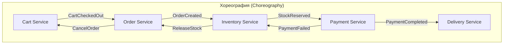

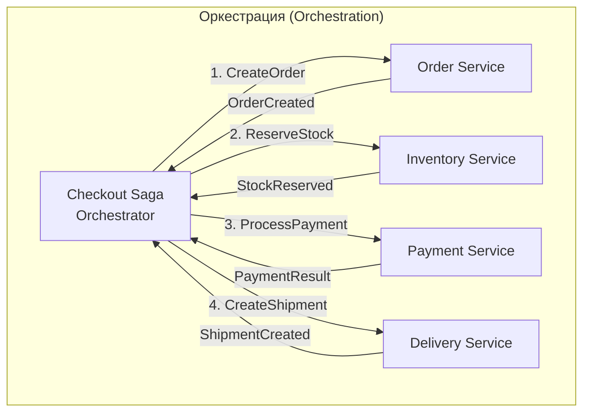

| Критерий                      | Хореография            | Оркестрация                 |
| ----------------------------- | ---------------------- | --------------------------- |
| Связность                     | Слабая                 | Средняя (через оркестратор) |
| Сложность                     | Растёт с числом шагов  | Контролируемая              |
| Видимость flow                | Разбросана по сервисам | Централизована              |
| Тестируемость                 | Сложнее                | Проще                       |
| **Рекомендация для checkout** | **Нет**                | **Да**                      |

### 7.3 Реализация Checkout Saga

```python
# application/sagas/checkout_saga.py
from enum import Enum
from dataclasses import dataclass, field
from uuid import UUID, uuid4


class CheckoutStep(str, Enum):
    CREATE_ORDER = "create_order"
    RESERVE_STOCK = "reserve_stock"
    PROCESS_PAYMENT = "process_payment"
    CONFIRM_ORDER = "confirm_order"
    COMPLETED = "completed"
    FAILED = "failed"


@dataclass
class CheckoutSagaState:
    """Состояние Saga — персистится в БД."""
    saga_id: UUID = field(default_factory=uuid4)
    cart_id: UUID = None
    order_id: UUID | None = None
    current_step: CheckoutStep = CheckoutStep.CREATE_ORDER
    completed_steps: list[str] = field(default_factory=list)
    failure_reason: str | None = None


class CheckoutSagaOrchestrator:
    """Оркестратор Saga для процесса checkout.

    Управляет последовательностью шагов и компенсациями.
    """

    def __init__(
        self,
        order_service: OrderServiceClient,
        inventory_service: InventoryServiceClient,
        payment_service: PaymentServiceClient,
        saga_repo: SagaRepository,
    ):
        self._order = order_service
        self._inventory = inventory_service
        self._payment = payment_service
        self._saga_repo = saga_repo

    async def start(self, cart_id: UUID, cart_items: list) -> UUID:
        state = CheckoutSagaState(cart_id=cart_id)
        await self._saga_repo.save(state)

        try:
            # Шаг 1: Создать заказ
            order_id = await self._order.create_order(
                cart_id=cart_id, items=cart_items
            )
            state.order_id = order_id
            state.completed_steps.append(CheckoutStep.CREATE_ORDER)

            # Шаг 2: Зарезервировать товар
            state.current_step = CheckoutStep.RESERVE_STOCK
            await self._inventory.reserve_stock(
                order_id=order_id, items=cart_items
            )
            state.completed_steps.append(CheckoutStep.RESERVE_STOCK)

            # Шаг 3: Обработать оплату
            state.current_step = CheckoutStep.PROCESS_PAYMENT
            await self._payment.process_payment(order_id=order_id)
            state.completed_steps.append(CheckoutStep.PROCESS_PAYMENT)

            # Шаг 4: Подтвердить заказ
            state.current_step = CheckoutStep.CONFIRM_ORDER
            await self._order.confirm_order(order_id=order_id)
            state.completed_steps.append(CheckoutStep.CONFIRM_ORDER)

            state.current_step = CheckoutStep.COMPLETED
            await self._saga_repo.save(state)
            return state.saga_id

        except Exception as e:
            state.failure_reason = str(e)
            state.current_step = CheckoutStep.FAILED
            await self._compensate(state)
            await self._saga_repo.save(state)
            raise

    async def _compensate(self, state: CheckoutSagaState) -> None:
        """Компенсирующие транзакции в обратном порядке."""
        for step in reversed(state.completed_steps):
            match step:
                case CheckoutStep.PROCESS_PAYMENT:
                    await self._payment.refund(state.order_id)
                case CheckoutStep.RESERVE_STOCK:
                    await self._inventory.release_stock(state.order_id)
                case CheckoutStep.CREATE_ORDER:
                    await self._order.cancel_order(state.order_id)
```

### 7.4 State Machine для статуса Cart → Order

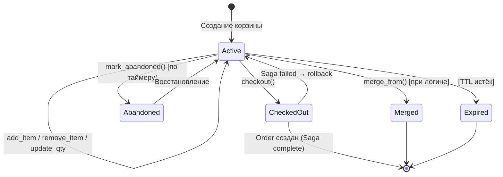

---

## 8. Outbox-паттерн для надёжной доставки событий

### 8.1 Проблема Dual Write

При сохранении агрегата и публикации событий возникает проблема "двойной записи": если БД сохранена, а сообщение в брокер не отправлено (или наоборот), система оказывается в неконсистентном состоянии.

### 8.2 Решение: Transactional Outbox

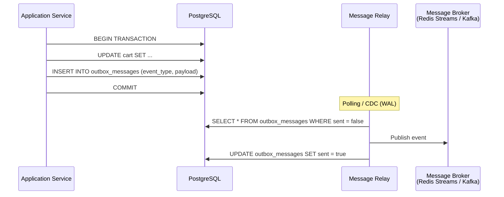

### 8.3 Схема таблицы outbox

```sql
CREATE TABLE outbox_messages (
    id              UUID PRIMARY KEY DEFAULT gen_random_uuid(),
    aggregate_type  VARCHAR(100) NOT NULL,  -- 'Cart'
    aggregate_id    UUID NOT NULL,
    event_type      VARCHAR(200) NOT NULL,  -- 'CartCheckedOut'
    payload         JSONB NOT NULL,
    created_at      TIMESTAMPTZ NOT NULL DEFAULT now(),
    sent_at         TIMESTAMPTZ,
    is_sent         BOOLEAN NOT NULL DEFAULT false,

    -- Для ordering и дедупликации
    sequence_number BIGSERIAL
);

CREATE INDEX idx_outbox_unsent
    ON outbox_messages (is_sent, created_at)
    WHERE is_sent = false;
```

### 8.4 Реализация в Python

```python
# infrastructure/outbox/outbox_publisher.py
import json
from datetime import datetime, timezone
from uuid import UUID

from domain.events import DomainEvent


class OutboxPublisher:
    """Сохраняет доменные события в outbox-таблицу
    в рамках той же транзакции, что и агрегат."""

    def __init__(self, session):
        self._session = session

    async def store_event(
        self,
        aggregate_id: UUID,
        event: DomainEvent,
    ) -> None:
        await self._session.execute(
            """
            INSERT INTO outbox_messages
                (aggregate_type, aggregate_id, event_type, payload)
            VALUES
                (:agg_type, :agg_id, :event_type, :payload)
            """,
            {
                "agg_type": "Cart",
                "agg_id": aggregate_id,
                "event_type": type(event).__name__,
                "payload": json.dumps(
                    self._serialize_event(event)
                ),
            },
        )


class OutboxRelay:
    """Периодически читает неотправленные сообщения
    и публикует в брокер."""

    def __init__(self, session_factory, broker):
        self._session_factory = session_factory
        self._broker = broker

    async def poll_and_publish(self, batch_size: int = 100) -> int:
        async with self._session_factory() as session:
            result = await session.execute(
                """
                SELECT id, event_type, payload, aggregate_id
                FROM outbox_messages
                WHERE is_sent = false
                ORDER BY sequence_number
                LIMIT :batch_size
                FOR UPDATE SKIP LOCKED
                """,
                {"batch_size": batch_size},
            )
            rows = result.fetchall()

            for row in rows:
                await self._broker.publish(
                    topic=row.event_type,
                    payload=row.payload,
                    key=str(row.aggregate_id),
                )
                await session.execute(
                    """
                    UPDATE outbox_messages
                    SET is_sent = true, sent_at = now()
                    WHERE id = :id
                    """,
                    {"id": row.id},
                )
            await session.commit()
            return len(rows)
```

### 8.5 Альтернатива: PostgreSQL WAL + Logical Replication

Для продвинутых сценариев можно использовать CDC (Change Data Capture) через PostgreSQL WAL. Логическая репликация позволяет PostgreSQL стримить изменения из outbox-таблицы без polling. Однако polling-подход проще для начала.

---

## 9. Персистенция: PostgreSQL + Redis

### 9.1 Стратегия гибридного хранения

```
┌─────────────────────────┐     ┌─────────────────────────┐
│      PostgreSQL         │     │         Redis           │
│    (Write Model)        │     │     (Read Model)        │
│                         │     │                         │
│  ┌────────────────────┐ │     │  cart:{id} = HASH {     │
│  │ carts              │ │     │    item1: {json...},    │
│  │ - id (PK)          │ │     │    item2: {json...},    │
│  │ - owner_id         │ │     │  }                      │
│  │ - session_id       │ │     │                         │
│  │ - status           │ │     │  TTL: 7 days            │
│  │ - version          │ │     │                         │
│  │ - created_at       │ │     │  cart:summary:{id} = {  │
│  │ - updated_at       │ │     │    item_count: 5,       │
│  └────────────────────┘ │     │    total: "12500.00",   │
│                         │     │  }                      │
│  ┌────────────────────┐ │     │                         │
│  │ cart_items         │ │     │  TTL: 7 days            │
│  │ - id (PK)          │ │     └─────────────────────────┘
│  │ - cart_id (FK)     │ │
│  │ - product_id       │ │
│  │ - variant_id       │ │
│  │ - quantity         │ │
│  │ - snapshot (JSONB) │ │
│  │ - added_at         │ │
│  └────────────────────┘ │
│                         │
│  ┌────────────────────┐ │
│  │ outbox_messages    │ │
│  │ (события для relay)│ │
│  └────────────────────┘ │
└─────────────────────────┘
```

### 9.2 Redis: структуры данных для корзины

Основная структура — **HASH** (по паттерну Redis in Action):

```python
# Ключевая конвенция:
#   cart:{cart_id}          — содержимое корзины
#   cart:summary:{cart_id}  — предрассчитанный итог
#   cart:ttl:{cart_id}      — метка последней активности

async def add_to_cart(redis, cart_id: str, item_id: str, data: dict):
    """Добавить/обновить позицию в Redis-кэше."""
    key = f"cart:{cart_id}"
    if data["quantity"] <= 0:
        await redis.hdel(key, item_id)
    else:
        await redis.hset(key, item_id, json.dumps(data))
    # Обновить TTL при каждом действии
    await redis.expire(key, 7 * 24 * 3600)  # 7 дней
```

### 9.3 SQL-схема (PostgreSQL)

```sql
-- Таблица корзин
CREATE TABLE carts (
    id          UUID PRIMARY KEY DEFAULT gen_random_uuid(),
    owner_id    UUID REFERENCES users(id),
    session_id  VARCHAR(255),
    status      VARCHAR(20) NOT NULL DEFAULT 'active'
                CHECK (status IN ('active','checked_out','abandoned','merged','expired')),
    version     INTEGER NOT NULL DEFAULT 0,
    created_at  TIMESTAMPTZ NOT NULL DEFAULT now(),
    updated_at  TIMESTAMPTZ NOT NULL DEFAULT now(),

    -- Один active cart на пользователя
    CONSTRAINT uq_owner_active_cart
        UNIQUE (owner_id) WHERE status = 'active'
);

CREATE INDEX idx_carts_session ON carts(session_id) WHERE status = 'active';
CREATE INDEX idx_carts_owner ON carts(owner_id) WHERE status = 'active';

-- Позиции корзины
CREATE TABLE cart_items (
    id          UUID PRIMARY KEY DEFAULT gen_random_uuid(),
    cart_id     UUID NOT NULL REFERENCES carts(id) ON DELETE CASCADE,
    product_id  UUID NOT NULL,
    variant_id  UUID NOT NULL,
    quantity    INTEGER NOT NULL CHECK (quantity > 0 AND quantity <= 99),
    snapshot    JSONB NOT NULL DEFAULT '{}',
    added_at    TIMESTAMPTZ NOT NULL DEFAULT now(),

    CONSTRAINT uq_cart_variant UNIQUE (cart_id, variant_id)
);

CREATE INDEX idx_cart_items_cart ON cart_items(cart_id);
```

### 9.4 TTL и управление жизненным циклом

```python
# infrastructure/tasks/cart_expiration.py

class CartExpirationService:
    """Фоновая задача для обработки истекших корзин."""

    CART_TTL_DAYS = 7
    ABANDONMENT_THRESHOLD_HOURS = 1

    async def process_expired_carts(self):
        """Запускается по cron (каждые 5 минут)."""
        cutoff = datetime.now(timezone.utc) - timedelta(
            days=self.CART_TTL_DAYS
        )
        expired = await self._repo.find_active_before(cutoff)
        for cart in expired:
            cart.status = CartStatus.EXPIRED
            await self._repo.save(cart)
            # Очистить Redis-кэш
            await self._redis.delete(f"cart:{cart.cart_id}")

    async def detect_abandoned_carts(self):
        """Обнаружение брошенных корзин для recovery."""
        cutoff = datetime.now(timezone.utc) - timedelta(
            hours=self.ABANDONMENT_THRESHOLD_HOURS
        )
        candidates = await self._repo.find_inactive_since(cutoff)
        for cart in candidates:
            if not cart.is_empty:
                cart.mark_abandoned()
                await self._repo.save(cart)
                # CartAbandoned событие → email recovery flow
```

---

## 10. Слияние гостевой и авторизованной корзины

### 10.1 Проблема

Пользователь может:
1. Добавить товары в корзину как гость (session-based)
2. Затем авторизоваться
3. У него уже может быть сохранённая корзина

Необходимо определить стратегию объединения.

### 10.2 Стратегии слияния

| Стратегия            | Описание                                                 | Используется            |
| -------------------- | -------------------------------------------------------- | ----------------------- |
| **Silent Merge**     | Автоматическое объединение без уведомления               | Amazon, Walmart, eBay   |
| **Session Priority** | Гостевая корзина заменяет сохранённую                    | Если анонимная непустая |
| **Interactive**      | Пользователь выбирает: сохранить / заменить / объединить | Сложная UX              |
| **Cart Archive**     | Старая корзина → wishlist, новая остаётся                | Shopify                 |

**Рекомендация:** Silent Merge — наиболее распространённый и удобный для пользователя подход.

### 10.3 Алгоритм Silent Merge

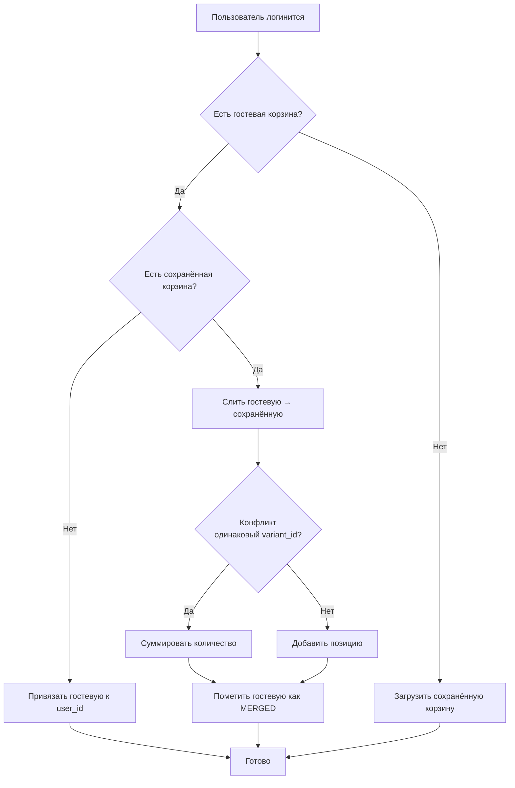

### 10.4 Реализация

```python
# application/services/cart_merge_service.py

class CartMergeService:
    """Сервис слияния гостевой и авторизованной корзин."""

    async def merge_on_login(
        self,
        user_id: UUID,
        session_id: str,
    ) -> Cart:
        async with self._uow as uow:
            guest_cart = await uow.cart_repo.get_by_session(session_id)
            user_cart = await uow.cart_repo.get_active_by_owner(user_id)

            if guest_cart is None:
                # Нет гостевой корзины — просто вернуть пользовательскую
                return user_cart

            if user_cart is None:
                # Нет сохранённой корзины — привязать гостевую к user
                guest_cart.assign_owner(user_id)
                await uow.commit()
                return guest_cart

            # Слияние: guest → user cart (Silent Merge)
            user_cart.merge_from(guest_cart)

            # Пометить гостевую как объединённую
            guest_cart.status = CartStatus.MERGED
            await uow.commit()

            return user_cart
```

### 10.5 Edge Cases при слиянии

| Ситуация                         | Поведение                                    |
| -------------------------------- | -------------------------------------------- |
| Одинаковый SKU в обеих корзинах  | Суммировать quantity (с проверкой max)       |
| Товар стал недоступен            | Сохранить в корзине, показать предупреждение |
| Превышен max_items после слияния | Приоритет позициям из гостевой (свежее)      |
| Купоны в гостевой корзине        | Не переносить (по HybriSmart рекомендации)   |
| Корзина на checkout              | Не сливать, показать предупреждение          |

---

## 11. Отслеживание брошенных корзин

### 11.1 Определение

Корзина считается "брошенной", если:
- Содержит хотя бы 1 товар
- Пользователь не выполнял действий более N часов
- Корзина не была оформлена (status != checked_out)

### 11.2 Multi-step Recovery Flow

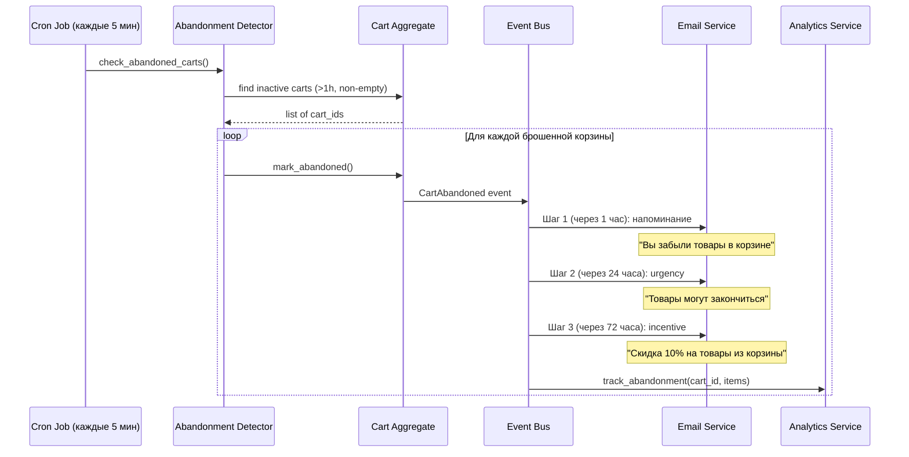

### 11.3 Метрики

- **Cart Abandonment Rate** = (кол-во брошенных / кол-во созданных) × 100%
- Средний показатель в e-commerce: ~70%
- Эффективные recovery-программы возвращают 15-30% брошенных корзин

---

## 12. BFF и API Gateway для корзины

### 12.1 Паттерн Backend for Frontend

BFF создаёт выделенные бэкенды для каждого типа клиента, оптимизируя данные и латентность.

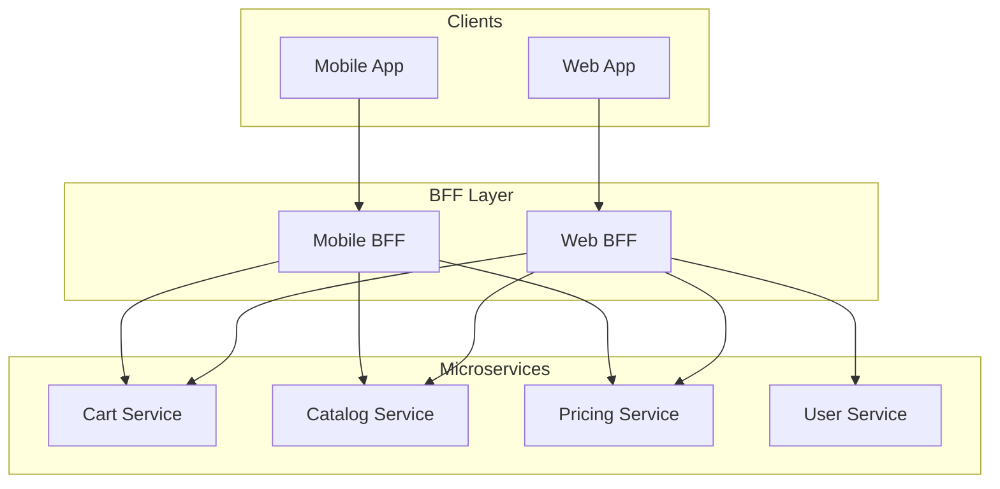

### 12.2 Агрегация данных в BFF

```python
# Web BFF: полная информация о корзине с деталями товаров
@router.get("/cart/full")
async def get_full_cart(
    cart_id: UUID,
    cart_service: CartServiceClient,
    catalog_service: CatalogServiceClient,
    pricing_service: PricingServiceClient,
):
    """BFF агрегирует данные из нескольких сервисов
    в один ответ для фронтенда."""
    cart = await cart_service.get_cart(cart_id)

    # Параллельные запросы к другим сервисам
    product_ids = [item["product_id"] for item in cart["items"]]
    products, prices = await asyncio.gather(
        catalog_service.get_products_batch(product_ids),
        pricing_service.calculate_cart_price(cart_id),
    )

    # Обогащение данных
    return {
        "cart_id": str(cart_id),
        "items": [
            {
                **item,
                "product": products.get(item["product_id"]),
                "line_total": prices["line_totals"].get(item["item_id"]),
            }
            for item in cart["items"]
        ],
        "summary": prices["summary"],
    }
```

---

## 13. Референсные реализации

### 13.1 Microsoft eShopOnContainers

Наиболее известная референсная реализация DDD-микросервисов от Microsoft.

**Ключевые принципы:**
- Basket (корзина) — отдельный микросервис с Redis-хранилищем
- Ordering — DDD-микросервис с CQRS, агрегатами, доменными событиями
- Все операции через aggregate root
- Не используются публичные сеттеры на сущностях
- Слои: Domain → Application → Infrastructure → API

**Архитектурные решения:**
- Basket хранится в Redis (cache-first, не в PostgreSQL)
- Checkout создаёт integration event → Ordering BC
- CQRS применяется только к write-стороне (команды)
- Queries — простые SQL без ORM

> Источник: [Microsoft Learn — DDD-oriented microservice](https://learn.microsoft.com/en-us/dotnet/architecture/microservices/microservice-ddd-cqrs-patterns/ddd-oriented-microservice)

### 13.2 Walmart Cart Service (DDD + Hexagonal)

Walmart Engineering описали архитектуру Cart-сервиса в двух статьях:

**Часть 1 — Стратегический дизайн:**
- Cart как отдельный Bounded Context
- Context Map: Partnership с Pricing, Customer/Supplier с Catalog
- ACL для трансляции между моделями
- Единый язык: `addItemToCart()`, `calculateCartPrice()`

**Часть 2 — Тактический дизайн:**
- Cart = Aggregate Root
- CartItem = Entity
- CartPrice = Value Object
- Port & Adapter (Hexagonal) архитектура
- Domain Services для pricing-логики

> Источник: [Walmart Global Tech Blog — Part 1](https://medium.com/walmartglobaltech/implementing-cart-service-with-ddd-hexagonal-port-adapter-architecture-part-1-4dab93b3fa9f), [Part 2](https://medium.com/walmartglobaltech/implementing-cart-service-with-ddd-hexagonal-port-adapter-architecture-part-2-d9c00e290ab)

### 13.3 Cosmic Python (Architecture Patterns with Python)

Каноническая книга для Python-разработчиков по DDD/Clean Architecture:

**Ключевые паттерны с примерами кода:**
- Aggregate + version number (Chapter 7)
- Domain Events + Message Bus (Chapter 8)
- CQRS с read-моделями (Chapter 12)
- Unit of Work с публикацией событий
- Repository pattern с `seen` set для tracking

> Источник: [cosmicpython.com](https://www.cosmicpython.com/book/chapter_07_aggregate.html)

### 13.4 Vaughn Vernon — Effective Aggregate Design

4 правила проектирования агрегатов:
1. Моделируйте истинные инварианты в границах согласованности
2. Проектируйте маленькие агрегаты
3. Ссылайтесь на другие агрегаты только по ID
4. Используйте eventual consistency за пределами агрегата

> Источник: [DDD Community — Effective Aggregate Design](https://www.dddcommunity.org/library/vernon_2011/)

### 13.5 EventStorming для Cart (Alberto Brandolini)

EventStorming позволяет быстро визуализировать бизнес-процессы:

```
[Событие]           [Команда]           [Агрегат]
──────────          ─────────           ─────────
ItemAddedToCart  ←  AddItemToCart     →  Cart
ItemRemoved      ←  RemoveItem        →  Cart
QuantityChanged  ←  UpdateQuantity    →  Cart
CartCheckedOut   ←  Checkout          →  Cart
OrderCreated     ←  CreateOrder       →  Order
StockReserved    ←  ReserveStock      →  Inventory
PaymentProcessed ←  ProcessPayment    →  Payment
```

> Источник: [EventStorming.com](https://www.eventstorming.com/book/), [Building Inventa — Medium](https://medium.com/building-inventa/how-we-used-event-storming-meetings-for-enabling-software-domain-driven-design-401e5d708eb)

---

## 14. Рекомендации для нашего стека

### 14.1 Архитектурные решения

| Решение             | Рекомендация                       | Обоснование                                |
| ------------------- | ---------------------------------- | ------------------------------------------ |
| **Persistence**     | State-based (не Event Sourcing)    | Простота; корзина — короткоживущий агрегат |
| **Write Store**     | PostgreSQL                         | ACID, optimistic locking, outbox           |
| **Read Store**      | Redis (HASH)                       | Быстрые GET, TTL, денормализация           |
| **Concurrency**     | Optimistic locking (version)       | Высокая конкурентность для add/remove      |
| **Checkout lock**   | SELECT FOR UPDATE                  | Защита от двойного checkout                |
| **Events delivery** | Outbox + Polling Relay             | Надёжность без Kafka                       |
| **Cart → Order**    | Saga (Orchestration)               | Прозрачность, тестируемость                |
| **Guest merge**     | Silent Merge                       | UX-стандарт индустрии                      |
| **Pricing**         | Domain Service + ACL               | Делегирование Pricing-контексту            |
| **Cart TTL**        | 7 дней (Redis) + cron cleanup (PG) | Баланс между UX и ресурсами                |

### 14.2 Структура модуля

```
src/modules/cart/
├── domain/
│   ├── __init__.py
│   ├── entities.py          # Cart (Aggregate Root), CartItem (Entity)
│   ├── value_objects.py     # Money, CatalogItemSnapshot, CartPriceSummary
│   ├── events.py            # Доменные события
│   ├── exceptions.py        # Доменные исключения
│   └── interfaces.py        # Порты: CatalogGateway, PricingGateway
│
├── application/
│   ├── __init__.py
│   ├── commands.py          # AddItemToCart, RemoveItem, Checkout...
│   ├── command_handlers.py  # Обработчики команд
│   ├── queries.py           # GetCart, GetCartSummary
│   ├── query_service.py     # Read-model queries (Redis)
│   ├── message_bus.py       # Внутренняя шина сообщений
│   ├── unit_of_work.py      # UoW с публикацией событий
│   └── sagas/
│       └── checkout_saga.py # Оркестратор Checkout Saga
│
├── infrastructure/
│   ├── __init__.py
│   ├── repositories/
│   │   └── cart_repository.py    # SQLAlchemy repository
│   ├── adapters/
│   │   ├── catalog_adapter.py    # ACL: Catalog → Cart model
│   │   └── pricing_adapter.py    # ACL: Pricing → Cart model
│   ├── outbox/
│   │   ├── outbox_publisher.py   # Сохранение событий в outbox
│   │   └── outbox_relay.py       # Polling + публикация
│   └── read_model/
│       └── redis_projector.py    # CQRS: update Redis on events
│
└── presentation/
    ├── __init__.py
    ├── cart_router.py       # FastAPI endpoints
    └── schemas.py           # Pydantic request/response models
```

### 14.3 Диаграмма зависимостей

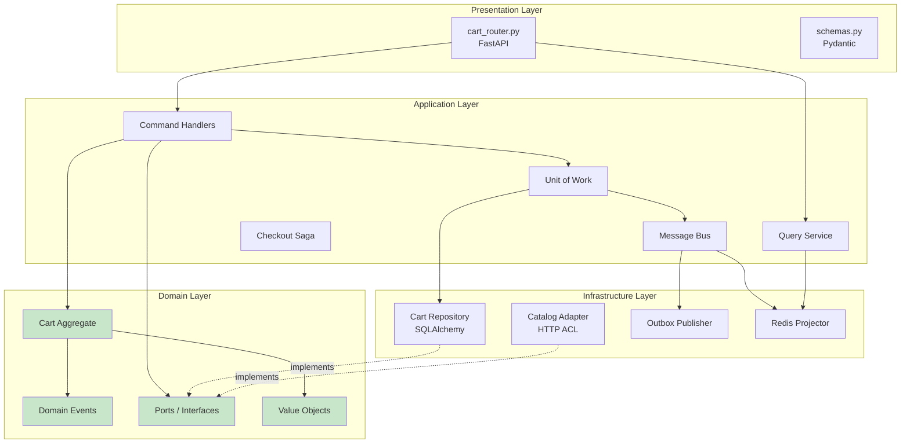

> **Ключевой принцип:** Domain Layer не зависит ни от какого другого слоя. Все зависимости направлены внутрь (Dependency Inversion Principle).

---

## Источники

### Книги и статьи

- [Cosmic Python — Aggregates and Consistency Boundaries (Chapter 7)](https://www.cosmicpython.com/book/chapter_07_aggregate.html)
- [Cosmic Python — Events and the Message Bus (Chapter 8)](https://www.cosmicpython.com/book/chapter_08_events_and_message_bus.html)
- [Cosmic Python — CQRS (Chapter 12)](https://www.cosmicpython.com/book/chapter_12_cqrs.html)
- [Vaughn Vernon — Effective Aggregate Design](https://www.dddcommunity.org/library/vernon_2011/)
- [Vaughn Vernon — Aggregate Design Rules](https://www.archi-lab.io/infopages/ddd/aggregate-design-rules-vernon.html)

### Референсные реализации

- [Microsoft Learn — Designing a DDD-oriented microservice](https://learn.microsoft.com/en-us/dotnet/architecture/microservices/microservice-ddd-cqrs-patterns/ddd-oriented-microservice)
- [Microsoft Learn — Applying CQRS and CQS in eShopOnContainers](https://learn.microsoft.com/en-us/dotnet/architecture/microservices/microservice-ddd-cqrs-patterns/eshoponcontainers-cqrs-ddd-microservice)
- [Walmart Global Tech — Cart Service with DDD (Part 1)](https://medium.com/walmartglobaltech/implementing-cart-service-with-ddd-hexagonal-port-adapter-architecture-part-1-4dab93b3fa9f)
- [Walmart Global Tech — Cart Service with DDD (Part 2)](https://medium.com/walmartglobaltech/implementing-cart-service-with-ddd-hexagonal-port-adapter-architecture-part-2-d9c00e290ab)
- [GitHub — simara-svatopluk/cart (DDD Cart Demo)](https://github.com/simara-svatopluk/cart)

### Паттерны

- [microservices.io — Saga Pattern](https://microservices.io/patterns/data/saga.html)
- [microservices.io — Transactional Outbox](https://microservices.io/patterns/data/transactional-outbox.html)
- [Microsoft Learn — Event Sourcing Pattern](https://learn.microsoft.com/en-us/azure/architecture/patterns/event-sourcing)
- [Event-Driven.io — Push-based Outbox with PostgreSQL](https://event-driven.io/en/push_based_outbox_pattern_with_postgres_logical_replication/)

### Корзина: специфические паттерны

- [Redis — Shopping Carts in Redis](https://redis.io/ebook/part-1-getting-started/chapter-2-anatomy-of-a-redis-web-application/2-2-shopping-carts-in-redis/)
- [HybriSmart — Merging Carts on Customer Login](https://hybrismart.com/2019/02/24/merging-carts-when-a-customer-logs-in-problems-solutions-and-recommendations/)
- [EventStorming.com — Alberto Brandolini](https://www.eventstorming.com/book/)

### Python-экосистема

- [Python eventsourcing library](https://github.com/pyeventsourcing/eventsourcing)
- [breadcrumbscollector — Event Sourcing in Python](https://breadcrumbscollector.tech/implementing-event-sourcing-in-python-part-1-aggregates/)
- [GitHub — tomasanchez/cosmic-fastapi (DDD + FastAPI Template)](https://github.com/tomasanchez/cosmic-fastapi)
- [GitHub — marcosvs98/cqrs-architecture-with-python](https://github.com/marcosvs98/cqrs-architecture-with-python)

### Микросервисные паттерны

- [Sam Newman — Backends for Frontends](https://samnewman.io/patterns/architectural/bff/)
- [AWS — Anti-Corruption Layer Pattern](https://docs.aws.amazon.com/prescriptive-guidance/latest/cloud-design-patterns/acl.html)
- [DZone — Microservices Powered by DDD](https://dzone.com/articles/microservices-powered-by-domain-driven-design)
