# Архитектура ценообразования, промо-акций и платежей в корзине e-commerce

> **Версия:** 1.0
> **Дата:** 2026-03-25
> **Автор:** Senior FinTech/Payment Architect Research
> **Фокус:** Финансовая точность, кросс-бордер коммерция, CIS-специфика

---

## Содержание

1. [Executive Summary](#1-executive-summary)
2. [Движок ценообразования корзины](#2-движок-ценообразования-корзины)
3. [Паттерн Money и финансовая точность](#3-паттерн-money-и-финансовая-точность)
4. [Мультивалютность](#4-мультивалютность)
5. [Система промо-акций и скидок](#5-система-промо-акций-и-скидок)
6. [Налоги и пошлины](#6-налоги-и-пошлины)
7. [Финансовая целостность корзины](#7-финансовая-целостность-корзины)
8. [Платёжная интеграция](#8-платёжная-интеграция)
9. [Доменная модель (DDD)](#9-доменная-модель-ddd)
10. [Практическая реализация на Python](#10-практическая-реализация-на-python)
11. [Ключевые выводы](#11-ключевые-выводы)
12. [Источники](#12-источники)

---

## 1. Executive Summary

Движок ценообразования корзины — одна из самых критичных и сложных подсистем e-commerce платформы. Ошибка в один тийин (0.01 UZS) при миллионах транзакций приводит к системным финансовым потерям.

**Ключевые принципы мирового класса:**

- **Никогда не используйте float для денег** — только `Decimal` (Python) или `BigNumber` (JS), или хранение в минимальных единицах валюты (тийины/копейки)
- **Округление только на выходе** — промежуточные вычисления хранятся с полной точностью
- **Все цены — снапшоты** — корзина хранит "замороженные" цены с TTL и ревалидацией при checkout
- **Скидки предвычисляются на уровне item** — даже cart-level скидки распределяются по позициям до расчёта налога
- **Аудит-трейл обязателен** — каждое изменение цены в корзине логируется с причиной и временной меткой
- **Идемпотентность** — повторный запрос расчёта цены даёт идентичный результат

**Для нашего рынка (Узбекистан + ЕАЭС):**
- UZS — валюта без минорных единиц в практическом использовании (0 десятичных знаков в ценообразовании)
- Интеграция с Payme, Click, Uzum — обязательна
- НДС 12% — tax-inclusive модель (B2C)
- De minimis порог ЕАЭС: €200 и 31 кг для кросс-бордер посылок

---

## 2. Движок ценообразования корзины

### 2.1 Пайплайн расчёта цены

Расчёт цены в корзине — это последовательный конвейер трансформаций, где порядок шагов критически важен.

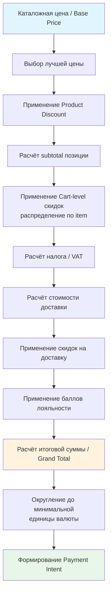

### 2.2 Этапы расчёта (детализация)

**Шаг 1: Выбор цены (Price Selection)**

Система выбирает наиболее подходящую цену из множества вариантов по иерархии приоритетов (на примере commercetools):

1. Customer Group + Channel + Country
2. Customer Group + Channel (все страны)
3. Customer Group + Country (все каналы)
4. Customer Group only
5. Channel + Country
6. Channel only
7. Country only
8. Цена без ограничений (fallback)

Цены с ограниченным периодом действия проверяются первыми. При множественных customer groups выбирается наименьшая цена.

**Шаг 2: Product Discount (скидка на товар)**

Применяется до добавления в корзину. Отображается на PDP/PLP. Только одна product-скидка на цену за раз (по sortOrder).

**Шаг 3: Item Subtotal**

```
item_subtotal = unit_price × quantity
```

**Шаг 4: Cart-level скидки → распределение по items**

Критически важный паттерн: cart-level скидка (например, "300 сум скидка на корзину") **предвычисляется** и **записывается как adjustment на уровне каждого item** пропорционально его стоимости.

**Шаг 5: Налог**

Для tax-exclusive:
```
tax_total = (subtotal - discount_total) × tax_rate
```

Для tax-inclusive:
```
tax_total = total × (1 - 1 / (1 + tax_rate))
subtotal = total - tax_total
```

**Шаг 6: Grand Total**
```
grand_total = Σ(item_totals) + shipping_total - shipping_discount - loyalty_points_value
```

### 2.3 Price Snapshot vs Live Calculation

| Аспект           | Price Snapshot                                 | Live Calculation                        |
| ---------------- | ---------------------------------------------- | --------------------------------------- |
| **Суть**         | Цена "замораживается" при добавлении в корзину | Цена пересчитывается при каждом запросе |
| **Перформанс**   | Высокий (из кэша)                              | Низкий (запрос к Pricing Service)       |
| **Актуальность** | Может устареть                                 | Всегда актуальна                        |
| **UX**           | Стабильный — нет "прыгающих" цен               | Может раздражать изменениями            |
| **Рекомендация** | Snapshot с TTL + ревалидация при checkout      | Для динамического pricing               |

**Best practice (Broadleaf Commerce):**
- Хранить `lastCatalogReprice` timestamp на корзине
- TTL по умолчанию: 60 минут
- При checkout — обязательная ревалидация (`CartStalePricingValidationActivity`)
- Если новая цена ниже — обновить молча
- Если новая цена выше — показать alert пользователю и запросить подтверждение

### 2.4 Rule Engine для ценообразования

**Варианты реализации:**

| Решение        | Язык                   | Тип                      | Стоимость                        |
| -------------- | ---------------------- | ------------------------ | -------------------------------- |
| **Drools**     | Java/JVM               | Open-source rule engine  | Бесплатно + $60K-$180K поддержка |
| **GoRules**    | Python, Node, Go, Rust | Облачный decision engine | SaaS-модель                      |
| **Custom DSL** | Python                 | JSON-based правила       | Бесплатно                        |
| **Nected**     | REST API               | Low-code rules           | 60-80% дешевле Drools            |

**Рекомендация для Python-стека:** Custom DSL с JSON-правилами + Python evaluation engine. Drools избыточен для среднего marketplace.

Пример правила в JSON:
```json
{
  "rule_id": "summer_sale_2026",
  "conditions": [
    {"type": "cart_total", "operator": "GTE", "value": 500000},
    {"type": "category", "operator": "IN", "value": ["electronics", "fashion"]},
    {"type": "date_range", "operator": "BETWEEN", "value": ["2026-06-01", "2026-08-31"]}
  ],
  "action": {
    "type": "percentage_discount",
    "value": 15,
    "max_discount": 200000,
    "target": "cart"
  },
  "priority": 10,
  "stackable": false
}
```

---

## 3. Паттерн Money и финансовая точность

### 3.1 Проблема (Martin Fowler)

> "A large proportion of the computers in this world manipulate money, so it's always puzzled me that money isn't actually a first class data type in any mainstream programming language."

Две фундаментальные проблемы:
1. **Смешение валют** — сложение долларов с сумами без конвертации
2. **Потеря точности при округлении** — накопление ошибок в дробных вычислениях

### 3.2 Почему float запрещён

```python
# НИКОГДА так не делайте!
>>> 0.1 + 0.2
0.30000000000000004

>>> 0.1 + 0.2 == 0.3
False

# Правильно:
>>> from decimal import Decimal
>>> Decimal('0.1') + Decimal('0.2')
Decimal('0.3')

>>> Decimal('0.1') + Decimal('0.2') == Decimal('0.3')
True
```

### 3.3 ISO 4217 — десятичные знаки валют

| Код | Валюта              | Minor Units                     | Пример     |
| --- | ------------------- | ------------------------------- | ---------- |
| UZS | Узбекский сум       | 2 (формально) / 0 (практически) | 100000 сум |
| USD | Доллар США          | 2                               | $19.99     |
| EUR | Евро                | 2                               | €19.99     |
| KZT | Казахстанский тенге | 2                               | ₸1999.00   |
| RUB | Российский рубль    | 2                               | ₽1999.00   |
| KWD | Кувейтский динар    | 3                               | KD 19.990  |
| JPY | Японская иена       | 0                               | ¥1999      |
| BHD | Бахрейнский динар   | 3                               | BD 19.990  |

**Важно для UZS:** Хотя ISO 4217 определяет 2 десятичных знака для UZS (тийины), в практическом e-commerce Узбекистана цены округляются до целых сумов. Тийины не используются в розничной торговле.

### 3.4 Стратегии округления

**Banker's Rounding (Round Half-Even)** — рекомендуемый метод:

```python
from decimal import Decimal, ROUND_HALF_EVEN

# Стандартное округление: 2.5 → 3, 3.5 → 4 (смещение вверх)
# Banker's rounding: 2.5 → 2, 3.5 → 4 (к ближайшему чётному)

price = Decimal('19.995')
rounded = price.quantize(Decimal('0.01'), rounding=ROUND_HALF_EVEN)
# Result: Decimal('20.00')

price2 = Decimal('19.985')
rounded2 = price2.quantize(Decimal('0.01'), rounding=ROUND_HALF_EVEN)
# Result: Decimal('19.98')
```

**8 правил обращения с "висячими копейками" (Shopify Engineering):**

1. **Уведомить стейкхолдеров** — показать где именно происходит округление
2. **Использовать Banker's Rounding** — минимизация систематического смещения
3. **Типы данных с максимальной точностью** — Decimal, не float
4. **Единообразие** — один метод округления по всему коду
5. **Явное округление** — prefix `rounded_` для переменных
6. **Государственные стандарты** — налоговые органы часто диктуют правила
7. **Округлять только при необходимости** — только финальные суммы к оплате
8. **Документировать для пользователей** — прозрачность метода расчёта

### 3.5 Аллокация (распределение) копеек

При распределении суммы между N позициями неизбежно возникают "лишние" копейки:

```python
from decimal import Decimal, ROUND_HALF_EVEN

def allocate_money(total: Decimal, ratios: list[Decimal]) -> list[Decimal]:
    """
    Распределение суммы по пропорциям без потери копеек.
    Алгоритм Мартина Фаулера из PoEAA.
    """
    sum_ratios = sum(ratios)
    results = []
    remainder = total

    for i, ratio in enumerate(ratios):
        if i == len(ratios) - 1:
            # Последний элемент получает весь остаток
            results.append(remainder)
        else:
            share = (total * ratio / sum_ratios).quantize(
                Decimal('0.01'), rounding=ROUND_HALF_EVEN
            )
            results.append(share)
            remainder -= share

    return results

# Пример: 100.00 делим на 3 части
total = Decimal('100.00')
parts = allocate_money(total, [Decimal('1'), Decimal('1'), Decimal('1')])
# [Decimal('33.33'), Decimal('33.33'), Decimal('33.34')]
# Сумма = 100.00 ✓
```

---

## 4. Мультивалютность

### 4.1 Три слоя валют

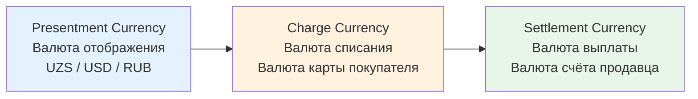

| Слой            | Описание                                       | Кто определяет                  |
| --------------- | ---------------------------------------------- | ------------------------------- |
| **Presentment** | Цена, которую видит покупатель на сайте        | Геолокация / выбор пользователя |
| **Charge**      | Валюта, в которой реально списываются средства | Банк-эмитент карты              |
| **Settlement**  | Валюта, в которой продавец получает деньги     | Настройки merchant account      |

### 4.2 Стратегии фиксации курса (FX Rate Locking)

| Стратегия        | Момент фиксации                    | Риск продавца             | Риск покупателя | Use Case               |
| ---------------- | ---------------------------------- | ------------------------- | --------------- | ---------------------- |
| **At Cart Add**  | При добавлении товара              | Высокий (курс может уйти) | Низкий          | Дорогие товары         |
| **At Checkout**  | При оформлении заказа              | Средний                   | Средний         | Стандартный e-commerce |
| **At Payment**   | При списании средств               | Низкий                    | Высокий         | Микроплатежи           |
| **Forward Rate** | Фиксируется на период (до 30 дней) | Заложен в spread          | Низкий          | Подписки               |

**Рекомендация:** Фиксация курса при checkout с TTL 15-30 минут. Если покупатель не завершил оплату за это время — пересчёт.

### 4.3 Регуляторные требования

**ЕС (Директива о ценах):**
- Все цены должны отображаться с включёнными налогами (tax-inclusive)
- Итоговая цена со всеми сборами показывается в начале процесса оформления
- Запрещена дискриминация по стране проживания при одинаковой доставке
- PSD2 запрещает надбавки (surcharges) за оплату картами

**ЕАЭС (Россия, Казахстан, Кыргызстан, Беларусь, Армения):**
- De minimis: €200 и 31 кг для личных посылок
- Превышение — таможенная пошлина по единым ставкам
- С 2018 года e-commerce товары в Казахстане облагаются как личные посылки

**Узбекистан:**
- Все платежи в UZS (расчёты в иностранной валюте запрещены в рознице)
- НДС 12% (tax-inclusive для B2C)
- Интеграция с Uzcard/HUMO обязательна для карточных платежей

---

## 5. Система промо-акций и скидок

### 5.1 Таксономия скидок

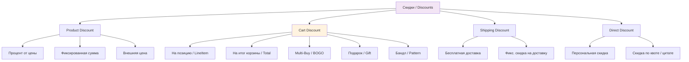

### 5.2 Порядок применения скидок (Evaluation Order)

На примере архитектуры commercetools:

1. **Product Discounts** → применяются к базовой цене
2. **Cart Discounts на LineItems/CustomLineItems** → по sortOrder
3. **Gift line items** → бесплатные товары добавляются
4. **Shipping cost discounts** → скидки на доставку
5. **Total price discounts** → скидки на итог корзины
6. **Discount Groups** → выбирается лучший вариант из группы
7. **Direct Discounts** → применяются в порядке массива (исключают Cart Discounts)

### 5.3 Стекинг скидок (Stacking Rules)

**Два основных режима:**

| Режим             | Описание                                                      | Пример                                 |
| ----------------- | ------------------------------------------------------------- | -------------------------------------- |
| **Stacking**      | Product + Cart скидки применяются последовательно             | Товарная скидка 10% + промокод 500 сум |
| **Best Deal**     | Система считает оба варианта и выбирает лучший для покупателя | MAX(Product Discounts, Cart Discounts) |
| **StopAfterThis** | Скидка применяется, все последующие игнорируются              | VIP-скидка блокирует промокоды         |

**Защита маржи (guardrails):**
- Максимальный % скидки на корзину (например, не более 40%)
- Halt condition — остановка стекинга при достижении лимита
- Conflict resolution — при двух exclusive промо выбирается одно
- Tracking использования — предотвращение злоупотреблений

### 5.4 Архитектура промо-движка

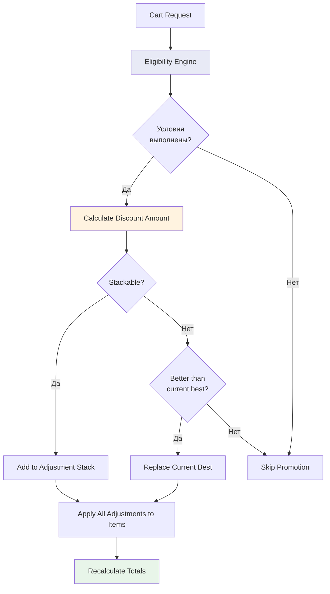

**Компоненты Eligibility Engine:**

```python
# Структура правила валидации скидки
@dataclass(frozen=True)
class PromotionRule:
    rule_type: str       # "cart_total", "item_count", "category", "user_segment"
    operator: str        # "GTE", "LTE", "EQ", "IN", "BETWEEN"
    value: Any           # Порог или множество значений

@dataclass
class Promotion:
    id: str
    name: str
    rules: list[PromotionRule]
    action: DiscountAction
    priority: int
    stackable: bool
    max_uses_total: int
    max_uses_per_user: int
    valid_from: datetime
    valid_to: datetime
```

### 5.5 Лояльность (баллы) в корзине

Интеграция баллов лояльности в расчёт корзины:

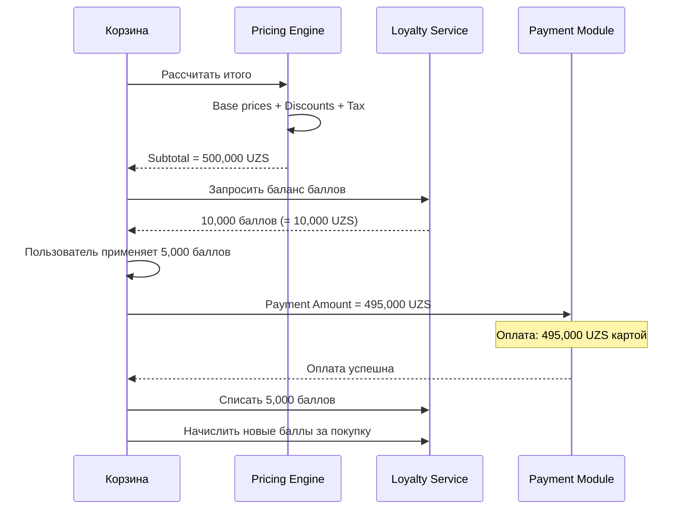

**Правила конвертации:**
- Exchange Rate: 1 балл = 1 UZS (настраиваемый коэффициент)
- Баллы применяются **после** расчёта налога
- Баллы — это **не скидка** (не влияют на налоговую базу)
- API: создание Transaction Journal в Loyalty Management при каждом заказе

### 5.6 Flash Sale архитектура

Для flash-распродаж с ограниченным инвентарём:

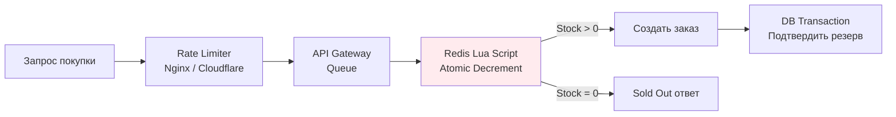

**Ключевые паттерны:**
- **Atomic counters в Redis** — `DECR` операция атомарна, нет race conditions
- **Lua Script** — read-modify-write выполняется как единая операция
- **Inventory Sharding** — разделение стока на N ключей для распределения нагрузки
- **Pre-event allocation** — жёсткий лимит в системе до начала распродажи

---

## 6. Налоги и пошлины

### 6.1 Tax-Inclusive vs Tax-Exclusive

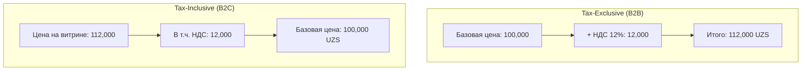

**Формулы:**

Tax-Exclusive (НДС сверху):
```
tax = base_price × tax_rate
total = base_price + tax
```

Tax-Inclusive (НДС внутри):
```
base_price = total / (1 + tax_rate)
tax = total - base_price
```

```python
from decimal import Decimal, ROUND_HALF_EVEN

def calculate_tax_exclusive(base_price: Decimal, tax_rate: Decimal) -> tuple[Decimal, Decimal]:
    """B2B: НДС начисляется сверху."""
    tax = (base_price * tax_rate).quantize(Decimal('1'), rounding=ROUND_HALF_EVEN)
    total = base_price + tax
    return tax, total

def extract_tax_inclusive(total_price: Decimal, tax_rate: Decimal) -> tuple[Decimal, Decimal]:
    """B2C: НДС уже включён в цену."""
    base_price = (total_price / (1 + tax_rate)).quantize(Decimal('1'), rounding=ROUND_HALF_EVEN)
    tax = total_price - base_price
    return tax, base_price

# Пример для Узбекистана (НДС 12%)
tax, total = calculate_tax_exclusive(Decimal('100000'), Decimal('0.12'))
# tax = 12000, total = 112000

tax2, base = extract_tax_inclusive(Decimal('112000'), Decimal('0.12'))
# tax2 = 12000, base = 100000
```

### 6.2 Интеграция с налоговыми сервисами

| Сервис                  | Покрытие                     | Интеграция                 | Лучше для               |
| ----------------------- | ---------------------------- | -------------------------- | ----------------------- |
| **Avalara AvaTax**      | 1400+ интеграций, глобальный | Pre-built connectors + API | Enterprise, multi-state |
| **TaxJar**              | API-first                    | REST API                   | SaaS стартапы           |
| **Vertex**              | SAP, Oracle, NetSuite        | ERP plugins                | Manufacturing           |
| **Custom (наш случай)** | Узбекистан, ЕАЭС             | Встроенный модуль          | Единая ставка НДС       |

**Для Узбекистана:** При единой ставке НДС 12% внешний налоговый сервис избыточен. Достаточно встроенного модуля с конфигурируемой ставкой и поддержкой tax-inclusive/exclusive.

### 6.3 De Minimis и таможенные пошлины (кросс-бордер)

| Регион        | De Minimis (Duty) | De Minimis (Tax)        | Примечания                  |
| ------------- | ----------------- | ----------------------- | --------------------------- |
| **ЕАЭС**      | €200 / 31 кг      | Включён                 | Единая ставка сверх порога  |
| **Казахстан** | €200 / 31 кг      | Включён                 | С 2018 — как личные посылки |
| **ЕС**        | €150              | €0 (НДС с первого евро) | IOSS для e-commerce         |
| **США**       | $800              | $800                    | Снижение с 2026 года        |

**Расчёт кросс-бордер пошлины:**
```python
def calculate_cross_border_duty(
    item_value: Decimal,
    shipping_cost: Decimal,
    weight_kg: Decimal,
    destination: str = "EAEU"
) -> Decimal:
    """Расчёт таможенной пошлины для ЕАЭС."""
    declared_value = item_value + shipping_cost  # CIF стоимость

    if destination == "EAEU":
        DE_MINIMIS_VALUE = Decimal('200')  # EUR
        DE_MINIMIS_WEIGHT = Decimal('31')  # кг
        DUTY_RATE = Decimal('0.15')  # 15% сверх порога
        MIN_DUTY_PER_KG = Decimal('2')  # €2/кг минимум

        if declared_value <= DE_MINIMIS_VALUE and weight_kg <= DE_MINIMIS_WEIGHT:
            return Decimal('0')

        excess_value = max(declared_value - DE_MINIMIS_VALUE, Decimal('0'))
        duty_by_value = excess_value * DUTY_RATE

        excess_weight = max(weight_kg - DE_MINIMIS_WEIGHT, Decimal('0'))
        duty_by_weight = excess_weight * MIN_DUTY_PER_KG

        return max(duty_by_value, duty_by_weight)

    return Decimal('0')
```

---

## 7. Финансовая целостность корзины

### 7.1 Race Condition Prevention

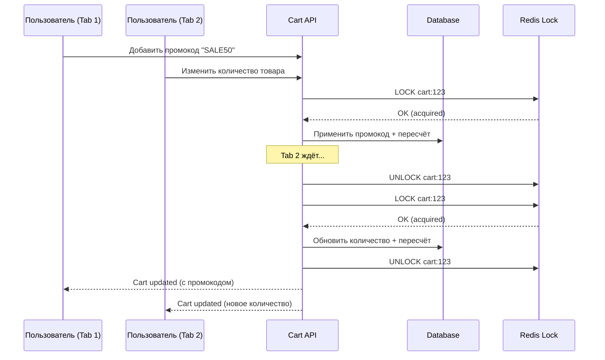

**Стратегии:**
- **Optimistic Locking** — version field на Cart entity, конфликт = retry
- **Pessimistic Locking** — Redis Redlock для критических секций
- **Saga Pattern** — для распределённых транзакций (Cart + Inventory + Pricing)

### 7.2 Идемпотентность

```python
import hashlib
from decimal import Decimal

def calculate_cart_total_idempotent(
    cart_id: str,
    items: list[dict],
    promotions: list[str],
    request_id: str  # Уникальный ID запроса от клиента
) -> dict:
    """
    Идемпотентный расчёт корзины.
    Одинаковый request_id → одинаковый результат.
    """
    # Проверка кэша идемпотентности
    cache_key = f"cart_calc:{cart_id}:{request_id}"
    cached = redis.get(cache_key)
    if cached:
        return json.loads(cached)

    # Вычисление
    result = _do_calculate(items, promotions)

    # Кэширование результата (TTL 24h)
    redis.setex(cache_key, 86400, json.dumps(result))

    return result
```

**Принципы:**
- Каждая операция корзины (`add_item`, `remove_item`, `apply_coupon`) — идемпотентна
- `Idempotency-Key` в HTTP заголовке от клиента
- Повторный запрос с тем же ключом → тот же результат без побочных эффектов
- Кэш идемпотентности хранится 24 часа

### 7.3 Аудит-трейл цен

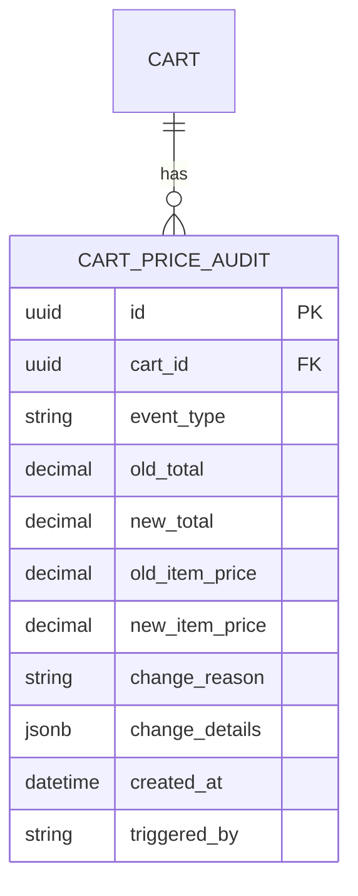

**Типы событий аудита:**
- `PRICE_CHANGED` — каталожная цена изменилась
- `PROMOTION_APPLIED` — применён промокод/скидка
- `PROMOTION_REMOVED` — удалён промокод
- `TAX_RECALCULATED` — пересчёт налога
- `FX_RATE_UPDATED` — обновление курса валюты
- `STALE_PRICE_REFRESH` — обновление устаревшей цены
- `CHECKOUT_VALIDATION` — финальная валидация при checkout

### 7.4 Триггеры пересчёта корзины

| Триггер                       | Причина                | Действие                    |
| ----------------------------- | ---------------------- | --------------------------- |
| Добавление/удаление товара    | Изменение состава      | Полный пересчёт             |
| Изменение количества          | Пороги скидок          | Пересчёт скидок + итого     |
| Применение/удаление промокода | Новые скидки           | Пересчёт скидок + итого     |
| Изменение адреса доставки     | Новый налоговый регион | Пересчёт налогов + доставки |
| Истечение TTL цены            | Stale pricing          | Ревалидация каталожных цен  |
| Начало checkout               | Обязательная проверка  | Полная ревалидация всех цен |
| Out-of-stock товара           | Недоступность          | Удаление + пересчёт         |

---

## 8. Платёжная интеграция

### 8.1 Cart → Payment Intent маппинг

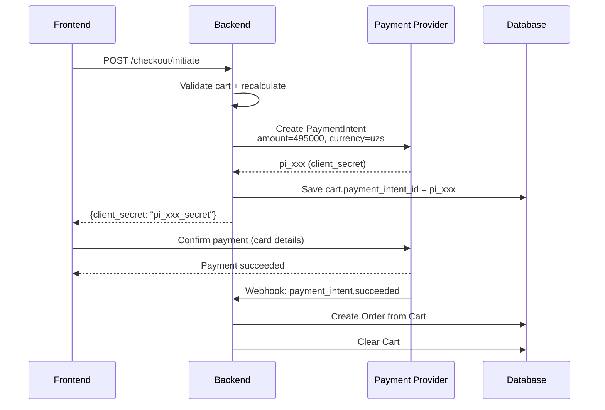

**Ключевые принципы (Stripe):**
- Создать PaymentIntent как можно раньше (при начале checkout)
- Хранить `payment_intent_id` на корзине/сессии
- При изменении суммы — обновить (`update`) существующий PaymentIntent, не создавать новый
- Один PaymentIntent ≈ одна корзина/сессия

### 8.2 Pre-Authorization (Authorize + Capture)

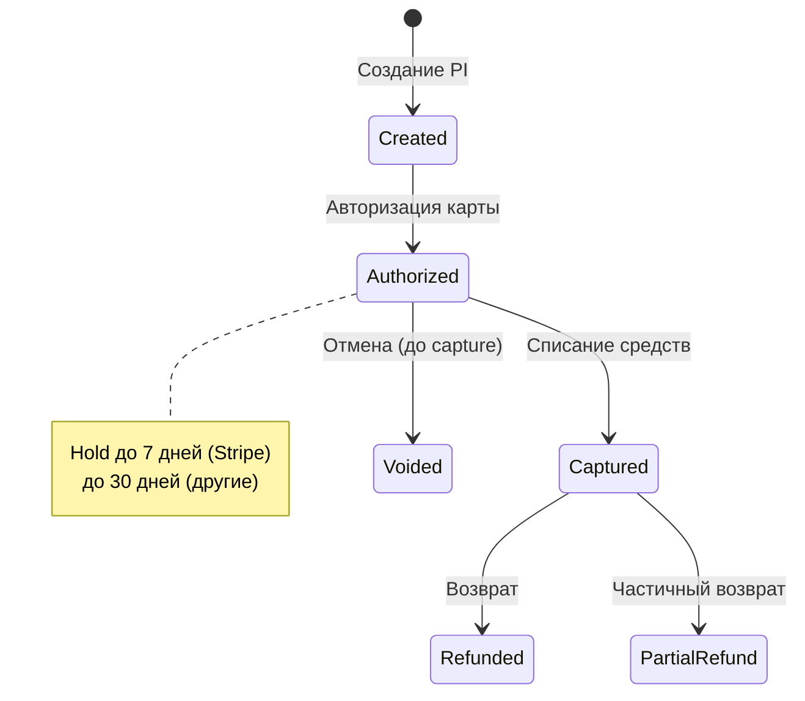

| Этап              | Действие                             | Средства            |
| ----------------- | ------------------------------------ | ------------------- |
| **Authorization** | Проверка + блокировка суммы на карте | Заблокированы       |
| **Capture**       | Фактическое списание                 | Переведены продавцу |
| **Void**          | Отмена до capture                    | Разблокированы      |

**Use Cases для Authorize + Capture:**
- Товары под заказ (capture при отправке)
- Предзаказы
- Бронирование с подтверждением

### 8.3 Split Payment (Wallet + Card)

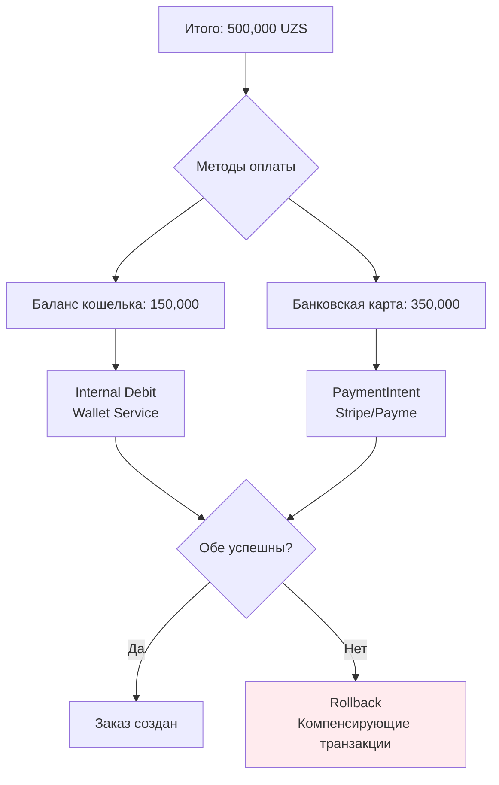

**Сложности split payment:**
- Атомарность: обе части должны успешно завершиться
- Компенсация: если одна часть failed, другая — refund
- Порядок: сначала списать из кошелька, затем внешний платёж
- Идемпотентность: retry не должен списать дважды

### 8.4 BNPL (Рассрочка) в корзине

Для Узбекистана актуальна интеграция с Uzum Nasiya (BNPL):

```python
@dataclass
class InstallmentPlan:
    provider: str           # "uzum_nasiya", "tabby"
    total_amount: Decimal
    installment_count: int  # 3, 6, 12
    interest_rate: Decimal  # 0% для шариат-совместимых
    monthly_payment: Decimal
    first_payment: Decimal

    @classmethod
    def calculate(
        cls,
        total: Decimal,
        months: int,
        rate: Decimal = Decimal('0')
    ) -> 'InstallmentPlan':
        if rate == Decimal('0'):
            monthly = (total / months).quantize(Decimal('1'), rounding=ROUND_HALF_EVEN)
            first = total - (monthly * (months - 1))  # Остаток в первый платёж
        else:
            monthly_rate = rate / 12
            monthly = (total * monthly_rate * (1 + monthly_rate) ** months /
                      ((1 + monthly_rate) ** months - 1)).quantize(
                          Decimal('1'), rounding=ROUND_HALF_EVEN)
            first = monthly

        return cls(
            provider="uzum_nasiya",
            total_amount=total,
            installment_count=months,
            interest_rate=rate,
            monthly_payment=monthly,
            first_payment=first,
        )
```

### 8.5 Multi-Seller Payment Splitting (Marketplace)

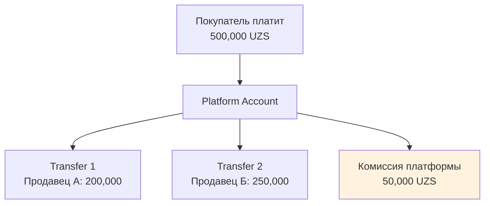

**Stripe Connect паттерны:**

| Паттерн                          | Описание                               | Когда использовать       |
| -------------------------------- | -------------------------------------- | ------------------------ |
| **Direct charges**               | Charge на connected account            | Один продавец            |
| **Destination charges**          | Charge на platform → transfer          | Один продавец + комиссия |
| **Separate charges + transfers** | Charge на platform, transfers отдельно | Мульти-продавец          |

**Для marketplace с несколькими продавцами:**
```
1. Customer → PaymentIntent на Platform (500,000 UZS)
2. Platform → Transfer to Seller A (200,000 UZS)
3. Platform → Transfer to Seller B (250,000 UZS)
4. Platform keeps commission (50,000 UZS)
```

### 8.6 Платёжный ландшафт Узбекистана

| Система    | Тип                   | Пользователи | Особенности                    |
| ---------- | --------------------- | ------------ | ------------------------------ |
| **Uzcard** | Платёжная система     | ~25M карт    | Национальная дебетовая система |
| **HUMO**   | Платёжная система     | ~15M карт    | Вторая национальная система    |
| **Payme**  | Платёжная организация | 20M+         | Super-app, QR-платежи          |
| **Click**  | Платёжная организация | 20M+         | USSD-платежи, P2P              |
| **Uzum**   | Экосистема            | —            | Marketplace + Bank + BNPL      |

**Объём транзакций (2022):**
- Общий объём: 116 трлн сум (рост 2.1x)
- QR-платежи: 191.6 млрд сум (рост 12.8x)
- NFC-транзакции: 25.5 трлн сум (рост 2.1x)
- E-wallet: 11.6 млн транзакций (+79.2%)

---

## 9. Доменная модель (DDD)

### 9.1 Bounded Contexts

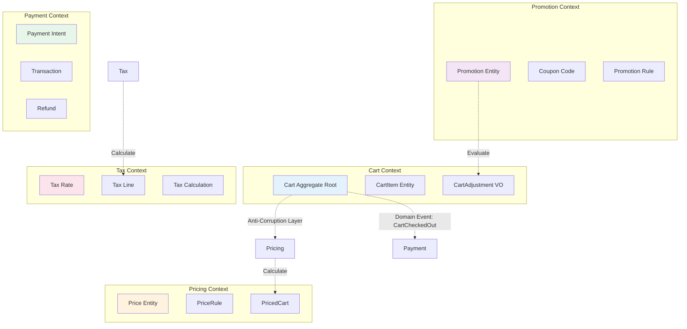

### 9.2 Взаимодействие контекстов (Walmart подход)

| Relationship              | Контексты                | Паттерн                         |
| ------------------------- | ------------------------ | ------------------------------- |
| **Partnership**           | Cart ↔ Pricing           | Одна команда, тесная интеграция |
| **Customer-Supplier**     | Cart → Catalog           | REST API, разные команды        |
| **Conformist**            | Cart → OMS               | Async events (CartCheckedOut)   |
| **Anti-Corruption Layer** | Cart → External Services | Адаптеры трансляции моделей     |

**Ключевой принцип:** "Item может означать разное в разных контекстах. В Catalog это 'core product information', а в Cart это 'item added to cart'." Каждый контекст имеет свою доменную модель Item.

---

## 10. Практическая реализация на Python

### 10.1 Value Objects

```python
from __future__ import annotations
from dataclasses import dataclass
from decimal import Decimal, ROUND_HALF_EVEN
from enum import Enum
from typing import Optional


class Currency(Enum):
    """ISO 4217 валюты с количеством десятичных знаков."""
    UZS = ("UZS", 0)    # Узбекский сум — 0 десятичных в практике
    USD = ("USD", 2)
    EUR = ("EUR", 2)
    RUB = ("RUB", 2)
    KZT = ("KZT", 2)

    def __init__(self, code: str, decimal_places: int):
        self.code = code
        self.decimal_places = decimal_places

    @property
    def quantizer(self) -> Decimal:
        """Квантайзер для округления до минимальной единицы."""
        if self.decimal_places == 0:
            return Decimal('1')
        return Decimal(10) ** -self.decimal_places


@dataclass(frozen=True)
class Money:
    """
    Value Object для денежных сумм.
    Реализация паттерна Martin Fowler Money.
    Immutable, type-safe, с контролем валюты.
    """
    amount: Decimal
    currency: Currency

    def __post_init__(self):
        if not isinstance(self.amount, Decimal):
            object.__setattr__(self, 'amount', Decimal(str(self.amount)))

    def __add__(self, other: Money) -> Money:
        self._check_currency(other)
        return Money(self.amount + other.amount, self.currency)

    def __sub__(self, other: Money) -> Money:
        self._check_currency(other)
        return Money(self.amount - other.amount, self.currency)

    def __mul__(self, multiplier: int | Decimal) -> Money:
        if isinstance(multiplier, int):
            multiplier = Decimal(multiplier)
        return Money(self.amount * multiplier, self.currency)

    def __truediv__(self, divisor: int | Decimal) -> Money:
        if isinstance(divisor, int):
            divisor = Decimal(divisor)
        return Money(self.amount / divisor, self.currency)

    def __gt__(self, other: Money) -> bool:
        self._check_currency(other)
        return self.amount > other.amount

    def __lt__(self, other: Money) -> bool:
        self._check_currency(other)
        return self.amount < other.amount

    def __ge__(self, other: Money) -> bool:
        self._check_currency(other)
        return self.amount >= other.amount

    def __le__(self, other: Money) -> bool:
        self._check_currency(other)
        return self.amount <= other.amount

    def __eq__(self, other: object) -> bool:
        if not isinstance(other, Money):
            return False
        return self.amount == other.amount and self.currency == other.currency

    def __hash__(self) -> int:
        return hash((self.amount, self.currency))

    def rounded(self) -> Money:
        """Округление до минимальной единицы валюты (Banker's Rounding)."""
        return Money(
            self.amount.quantize(self.currency.quantizer, rounding=ROUND_HALF_EVEN),
            self.currency,
        )

    def allocate(self, ratios: list[Decimal]) -> list[Money]:
        """
        Распределение суммы по пропорциям без потери копеек.
        Последний элемент получает весь остаток.
        """
        total_ratio = sum(ratios)
        results: list[Money] = []
        remainder = self.amount

        for i, ratio in enumerate(ratios):
            if i == len(ratios) - 1:
                results.append(Money(remainder, self.currency))
            else:
                share = (self.amount * ratio / total_ratio).quantize(
                    self.currency.quantizer, rounding=ROUND_HALF_EVEN
                )
                results.append(Money(share, self.currency))
                remainder -= share

        return results

    def percentage(self, rate: Decimal) -> Money:
        """Вычислить процент от суммы."""
        return Money(self.amount * rate / Decimal('100'), self.currency)

    @classmethod
    def zero(cls, currency: Currency) -> Money:
        return cls(Decimal('0'), currency)

    def _check_currency(self, other: Money) -> None:
        if self.currency != other.currency:
            raise ValueError(
                f"Нельзя выполнять операции с разными валютами: "
                f"{self.currency.code} и {other.currency.code}"
            )

    def __repr__(self) -> str:
        return f"{self.amount} {self.currency.code}"


@dataclass(frozen=True)
class TaxRate:
    """Ставка налога."""
    code: str           # "UZ_VAT", "RU_VAT"
    rate: Decimal       # 0.12 для 12%
    name: str           # "НДС 12%"
    inclusive: bool      # True для B2C Узбекистан
```

### 10.2 Cart Entities

```python
from __future__ import annotations
from dataclasses import dataclass, field
from decimal import Decimal
from datetime import datetime
from uuid import UUID, uuid4
from enum import Enum
from typing import Optional


class AdjustmentType(Enum):
    PROMOTION = "promotion"
    COUPON = "coupon"
    LOYALTY = "loyalty"
    MANUAL = "manual"


class CartStatus(Enum):
    ACTIVE = "active"
    CALCULATING = "calculating"
    CALCULATED = "calculated"
    CHECKOUT = "checkout"
    COMPLETED = "completed"
    ABANDONED = "abandoned"


@dataclass
class CartItemAdjustment:
    """Скидка/корректировка на уровне позиции корзины."""
    id: UUID = field(default_factory=uuid4)
    type: AdjustmentType = AdjustmentType.PROMOTION
    code: Optional[str] = None            # Промокод
    label: str = ""                       # "Скидка 10%"
    amount: Money = field(default_factory=lambda: Money.zero(Currency.UZS))


@dataclass
class TaxLine:
    """Строка налога для позиции."""
    code: str                             # "UZ_VAT"
    rate: Decimal                         # 0.12
    amount: Money = field(default_factory=lambda: Money.zero(Currency.UZS))


@dataclass
class CartItem:
    """Позиция в корзине."""
    id: UUID = field(default_factory=uuid4)
    product_id: UUID = field(default_factory=uuid4)
    variant_id: Optional[UUID] = None
    sku: str = ""
    title: str = ""

    # Цена
    unit_price: Money = field(default_factory=lambda: Money.zero(Currency.UZS))
    compare_at_price: Optional[Money] = None  # Зачёркнутая цена
    quantity: int = 1

    # Скидки (предвычисленные)
    adjustments: list[CartItemAdjustment] = field(default_factory=list)

    # Налоги
    tax_lines: list[TaxLine] = field(default_factory=list)
    is_tax_inclusive: bool = True          # B2C Узбекистан

    # Снапшот
    price_snapshot_at: Optional[datetime] = None
    catalog_price: Optional[Money] = None  # Текущая каталожная цена

    # --- Вычисляемые поля ---

    @property
    def subtotal(self) -> Money:
        """unit_price × quantity (до скидок и налогов)."""
        return self.unit_price * self.quantity

    @property
    def discount_total(self) -> Money:
        """Сумма всех скидок на позицию."""
        if not self.adjustments:
            return Money.zero(self.unit_price.currency)
        total = Money.zero(self.unit_price.currency)
        for adj in self.adjustments:
            total = total + adj.amount
        return total

    @property
    def tax_total(self) -> Money:
        """Сумма всех налогов на позицию."""
        currency = self.unit_price.currency
        if not self.tax_lines:
            return Money.zero(currency)

        taxable_amount = self.subtotal - self.discount_total

        if self.is_tax_inclusive:
            # Извлечь НДС из цены
            total_rate = sum(tl.rate for tl in self.tax_lines)
            tax_amount = taxable_amount.amount * (
                Decimal('1') - Decimal('1') / (Decimal('1') + total_rate)
            )
            return Money(tax_amount, currency)
        else:
            # Начислить НДС сверху
            total_rate = sum(tl.rate for tl in self.tax_lines)
            tax_amount = taxable_amount.amount * total_rate
            return Money(tax_amount, currency)

    @property
    def total(self) -> Money:
        """Итого по позиции (с учётом скидок и налогов)."""
        if self.is_tax_inclusive:
            return self.subtotal - self.discount_total
        else:
            return self.subtotal - self.discount_total + self.tax_total


@dataclass
class ShippingLine:
    """Строка доставки."""
    method_id: str = ""
    title: str = ""
    price: Money = field(default_factory=lambda: Money.zero(Currency.UZS))
    discount: Money = field(default_factory=lambda: Money.zero(Currency.UZS))
    tax_rate: Decimal = Decimal('0.12')
    is_tax_inclusive: bool = True

    @property
    def total(self) -> Money:
        return self.price - self.discount


@dataclass
class Cart:
    """
    Агрегат корзины — Root Aggregate.
    Все финансовые операции проходят через этот объект.
    """
    id: UUID = field(default_factory=uuid4)
    customer_id: Optional[UUID] = None
    currency: Currency = Currency.UZS
    status: CartStatus = CartStatus.ACTIVE

    # Содержимое
    items: list[CartItem] = field(default_factory=list)
    shipping_lines: list[ShippingLine] = field(default_factory=list)

    # Промо
    coupon_codes: list[str] = field(default_factory=list)
    loyalty_points_applied: int = 0
    loyalty_points_value: Money = field(default_factory=lambda: Money.zero(Currency.UZS))

    # Платёж
    payment_intent_id: Optional[str] = None

    # Мета
    created_at: datetime = field(default_factory=datetime.utcnow)
    updated_at: datetime = field(default_factory=datetime.utcnow)
    last_repriced_at: Optional[datetime] = None
    version: int = 0  # Для optimistic locking

    # --- Вычисляемые итоги ---

    @property
    def item_subtotal(self) -> Money:
        """Сумма subtotal всех позиций."""
        total = Money.zero(self.currency)
        for item in self.items:
            total = total + item.subtotal
        return total

    @property
    def item_discount_total(self) -> Money:
        """Сумма скидок всех позиций."""
        total = Money.zero(self.currency)
        for item in self.items:
            total = total + item.discount_total
        return total

    @property
    def item_tax_total(self) -> Money:
        """Сумма налогов всех позиций."""
        total = Money.zero(self.currency)
        for item in self.items:
            total = total + item.tax_total
        return total

    @property
    def item_total(self) -> Money:
        """Итого по товарам (после скидок, с налогами)."""
        total = Money.zero(self.currency)
        for item in self.items:
            total = total + item.total
        return total

    @property
    def shipping_subtotal(self) -> Money:
        """Стоимость доставки до скидок."""
        total = Money.zero(self.currency)
        for sl in self.shipping_lines:
            total = total + sl.price
        return total

    @property
    def shipping_discount_total(self) -> Money:
        """Скидки на доставку."""
        total = Money.zero(self.currency)
        for sl in self.shipping_lines:
            total = total + sl.discount
        return total

    @property
    def shipping_total(self) -> Money:
        """Итого доставка."""
        total = Money.zero(self.currency)
        for sl in self.shipping_lines:
            total = total + sl.total
        return total

    @property
    def grand_total(self) -> Money:
        """
        ИТОГО К ОПЛАТЕ.
        Округляется до минимальной единицы валюты.
        """
        total = self.item_total + self.shipping_total - self.loyalty_points_value
        return total.rounded()

    @property
    def payment_amount(self) -> Money:
        """Сумма для PaymentIntent (= grand_total)."""
        return self.grand_total

    # --- Бизнес-правила ---

    def is_price_stale(self, ttl_minutes: int = 60) -> bool:
        """Проверить, устарели ли цены в корзине."""
        if self.last_repriced_at is None:
            return True
        from datetime import timedelta
        return datetime.utcnow() - self.last_repriced_at > timedelta(minutes=ttl_minutes)

    @property
    def requires_reprice(self) -> bool:
        """Нужен ли пересчёт цен."""
        return self.is_price_stale() or self.status == CartStatus.CHECKOUT
```

### 10.3 Pricing Service

```python
from __future__ import annotations
from dataclasses import dataclass
from decimal import Decimal, ROUND_HALF_EVEN
from datetime import datetime
from typing import Protocol, Optional
from uuid import UUID


class CatalogPriceProvider(Protocol):
    """Порт для получения каталожных цен."""
    async def get_price(
        self,
        product_id: UUID,
        variant_id: Optional[UUID],
        currency: Currency,
        customer_group: Optional[str] = None,
    ) -> Money: ...


class PromotionEngine(Protocol):
    """Порт для расчёта промо-скидок."""
    async def evaluate(
        self,
        cart: Cart,
    ) -> list[CartItemAdjustment]: ...


class TaxCalculator(Protocol):
    """Порт для расчёта налогов."""
    def calculate_tax_lines(
        self,
        item: CartItem,
        shipping_address_country: str,
    ) -> list[TaxLine]: ...


@dataclass
class CartPricingService:
    """
    Application Service для расчёта цен корзины.

    Orchestrates: Price Selection → Discounts → Tax → Totals
    """
    catalog_provider: CatalogPriceProvider
    promotion_engine: PromotionEngine
    tax_calculator: TaxCalculator

    async def reprice_cart(
        self,
        cart: Cart,
        force: bool = False,
    ) -> Cart:
        """
        Полный пересчёт корзины.

        Pipeline:
        1. Обновить каталожные цены (если stale)
        2. Рассчитать промо-скидки
        3. Распределить cart-level скидки по items
        4. Рассчитать налоги
        5. Обновить итоги
        """
        if not force and not cart.requires_reprice:
            return cart

        cart.status = CartStatus.CALCULATING

        # Шаг 1: Обновить каталожные цены
        for item in cart.items:
            current_price = await self.catalog_provider.get_price(
                product_id=item.product_id,
                variant_id=item.variant_id,
                currency=cart.currency,
            )
            item.catalog_price = current_price
            item.unit_price = current_price
            item.price_snapshot_at = datetime.utcnow()

        # Шаг 2: Рассчитать промо-скидки
        adjustments = await self.promotion_engine.evaluate(cart)

        # Шаг 3: Распределить скидки по items
        self._apply_adjustments(cart, adjustments)

        # Шаг 4: Рассчитать налоги для каждого item
        for item in cart.items:
            item.tax_lines = self.tax_calculator.calculate_tax_lines(
                item=item,
                shipping_address_country="UZ",
            )

        # Шаг 5: Обновить метаданные
        cart.last_repriced_at = datetime.utcnow()
        cart.status = CartStatus.CALCULATED
        cart.version += 1

        return cart

    def _apply_adjustments(
        self,
        cart: Cart,
        adjustments: list[CartItemAdjustment],
    ) -> None:
        """
        Распределить cart-level скидки по позициям пропорционально стоимости.
        Item-level скидки привязываются напрямую.
        """
        # Очистить старые скидки
        for item in cart.items:
            item.adjustments.clear()

        for adj in adjustments:
            if hasattr(adj, 'target_item_id') and adj.target_item_id:
                # Item-level скидка — привязать к конкретному item
                for item in cart.items:
                    if item.id == adj.target_item_id:
                        item.adjustments.append(adj)
                        break
            else:
                # Cart-level скидка — распределить пропорционально
                self._distribute_cart_discount(cart, adj)

    def _distribute_cart_discount(
        self,
        cart: Cart,
        adjustment: CartItemAdjustment,
    ) -> None:
        """
        Распределение cart-level скидки по позициям.
        Используется аллокация Фаулера (последний item получает остаток).
        """
        if not cart.items:
            return

        total_amount = adjustment.amount
        item_subtotals = [item.subtotal.amount for item in cart.items]
        cart_subtotal = sum(item_subtotals)

        if cart_subtotal == Decimal('0'):
            return

        # Рассчитать пропорции
        ratios = [st / cart_subtotal for st in item_subtotals]

        # Аллокация с коррекцией остатка
        allocated = total_amount.allocate(
            [Decimal(str(r)) for r in ratios]
        )

        for item, share in zip(cart.items, allocated):
            item.adjustments.append(
                CartItemAdjustment(
                    type=adjustment.type,
                    code=adjustment.code,
                    label=adjustment.label,
                    amount=share,
                )
            )

    async def validate_for_checkout(self, cart: Cart) -> list[str]:
        """
        Валидация корзины перед checkout.
        Возвращает список предупреждений.
        """
        warnings: list[str] = []

        # Принудительный пересчёт
        old_total = cart.grand_total
        await self.reprice_cart(cart, force=True)
        new_total = cart.grand_total

        # Проверка изменения цены
        if new_total != old_total:
            diff = new_total - old_total
            if diff.amount > Decimal('0'):
                warnings.append(
                    f"Цены обновились. Итого изменилось на +{diff}. "
                    f"Новая сумма: {new_total}"
                )
            else:
                warnings.append(
                    f"Хорошие новости! Итого снизилось на {diff}. "
                    f"Новая сумма: {new_total}"
                )

        # Проверка доступности товаров
        for item in cart.items:
            if item.catalog_price is None:
                warnings.append(f"Товар '{item.title}' больше недоступен")

        return warnings
```

### 10.4 Полный пример расчёта

```python
# === Пример: Расчёт корзины для Узбекистана ===

from decimal import Decimal

# Создаём корзину
cart = Cart(currency=Currency.UZS)

# Добавляем товары
item1 = CartItem(
    title="Смартфон Samsung Galaxy",
    unit_price=Money(Decimal('5500000'), Currency.UZS),
    quantity=1,
    is_tax_inclusive=True,
    tax_lines=[TaxLine(code="UZ_VAT", rate=Decimal('0.12'))],
)

item2 = CartItem(
    title="Чехол для телефона",
    unit_price=Money(Decimal('150000'), Currency.UZS),
    quantity=2,
    is_tax_inclusive=True,
    tax_lines=[TaxLine(code="UZ_VAT", rate=Decimal('0.12'))],
)

cart.items = [item1, item2]

# Применяем промокод "WELCOME10" — скидка 10% на корзину
cart_discount = Money(Decimal('580800'), Currency.UZS)  # 10% от 5,800,000

# Распределяем по items:
# item1: 5,500,000 / 5,800,000 × 580,000 = 550,000
# item2: 300,000 / 5,800,000 × 580,000 = 30,000

item1.adjustments = [
    CartItemAdjustment(
        type=AdjustmentType.COUPON,
        code="WELCOME10",
        label="Скидка 10%",
        amount=Money(Decimal('550000'), Currency.UZS),
    )
]

item2.adjustments = [
    CartItemAdjustment(
        type=AdjustmentType.COUPON,
        code="WELCOME10",
        label="Скидка 10%",
        amount=Money(Decimal('30000'), Currency.UZS),
    )
]

# Добавляем доставку
cart.shipping_lines = [
    ShippingLine(
        method_id="express",
        title="Экспресс-доставка",
        price=Money(Decimal('50000'), Currency.UZS),
        is_tax_inclusive=True,
    )
]

# === Результат расчёта ===

# Item 1: Смартфон
# subtotal = 5,500,000
# discount = 550,000
# taxable = 4,950,000
# tax (inclusive) = 4,950,000 × (1 - 1/(1+0.12)) = 530,357
# total = 4,950,000

# Item 2: Чехол × 2
# subtotal = 300,000
# discount = 30,000
# taxable = 270,000
# tax (inclusive) = 270,000 × (1 - 1/(1+0.12)) = 28,929
# total = 270,000

# Shipping = 50,000

# Grand Total = 4,950,000 + 270,000 + 50,000 = 5,270,000 UZS

print(f"Подитого товаров: {cart.item_subtotal}")      # 5,800,000 UZS
print(f"Скидки: -{cart.item_discount_total}")          # 580,000 UZS
print(f"НДС (в т.ч.): {cart.item_tax_total}")          # 559,286 UZS
print(f"Итого товары: {cart.item_total}")               # 5,220,000 UZS
print(f"Доставка: {cart.shipping_total}")               # 50,000 UZS
print(f"ИТОГО К ОПЛАТЕ: {cart.grand_total}")            # 5,270,000 UZS
```

---

## 11. Ключевые выводы

### Принципы финансовой точности

1. **Decimal ALWAYS** — float запрещён для денежных вычислений
2. **Round late** — округление только при выводе финальных сумм
3. **Allocate, don't round** — при распределении использовать аллокацию Фаулера
4. **Audit everything** — каждое изменение цены логируется
5. **Validate at checkout** — обязательная ревалидация цен при оформлении
6. **Idempotent operations** — повторные запросы безопасны

### Архитектурные рекомендации

| Аспект           | Рекомендация                                 | Обоснование                     |
| ---------------- | -------------------------------------------- | ------------------------------- |
| **Хранение цен** | В минимальных единицах (тийинах) как integer | Нет floating point проблем      |
| **Расчёт**       | `Decimal` с полной точностью                 | Промежуточные вычисления точны  |
| **Скидки**       | Предвычисляются и сохраняются на уровне item | Налог считается корректно       |
| **Налоги**       | Tax-inclusive для B2C UZ                     | Требование законодательства     |
| **Snapshots**    | TTL 60 мин + обязательная ревалидация        | Баланс UX и актуальности        |
| **Валюта**       | Value Object (Money + Currency)              | Type safety, нет смешения валют |
| **Промо-движок** | JSON rules + Python evaluator                | Гибкость без сложности Drools   |
| **Платежи**      | PaymentIntent per Cart                       | Простота, идемпотентность       |

### Специфика для Узбекистана

- **UZS**: 0 десятичных знаков в практике, хотя ISO 4217 определяет 2
- **НДС**: 12%, tax-inclusive для B2C
- **Платежи**: Uzcard, HUMO (национальные), Payme, Click (организации)
- **BNPL**: Uzum Nasiya — шариат-совместимая рассрочка
- **Кросс-бордер**: ЕАЭС de minimis €200/31кг, все расчёты в UZS
- **Регуляторика**: 49 лицензированных платёжных организаций под контролем ЦБ

---

## 12. Источники

### Архитектура и паттерны
- [Martin Fowler — Money Pattern (PoEAA)](https://martinfowler.com/eaaCatalog/money.html)
- [Medusa.js — Calculating Cart totals with discounts, taxes, and currencies](https://medusajs.com/blog/cart-totals/)
- [Walmart Tech Blog — Cart Microservice with DDD & Hexagonal Architecture](https://medium.com/walmartglobaltech/implementing-cart-service-with-ddd-hexagonal-port-adapter-architecture-part-1-4dab93b3fa9f)
- [commercetools — Pricing and Discounts Overview](https://docs.commercetools.com/api/pricing-and-discounts-overview)
- [Broadleaf Commerce — Stale Cart Pricing](https://developer.broadleafcommerce.com/services/cart-operation-services/pricing/stale-cart-pricing)
- [Scalable E-Commerce Architecture: Shopping Cart (DEV Community)](https://dev.to/savyjs/scalable-e-commerce-architecture-part-2-shopping-cart-3blg)

### Промо-акции и скидки
- [Building a Flexible Discount Engine (Medium)](https://medium.com/@sammyasopa/building-a-flexible-discount-engine-b9f4fba3af51)
- [Voucherify — Promotion Stacking](https://www.voucherify.io/glossary/promotion-stacking)
- [fabric Inc — Enterprise Guide to Promotions Engines](https://fabric.inc/blog/product/enterprise-guide-promotions-engines)
- [commercetools — Cart Discounts API](https://docs.commercetools.com/api/projects/cartDiscounts)

### Финансовая точность
- [Shopify Engineering — 8 Tips for Hanging Pennies](https://shopify.engineering/eight-tips-for-hanging-pennies)
- [py-moneyed — Python Money/Currency Library](https://py-moneyed.readthedocs.io/en/latest/usage.html)
- [Vimeo/py-money — Money class for Python 3](https://github.com/vimeo/py-money)
- [Python Decimal Documentation](https://docs.python.org/3/library/decimal.html)

### Платежи
- [Stripe — Payment Intents API](https://docs.stripe.com/payments/payment-intents)
- [Stripe — Separate Charges and Transfers (Connect)](https://docs.stripe.com/connect/separate-charges-and-transfers)
- [Stripe — Place a Hold on a Payment Method](https://docs.stripe.com/payments/place-a-hold-on-a-payment-method)
- [commercetools — Payment Lifecycle](https://docs.commercetools.com/checkout/payments-lifecycle)

### Мультивалютность и кросс-бордер
- [Stripe — Multicurrency Payments](https://stripe.com/resources/more/what-are-multicurrency-payments-how-they-work-and-how-to-use-them)
- [Xe Blog — FX in E-Commerce](https://www.xe.com/blog/business/fx-in-e-commerce-multi-currency-pricing-and-payouts/)
- [Avalara — De Minimis Threshold Table](https://www.avalara.com/us/en/learn/cross-border-resources/de-minimis-threshold-table.html)
- [World Customs Journal — Cross-border E-Commerce and De Minimis: Kazakhstan](https://www.worldcustomsjournal.org/article/117024-cross-border-retail-e-commerce-and-de-minimis-the-case-of-kazakhstan)

### Налоги
- [Avalara Developer Documentation](https://developer.avalara.com/documentation/)
- [Medusa.js — Tax Inclusive Pricing](https://docs.medusajs.com/v1/modules/taxes/inclusive-pricing)
- [Vertex — E-Commerce Tax Calculation](https://www.vertexinc.com/solutions/products/vertex-advantage)

### Узбекистан
- [Deep Dive: Payments in Uzbekistan (Medium)](https://samboboev.medium.com/deep-dive-payments-in-uzbekistan-f07981902911)
- [Esplora Legal — Regulation of Payment Organizations in Uzbekistan](https://esploralegal.com/regulation-of-payment-organizations-in-the-republic-of-uzbekistan/)
- [U.S. Trade.gov — Uzbekistan eCommerce](https://www.trade.gov/country-commercial-guides/uzbekistan-ecommerce)
- [Central Bank of Uzbekistan — Payment Systems](https://cbu.uz/en/payment-systems/)

### Регуляторика ЕС
- [EU — Pricing, Payments and Price Discrimination](https://europa.eu/youreurope/citizens/consumers/shopping/pricing-payments/index_en.htm)
- [Fenige — Omnibus Directive](https://www.fenige.com/omnibus-what-is-it-and-how-is-it-reshaping-price-transparency-and-consumer-protection-in-european-e-commerce/)
- [Stripe — PSD2 Compliance Guide](https://stripe.com/resources/more/what-is-psd2-here-is-what-businesses-need-to-know)

### Flash Sales и конкурентность
- [Flash Sale Architecture — 7 Critical Design Strategies (Medium)](https://jinlow.medium.com/mastering-flash-sale-architecture-7-critical-design-strategies-for-handling-millions-of-concurrent-fa8f4a6b712c)
- [Designing a Flash Sale System That Never Oversells (Medium)](https://medium.com/@umesh382.kushwaha/designing-a-flash-sale-system-that-never-oversells-from-1-user-to-1-million-users-without-8426db0f1ad0)

### BNPL
- [BNPL App Development Guide (GeekyAnts)](https://geekyants.com/en-us/blog/buy-now-pay-later-app-development-like-klarna-or-tabby-in-usa--a-complete-guide)
- [BNPL Software Architecture (WeSoftYou)](https://wesoftyou.com/fintech/buy-now-pay-later-software-architecture/)
- [KPMG — B2C Payments, POS financing and BNPL in Uzbekistan](https://assets.kpmg.com/content/dam/kpmg/uz/pdf/2024/Fintech%20UZ_Payments_POS%20Financing_BNPL-final.pdf)
