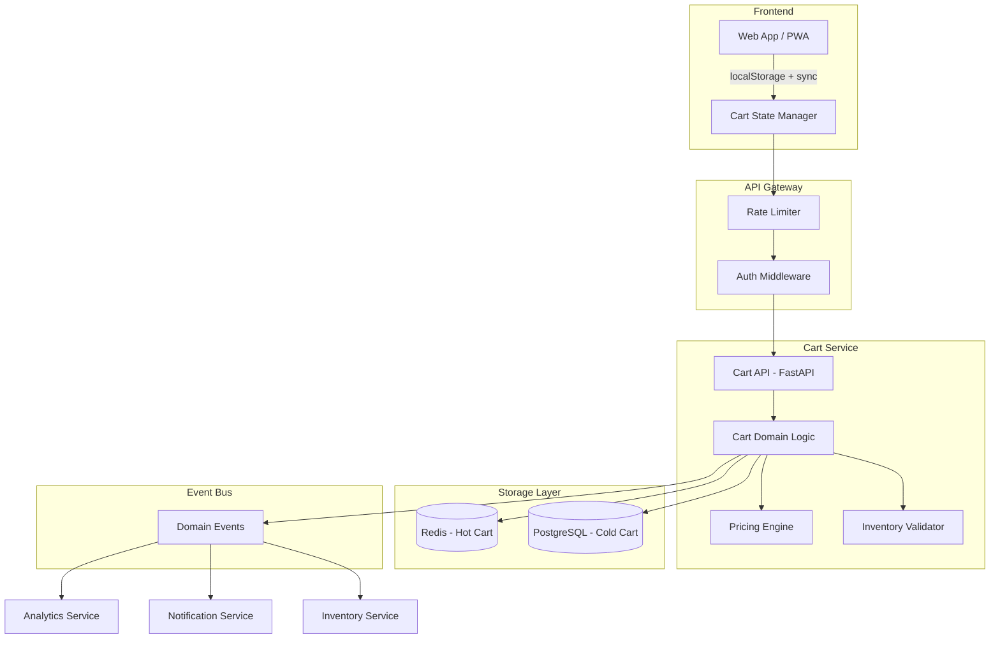
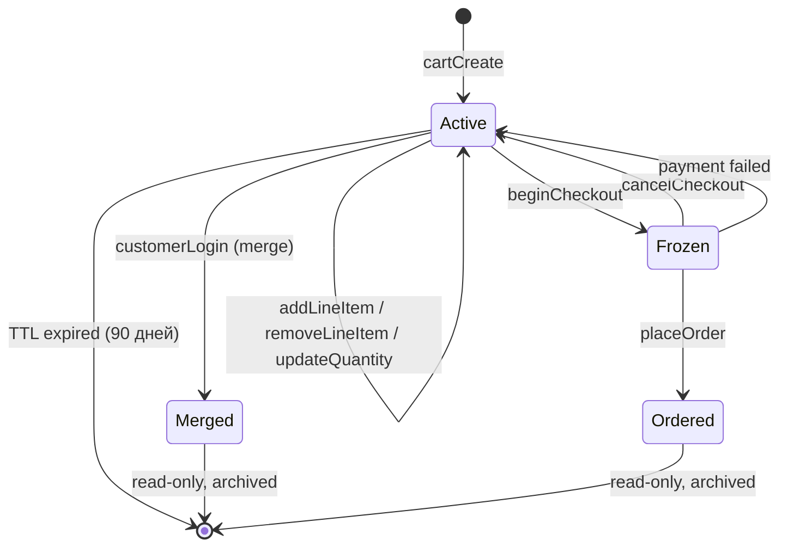
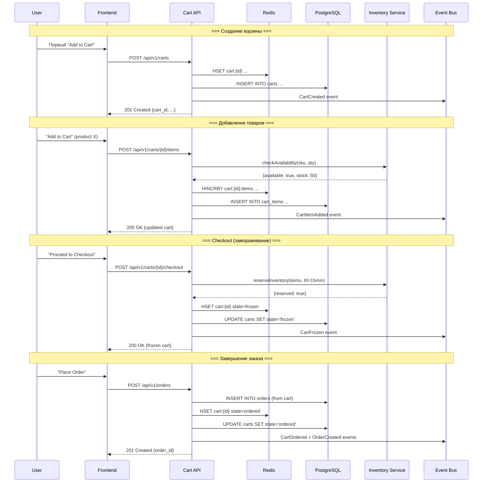
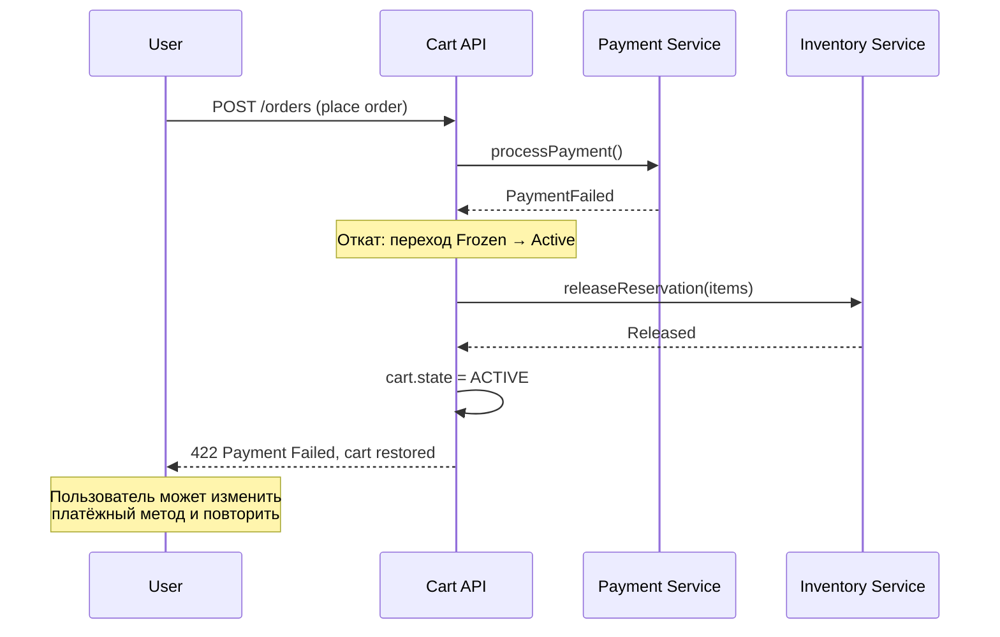
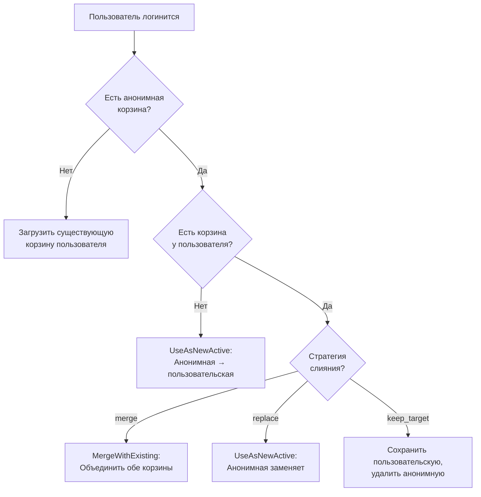
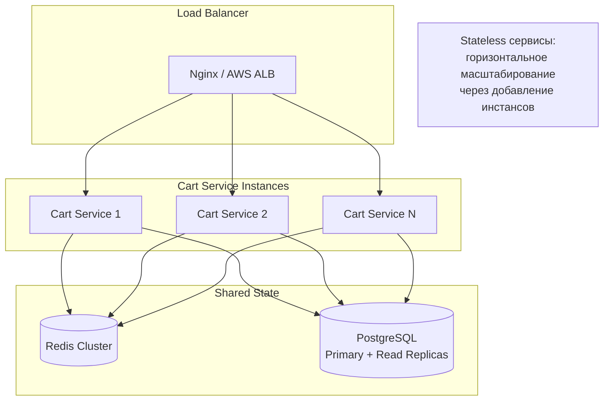
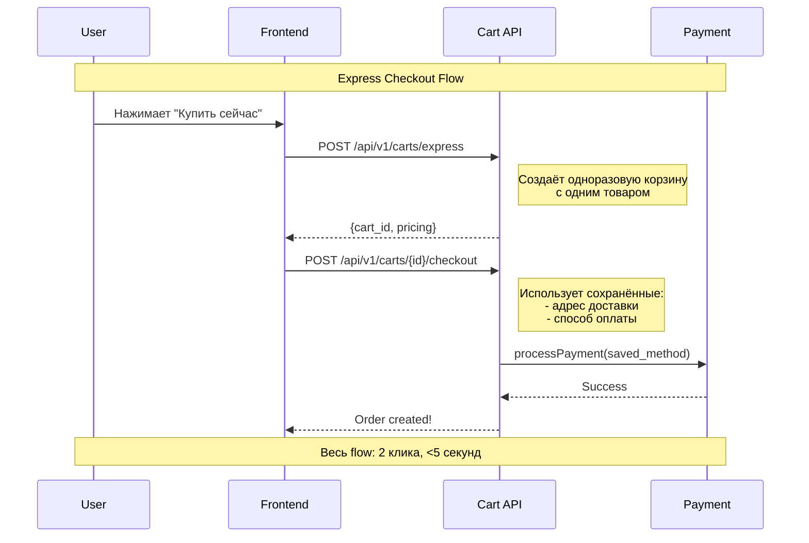
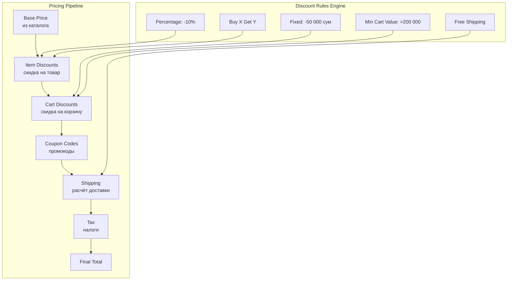
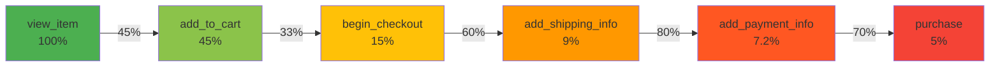

# Управление состоянием корзины, UX-паттерны и проектирование API

> **Тип документа:** Исследовательский отчёт
> **Дата:** 2026-03-25
> **Стек:** FastAPI + SQLAlchemy + Redis + PostgreSQL
> **Статус:** Deep Research Complete

---

## Содержание

1. [Резюме для руководства](#1-резюме-для-руководства)
2. [Конечный автомат корзины (State Machine)](#2-конечный-автомат-корзины-state-machine)
3. [Жизненный цикл корзины](#3-жизненный-цикл-корзины)
4. [Персистентность и управление сессиями](#4-персистентность-и-управление-сессиями)
5. [Проектирование Cart API](#5-проектирование-cart-api)
6. [Стратегии слияния корзин (Cart Merge)](#6-стратегии-слияния-корзин-cart-merge)
7. [Резервирование инвентаря](#7-резервирование-инвентаря)
8. [Производительность и масштабируемость](#8-производительность-и-масштабируемость)
9. [UX-паттерны корзины](#9-ux-паттерны-корзины)
10. [Ценообразование и система скидок](#10-ценообразование-и-система-скидок)
11. [Аналитика и наблюдаемость](#11-аналитика-и-наблюдаемость)
12. [Стратегии тестирования](#12-стратегии-тестирования)
13. [Рекомендации для нашего проекта](#13-рекомендации-для-нашего-проекта)
14. [Источники](#14-источники)

---

## 1. Резюме для руководства

### Ключевые выводы

Корзина покупок — это **центральный агрегат** e-commerce платформы, через который проходит 100% транзакций. Исследование лучших мировых практик (Shopify, commercetools, Amazon, Magento) выявило следующие критические паттерны:

| Аспект               | Рекомендация                                    | Обоснование                                                |
| -------------------- | ----------------------------------------------- | ---------------------------------------------------------- |
| **Хранение**         | Redis (hot) + PostgreSQL (cold)                 | Sub-millisecond операции + надёжная персистентность        |
| **State Machine**    | 4 состояния: Active → Frozen → Ordered / Merged | Предотвращение невалидных переходов                        |
| **Конкурентность**   | Оптимистичная блокировка (version field)        | Высокая пропускная способность без deadlocks               |
| **Слияние корзин**   | Silent merge при логине                         | Используют Amazon, eBay, Target, Walmart                   |
| **Инвентарь**        | Soft Reservation с TTL 15 мин                   | Баланс между удержанием и доступностью                     |
| **UX**               | Cart Drawer (desktop) + Cart Page (mobile)      | +17% конверсия desktop, без потерь на mobile               |
| **API**              | RESTful с batch-операциями                      | До 500 update actions в одном запросе (опыт commercetools) |
| **Abandonment Rate** | 70.19% средний по индустрии (2025)              | Критически важна оптимизация checkout UX                   |

### Архитектурная диаграмма высокого уровня



---

## 2. Конечный автомат корзины (State Machine)

### 2.1. Состояния корзины

На основе анализа commercetools, Shopify и Sylius, оптимальная модель включает 4 состояния:



| Состояние   | Описание                                       | Модифицируемость                                | TTL                                                              |
| ----------- | ---------------------------------------------- | ----------------------------------------------- | ---------------------------------------------------------------- |
| **Active**  | Корзина в работе, товары добавляются/удаляются | Полная                                          | 90 дней (configurable via `delete_days_after_last_modification`) |
| **Frozen**  | Финальный этап checkout, цены зафиксированы    | Запрещены изменения, влияющие на итоговую сумму | 30 мин (checkout timeout)                                        |
| **Merged**  | Анонимная корзина поглощена клиентской         | Только чтение                                   | Архив                                                            |
| **Ordered** | Конвертирована в заказ                         | Только чтение                                   | Архив                                                            |

### 2.2. Правила переходов (Guards)

```python
# src/modules/cart/domain/state_machine.py

from enum import Enum
from typing import Optional


class CartState(str, Enum):
    ACTIVE = "active"
    FROZEN = "frozen"
    MERGED = "merged"
    ORDERED = "ordered"


class CartTransitionError(Exception):
    """Невалидный переход между состояниями корзины."""
    pass


# Матрица допустимых переходов
ALLOWED_TRANSITIONS: dict[CartState, set[CartState]] = {
    CartState.ACTIVE: {CartState.FROZEN, CartState.MERGED},
    CartState.FROZEN: {CartState.ACTIVE, CartState.ORDERED},
    CartState.MERGED: set(),   # терминальное
    CartState.ORDERED: set(),  # терминальное
}

# Guards для каждого перехода
TRANSITION_GUARDS = {
    (CartState.ACTIVE, CartState.FROZEN): [
        "cart_has_items",
        "all_items_in_stock",
        "pricing_is_valid",
    ],
    (CartState.FROZEN, CartState.ORDERED): [
        "payment_confirmed",
        "inventory_reserved",
        "shipping_address_set",
    ],
    (CartState.FROZEN, CartState.ACTIVE): [
        "release_inventory_reservations",
    ],
}


def can_transition(current: CartState, target: CartState) -> bool:
    """Проверяет допустимость перехода."""
    return target in ALLOWED_TRANSITIONS.get(current, set())


def validate_transition(
    current: CartState,
    target: CartState,
    context: dict,
) -> None:
    """Проверяет guard-условия перехода."""
    if not can_transition(current, target):
        raise CartTransitionError(
            f"Переход {current} → {target} запрещён"
        )
    guards = TRANSITION_GUARDS.get((current, target), [])
    for guard in guards:
        if not context.get(guard, False):
            raise CartTransitionError(
                f"Guard '{guard}' не выполнен для перехода "
                f"{current} → {target}"
            )
```

### 2.3. Идемпотентность переходов

Критический принцип из опыта commercetools: обработчики событий должны быть **идемпотентными** — повторное получение одного и того же события не должно приводить к дублированию перехода. Это достигается через:

- **Version field** на агрегате Cart (optimistic locking)
- **Idempotency key** в каждом запросе на мутацию
- **Event deduplication** на уровне message broker

---

## 3. Жизненный цикл корзины

### 3.1. Полная диаграмма жизненного цикла



### 3.2. Восстановление из неудачного checkout



### 3.3. Обработка брошенных корзин (Abandoned Carts)

```python
# Фоновая задача для обработки брошенных корзин

from datetime import datetime, timedelta


ABANDONMENT_THRESHOLDS = {
    "reminder_1": timedelta(hours=1),    # Первое напоминание
    "reminder_2": timedelta(hours=24),   # Второе напоминание
    "reminder_3": timedelta(days=3),     # Третье напоминание
    "cleanup": timedelta(days=90),       # Удаление корзины
}


async def process_abandoned_carts():
    """
    Периодическая задача (cron каждые 15 мин):
    1. Находит корзины Active без активности
    2. Отправляет напоминания через Event Bus
    3. Удаляет просроченные корзины
    """
    now = datetime.utcnow()

    # Поиск корзин для каждого порога
    for threshold_name, delta in ABANDONMENT_THRESHOLDS.items():
        cutoff = now - delta
        carts = await cart_repo.find_abandoned(
            state=CartState.ACTIVE,
            last_modified_before=cutoff,
            threshold_name=threshold_name,
        )
        for cart in carts:
            if threshold_name == "cleanup":
                await cart_repo.delete(cart.id)
                await event_bus.publish(CartDeleted(cart_id=cart.id))
            else:
                await event_bus.publish(
                    CartAbandoned(
                        cart_id=cart.id,
                        customer_id=cart.customer_id,
                        threshold=threshold_name,
                        items=cart.items,
                    )
                )
```

---

## 4. Персистентность и управление сессиями

### 4.1. Гибридная модель: Redis + PostgreSQL

```mermaid
graph LR
    subgraph "Hot Layer — Redis"
        R1[cart:{id} — Hash<br/>товары + количества]
        R2[cart:meta:{id} — Hash<br/>метаданные товаров]
        R3[cart:session:{token} — String<br/>привязка сессии]
        R4[cart:active — Sorted Set<br/>active carts by timestamp]
    end

    subgraph "Cold Layer — PostgreSQL"
        P1[carts — таблица<br/>основная сущность]
        P2[cart_items — таблица<br/>позиции корзины]
        P3[cart_events — таблица<br/>аудит изменений]
    end

    R1 -->|Write-through| P1
    R2 -->|Периодический sync| P2
    P1 -->|Cache miss| R1
```

**Стратегия записи:** Write-through для критических данных (состояние, итоги), write-behind для метаданных.

| Операция              | Redis                               | PostgreSQL               | Причина                             |
| --------------------- | ----------------------------------- | ------------------------ | ----------------------------------- |
| Добавление товара     | `HINCRBY` — атомарный инкремент     | INSERT/UPDATE cart_items | Мгновенный отклик + персистентность |
| Получение корзины     | `HGETALL`                           | Fallback при cache miss  | <1ms vs ~5ms                        |
| Обновление количества | `HSET`                              | UPDATE cart_items        | Атомарность                         |
| Checkout (freeze)     | `HSET state=frozen` + `EXPIRE 1800` | UPDATE carts             | TTL через Redis                     |
| Удаление корзины      | `DEL cart:{id}`                     | Soft delete              | Чистка памяти                       |

### 4.2. Структуры данных Redis

```python
# Redis-схема для корзины

import redis.asyncio as redis
import json
from datetime import timedelta


class CartRedisRepository:
    """Работа с корзиной через Redis."""

    CART_TTL = timedelta(days=7)          # Активная корзина
    SESSION_TTL = timedelta(hours=24)     # Гостевая сессия
    CHECKOUT_TTL = timedelta(minutes=30)  # Замороженная корзина

    def __init__(self, redis_client: redis.Redis):
        self._redis = redis_client

    async def add_item(
        self, cart_id: str, sku: str, quantity: int, metadata: dict
    ) -> None:
        """Атомарное добавление товара с pipeline."""
        async with self._redis.pipeline(transaction=True) as pipe:
            # Атомарный инкремент количества
            pipe.hincrby(f"cart:{cart_id}:items", sku, quantity)
            # Метаданные товара (цена, название, изображение)
            pipe.hset(
                f"cart:{cart_id}:meta",
                sku,
                json.dumps(metadata),
            )
            # Обновляем timestamp в sorted set активных корзин
            pipe.zadd(
                "cart:active",
                {cart_id: datetime.utcnow().timestamp()},
            )
            # Обновляем TTL
            pipe.expire(f"cart:{cart_id}:items", int(self.CART_TTL.total_seconds()))
            pipe.expire(f"cart:{cart_id}:meta", int(self.CART_TTL.total_seconds()))

            await pipe.execute()

    async def get_cart(self, cart_id: str) -> dict | None:
        """Получение полной корзины одним pipeline."""
        async with self._redis.pipeline() as pipe:
            pipe.hgetall(f"cart:{cart_id}:items")
            pipe.hgetall(f"cart:{cart_id}:meta")
            items_raw, meta_raw = await pipe.execute()

        if not items_raw:
            return None

        items = []
        for sku, qty in items_raw.items():
            meta = json.loads(meta_raw.get(sku, "{}"))
            items.append({
                "sku": sku.decode() if isinstance(sku, bytes) else sku,
                "quantity": int(qty),
                **meta,
            })
        return {"cart_id": cart_id, "items": items}

    async def merge_carts(
        self, guest_cart_id: str, user_cart_id: str
    ) -> None:
        """Слияние гостевой корзины в пользовательскую.

        Lua-скрипт для атомарности слияния.
        """
        lua_script = """
        local guest_key = KEYS[1]
        local user_key = KEYS[2]
        local guest_items = redis.call('HGETALL', guest_key)

        for i = 1, #guest_items, 2 do
            local sku = guest_items[i]
            local qty = tonumber(guest_items[i + 1])
            redis.call('HINCRBY', user_key, sku, qty)
        end

        redis.call('DEL', guest_key)
        return 1
        """
        await self._redis.eval(
            lua_script,
            2,
            f"cart:{guest_cart_id}:items",
            f"cart:{user_cart_id}:items",
        )
```

### 4.3. Идентификация анонимных корзин

```python
import secrets
from uuid import uuid4


class CartSessionManager:
    """Управление сессиями корзины."""

    @staticmethod
    def generate_anonymous_id() -> str:
        """Генерация безопасного anonymous_id для гостя."""
        return secrets.token_urlsafe(32)

    @staticmethod
    def generate_cart_id() -> str:
        """UUID v4 для cart_id."""
        return str(uuid4())

    async def create_guest_session(
        self, redis_client, device_fingerprint: str | None = None
    ) -> dict:
        """Создание гостевой сессии.

        Стратегия идентификации:
        1. Device fingerprint (если доступен)
        2. Session token (fallback)
        """
        anonymous_id = self.generate_anonymous_id()
        cart_id = self.generate_cart_id()

        session_data = {
            "cart_id": cart_id,
            "anonymous_id": anonymous_id,
            "device_fingerprint": device_fingerprint,
            "created_at": datetime.utcnow().isoformat(),
        }

        await redis_client.setex(
            f"cart:session:{anonymous_id}",
            CartRedisRepository.SESSION_TTL,
            json.dumps(session_data),
        )

        return session_data
```

### 4.4. Стратегии TTL по типу корзины

| Тип корзины                    | TTL в Redis     | TTL в PostgreSQL | Обоснование                   |
| ------------------------------ | --------------- | ---------------- | ----------------------------- |
| Гостевая (anonymous)           | 24 часа         | 30 дней          | Низкая вероятность возврата   |
| Авторизованного пользователя   | 7 дней          | 90 дней          | Высокая ценность, omnichannel |
| Frozen (checkout)              | 30 минут        | 30 минут         | Резервация инвентаря          |
| Сохранённая ("Save for Later") | Нет TTL в Redis | Бессрочно        | Wishlist-функциональность     |

---

## 5. Проектирование Cart API

### 5.1. RESTful API Design (FastAPI)

#### Полная спецификация эндпоинтов

```
┌──────────────────────────────────────────────────────────────────────────┐
│  Cart API Endpoints                                                      │
├──────────────┬──────────────────────────┬──────────────────────────────── │
│  Method      │  Path                    │  Описание                      │
├──────────────┼──────────────────────────┼──────────────────────────────── │
│  POST        │  /api/v1/carts           │  Создать корзину               │
│  GET         │  /api/v1/carts/{id}      │  Получить корзину              │
│  DELETE      │  /api/v1/carts/{id}      │  Удалить корзину               │
│  POST        │  /api/v1/carts/{id}/items│  Добавить товар(ы)             │
│  PATCH       │  /api/v1/carts/{id}/items/{item_id}  │  Обновить количество│
│  DELETE      │  /api/v1/carts/{id}/items/{item_id}  │  Удалить товар     │
│  POST        │  /api/v1/carts/{id}/items/batch      │  Batch-операции    │
│  POST        │  /api/v1/carts/{id}/coupons          │  Применить купон   │
│  DELETE      │  /api/v1/carts/{id}/coupons/{code}   │  Убрать купон      │
│  POST        │  /api/v1/carts/{id}/checkout          │  Начать checkout   │
│  POST        │  /api/v1/carts/{id}/checkout/cancel   │  Отменить checkout │
│  POST        │  /api/v1/carts/merge     │  Слияние корзин               │
└──────────────┴──────────────────────────┴──────────────────────────────── │
```

### 5.2. Pydantic-схемы (Request / Response)

```python
# src/modules/cart/presentation/schemas.py

from __future__ import annotations

from datetime import datetime
from decimal import Decimal
from enum import Enum
from typing import Optional
from uuid import UUID

from pydantic import BaseModel, Field, field_validator


# ── Enums ──────────────────────────────────────────────

class CartState(str, Enum):
    ACTIVE = "active"
    FROZEN = "frozen"
    MERGED = "merged"
    ORDERED = "ordered"


# ── Request Schemas ────────────────────────────────────

class CartCreateRequest(BaseModel):
    """Создание корзины."""
    currency: str = Field(default="UZS", pattern=r"^[A-Z]{3}$")
    anonymous_id: str | None = Field(
        default=None,
        description="ID анонимного пользователя (для гостевых корзин)",
    )

    class Config:
        json_schema_extra = {
            "example": {
                "currency": "UZS",
                "anonymous_id": "anon_abc123def456",
            }
        }


class CartItemAddRequest(BaseModel):
    """Добавление товара в корзину."""
    variant_id: UUID = Field(..., description="ID варианта товара")
    quantity: int = Field(..., ge=1, le=999, description="Количество")
    metadata: dict | None = Field(
        default=None,
        description="Дополнительные данные (подарочная упаковка и т.д.)",
    )


class CartItemUpdateRequest(BaseModel):
    """Обновление количества товара."""
    quantity: int = Field(..., ge=0, le=999)

    @field_validator("quantity")
    @classmethod
    def zero_means_remove(cls, v):
        """quantity=0 эквивалентно удалению товара."""
        return v


class CartBatchOperationRequest(BaseModel):
    """Batch-операции с товарами корзины.

    Позволяет выполнить до 50 операций за один запрос.
    По опыту commercetools, batch-запросы до 500 действий
    выполняются в 20x быстрее отдельных запросов.
    """
    operations: list[CartBatchItem] = Field(
        ..., min_length=1, max_length=50
    )


class CartBatchItem(BaseModel):
    action: str = Field(
        ...,
        pattern=r"^(add|update|remove)$",
        description="Тип операции",
    )
    variant_id: UUID
    quantity: int | None = Field(default=None, ge=0, le=999)


class CouponApplyRequest(BaseModel):
    """Применение купона."""
    code: str = Field(..., min_length=3, max_length=50)


class CartMergeRequest(BaseModel):
    """Слияние анонимной корзины с пользовательской."""
    source_cart_id: UUID = Field(
        ..., description="ID анонимной корзины (guest)"
    )
    target_cart_id: UUID = Field(
        ..., description="ID авторизованной корзины (user)"
    )
    strategy: str = Field(
        default="merge",
        pattern=r"^(merge|replace|keep_target)$",
    )


# ── Response Schemas ───────────────────────────────────

class MoneyResponse(BaseModel):
    """Денежное значение с валютой."""
    amount: Decimal = Field(..., description="Сумма в минимальных единицах")
    currency: str
    formatted: str = Field(
        ..., description="Отформатированная строка, e.g. '125 000 сум'"
    )


class CartItemResponse(BaseModel):
    """Позиция корзины."""
    id: UUID
    variant_id: UUID
    product_id: UUID
    product_name: str
    variant_name: str | None
    image_url: str | None
    sku: str
    quantity: int
    unit_price: MoneyResponse
    total_price: MoneyResponse
    discount_amount: MoneyResponse | None = None
    in_stock: bool
    max_quantity: int = Field(
        ..., description="Максимальное доступное количество"
    )


class CartDiscountResponse(BaseModel):
    """Применённая скидка."""
    code: str | None
    description: str
    type: str  # "percentage" | "fixed" | "free_shipping"
    amount: MoneyResponse


class CartPricingResponse(BaseModel):
    """Полная разбивка стоимости корзины.

    Прозрачная структура ценообразования, включающая
    все компоненты итоговой суммы.
    """
    subtotal: MoneyResponse          # Сумма товаров до скидок
    discount_total: MoneyResponse     # Общая сумма скидок
    shipping_cost: MoneyResponse | None  # Доставка (null если не выбрана)
    tax_total: MoneyResponse | None   # Налоги (если применимо)
    total: MoneyResponse              # Итого к оплате


class CartResponse(BaseModel):
    """Полный ответ корзины.

    Включает все данные, необходимые фронтенду для
    отображения корзины без дополнительных запросов.
    """
    id: UUID
    state: CartState
    version: int = Field(
        ...,
        description="Версия для optimistic locking. "
        "Передаётся клиентом при мутациях.",
    )
    customer_id: UUID | None = None
    anonymous_id: str | None = None
    items: list[CartItemResponse]
    item_count: int = Field(
        ..., description="Общее количество единиц товаров"
    )
    unique_item_count: int = Field(
        ..., description="Количество уникальных позиций"
    )
    discounts: list[CartDiscountResponse] = []
    pricing: CartPricingResponse
    currency: str
    created_at: datetime
    updated_at: datetime

    class Config:
        json_schema_extra = {
            "example": {
                "id": "550e8400-e29b-41d4-a716-446655440000",
                "state": "active",
                "version": 3,
                "customer_id": "123e4567-e89b-12d3-a456-426614174000",
                "items": [
                    {
                        "id": "item-uuid",
                        "variant_id": "variant-uuid",
                        "product_id": "product-uuid",
                        "product_name": "Футболка Premium",
                        "variant_name": "Размер M / Чёрный",
                        "image_url": "https://cdn.example.com/img.jpg",
                        "sku": "TSH-BLK-M",
                        "quantity": 2,
                        "unit_price": {
                            "amount": 125000,
                            "currency": "UZS",
                            "formatted": "125 000 сум",
                        },
                        "total_price": {
                            "amount": 250000,
                            "currency": "UZS",
                            "formatted": "250 000 сум",
                        },
                        "in_stock": True,
                        "max_quantity": 10,
                    }
                ],
                "item_count": 2,
                "unique_item_count": 1,
                "pricing": {
                    "subtotal": {
                        "amount": 250000,
                        "currency": "UZS",
                        "formatted": "250 000 сум",
                    },
                    "discount_total": {
                        "amount": 25000,
                        "currency": "UZS",
                        "formatted": "25 000 сум",
                    },
                    "shipping_cost": None,
                    "tax_total": None,
                    "total": {
                        "amount": 225000,
                        "currency": "UZS",
                        "formatted": "225 000 сум",
                    },
                },
                "currency": "UZS",
            }
        }
```

### 5.3. FastAPI Router

```python
# src/modules/cart/presentation/router.py

from fastapi import APIRouter, Depends, Header, HTTPException, status
from uuid import UUID

router = APIRouter(prefix="/api/v1/carts", tags=["Cart"])


@router.post(
    "",
    response_model=CartResponse,
    status_code=status.HTTP_201_CREATED,
    summary="Создать новую корзину",
    description=(
        "Создаёт пустую корзину. Для авторизованных пользователей "
        "привязывается к customer_id, для гостей — к anonymous_id."
    ),
)
async def create_cart(
    body: CartCreateRequest,
    cart_service: CartService = Depends(get_cart_service),
    current_user: User | None = Depends(get_optional_user),
):
    cart = await cart_service.create_cart(
        customer_id=current_user.id if current_user else None,
        anonymous_id=body.anonymous_id,
        currency=body.currency,
    )
    return cart


@router.get(
    "/{cart_id}",
    response_model=CartResponse,
    summary="Получить корзину по ID",
)
async def get_cart(
    cart_id: UUID,
    cart_service: CartService = Depends(get_cart_service),
):
    cart = await cart_service.get_cart(cart_id)
    if not cart:
        raise HTTPException(
            status_code=status.HTTP_404_NOT_FOUND,
            detail="Cart not found",
        )
    return cart


@router.post(
    "/{cart_id}/items",
    response_model=CartResponse,
    summary="Добавить товар в корзину",
    description=(
        "Добавляет товар или увеличивает его количество. "
        "Автоматически проверяет доступность на складе."
    ),
)
async def add_item(
    cart_id: UUID,
    body: CartItemAddRequest,
    x_idempotency_key: str = Header(
        ...,
        description="Ключ идемпотентности для предотвращения дублей",
    ),
    cart_service: CartService = Depends(get_cart_service),
):
    cart = await cart_service.add_item(
        cart_id=cart_id,
        variant_id=body.variant_id,
        quantity=body.quantity,
        idempotency_key=x_idempotency_key,
    )
    return cart


@router.patch(
    "/{cart_id}/items/{item_id}",
    response_model=CartResponse,
    summary="Обновить количество товара",
)
async def update_item(
    cart_id: UUID,
    item_id: UUID,
    body: CartItemUpdateRequest,
    if_match: int = Header(
        ...,
        alias="If-Match",
        description="Версия корзины (optimistic locking)",
    ),
    cart_service: CartService = Depends(get_cart_service),
):
    cart = await cart_service.update_item(
        cart_id=cart_id,
        item_id=item_id,
        quantity=body.quantity,
        expected_version=if_match,
    )
    return cart


@router.delete(
    "/{cart_id}/items/{item_id}",
    response_model=CartResponse,
    summary="Удалить товар из корзины",
)
async def remove_item(
    cart_id: UUID,
    item_id: UUID,
    cart_service: CartService = Depends(get_cart_service),
):
    return await cart_service.remove_item(cart_id, item_id)


@router.post(
    "/{cart_id}/items/batch",
    response_model=CartResponse,
    summary="Batch-операции с товарами",
    description=(
        "Выполняет до 50 операций за один запрос. "
        "Все операции атомарны — либо все, либо ни одна."
    ),
)
async def batch_operations(
    cart_id: UUID,
    body: CartBatchOperationRequest,
    cart_service: CartService = Depends(get_cart_service),
):
    return await cart_service.batch_update(cart_id, body.operations)


@router.post(
    "/{cart_id}/coupons",
    response_model=CartResponse,
    summary="Применить купон",
)
async def apply_coupon(
    cart_id: UUID,
    body: CouponApplyRequest,
    cart_service: CartService = Depends(get_cart_service),
):
    return await cart_service.apply_coupon(cart_id, body.code)


@router.post(
    "/{cart_id}/checkout",
    response_model=CartResponse,
    summary="Начать checkout (заморозить корзину)",
    description=(
        "Переводит корзину в состояние Frozen. "
        "Резервирует инвентарь на 15 минут. "
        "Фиксирует текущие цены."
    ),
)
async def begin_checkout(
    cart_id: UUID,
    cart_service: CartService = Depends(get_cart_service),
):
    return await cart_service.begin_checkout(cart_id)


@router.post(
    "/merge",
    response_model=CartResponse,
    summary="Слияние корзин (guest → authenticated)",
)
async def merge_carts(
    body: CartMergeRequest,
    cart_service: CartService = Depends(get_cart_service),
    current_user: User = Depends(get_current_user),
):
    return await cart_service.merge_carts(
        source_id=body.source_cart_id,
        target_id=body.target_cart_id,
        strategy=body.strategy,
    )
```

### 5.4. Конкурентный доступ: Optimistic Locking

```python
# src/modules/cart/domain/entities.py

from sqlalchemy import Column, Integer
from sqlalchemy.orm import Mapped, mapped_column


class Cart(Base):
    """Агрегат корзины с оптимистичной блокировкой.

    Использует поле version для предотвращения конфликтов
    при параллельных модификациях. При каждом UPDATE
    проверяется совпадение версии.
    """
    __tablename__ = "carts"

    # ... другие поля ...

    version: Mapped[int] = mapped_column(
        Integer, default=1, nullable=False
    )

    def increment_version(self):
        self.version += 1


# Пример UPDATE с проверкой версии
async def update_cart_with_lock(
    session, cart_id: UUID, expected_version: int, updates: dict
) -> Cart:
    """Optimistic locking через WHERE version = expected."""
    result = await session.execute(
        update(Cart)
        .where(
            Cart.id == cart_id,
            Cart.version == expected_version,  # ← guard
        )
        .values(
            **updates,
            version=expected_version + 1,
        )
        .returning(Cart)
    )
    cart = result.scalar_one_or_none()
    if cart is None:
        raise ConflictError(
            "Cart was modified by another request. "
            f"Expected version {expected_version}, "
            "please retry with the latest version."
        )
    return cart
```

**Выбор Optimistic Locking обоснован:**
- Корзина имеет высокий read/write ratio (~10:1)
- Конфликты при параллельных записях редки (один пользователь ≈ один активный сеанс)
- Нет deadlocks, высокая пропускная способность
- Простота реализации через version field + HTTP `If-Match` header
- Используется в Shopify, commercetools, Magento

---

## 6. Стратегии слияния корзин (Cart Merge)

### 6.1. Доступные стратегии

На основе анализа commercetools и реальных ритейлеров:



### 6.2. Алгоритм слияния (Silent Merge)

Используется Amazon, eBay, Target, Etsy, Walmart:

```python
# src/modules/cart/application/services/merge_service.py


class CartMergeService:
    """Сервис слияния корзин при логине."""

    async def merge(
        self,
        guest_cart: Cart,
        user_cart: Cart,
        strategy: str = "merge",
    ) -> Cart:
        if strategy == "replace":
            return await self._replace(guest_cart, user_cart)
        elif strategy == "keep_target":
            return await self._keep_target(guest_cart, user_cart)
        else:
            return await self._merge(guest_cart, user_cart)

    async def _merge(self, guest: Cart, user: Cart) -> Cart:
        """Silent merge: объединение позиций.

        Двухшаговый алгоритм (по опыту commercetools):

        Шаг 1 — Обнаружение конфликтов ключей:
            Если позиции имеют одинаковые ключи, но разные товары/
            варианты — гостевая позиция НЕ мёрджится.

        Шаг 2 — Сопоставление по свойствам:
            Позиции совпадают по: product_id, variant_id, channel,
            custom_fields. При совпадении — сохраняется БОЛЬШЕЕ
            количество (а не сумма).
        """
        merged_items: dict[str, CartItem] = {}

        # Базовый слой — позиции пользовательской корзины
        for item in user.items:
            key = self._item_key(item)
            merged_items[key] = item

        # Слияние гостевых позиций
        for guest_item in guest.items:
            key = self._item_key(guest_item)
            if key in merged_items:
                # Дубликат: сохранить большее количество
                existing = merged_items[key]
                if guest_item.quantity > existing.quantity:
                    existing.quantity = guest_item.quantity
            else:
                # Новая позиция: добавить
                merged_items[key] = guest_item.copy_to_cart(user.id)

        user.items = list(merged_items.values())
        user.recalculate_totals()

        # Пометить гостевую как Merged
        guest.state = CartState.MERGED
        guest.merged_into_cart_id = user.id

        return user

    @staticmethod
    def _item_key(item: CartItem) -> str:
        """Уникальный ключ позиции для сопоставления."""
        return f"{item.variant_id}:{item.channel or 'default'}"
```

---

## 7. Резервирование инвентаря

### 7.1. Паттерны резервирования


### 7.2. Рекомендуемая реализация: Soft Reservation при Checkout

```python
# src/modules/cart/application/services/inventory_service.py


class InventoryReservationService:
    """Сервис резервирования инвентаря.

    Стратегия: Soft Reservation при начале Checkout.
    - При добавлении в корзину: только проверка доступности
    - При beginCheckout: soft reservation на 15 минут
    - При placeOrder: конвертация в hard reservation
    - При timeout/cancel: автоматическое освобождение
    """

    RESERVATION_TTL = timedelta(minutes=15)

    async def check_availability(
        self, variant_id: UUID, requested_qty: int
    ) -> AvailabilityResult:
        """Проверка доступности без резервирования."""
        stock = await self._stock_repo.get_available(variant_id)
        return AvailabilityResult(
            available=stock >= requested_qty,
            current_stock=stock,
            max_orderable=min(stock, 999),  # бизнес-лимит
        )

    async def reserve_for_checkout(
        self, cart: Cart
    ) -> ReservationResult:
        """Soft reservation при начале checkout.

        Формула: Available = OnHand - SoftReserved - HardReserved
        """
        reservations = []
        for item in cart.items:
            reservation = await self._create_reservation(
                variant_id=item.variant_id,
                quantity=item.quantity,
                cart_id=cart.id,
                expires_at=datetime.utcnow() + self.RESERVATION_TTL,
            )
            reservations.append(reservation)

        return ReservationResult(
            success=True,
            reservations=reservations,
            expires_at=datetime.utcnow() + self.RESERVATION_TTL,
        )

    async def release_expired_reservations(self) -> int:
        """Background job: освобождение просроченных резерваций.

        Запускается каждые 5 минут.
        Целевой oversell rate: < 0.1% заказов.
        """
        expired = await self._reservation_repo.find_expired()
        count = 0
        for reservation in expired:
            await self._reservation_repo.release(reservation.id)
            await self._event_bus.publish(
                ReservationExpired(
                    reservation_id=reservation.id,
                    cart_id=reservation.cart_id,
                    variant_id=reservation.variant_id,
                    quantity=reservation.quantity,
                )
            )
            count += 1
        return count
```

### 7.3. Таймер обратного отсчёта (UX)

```
┌──────────────────────────────────────┐
│  🛒 Ваша корзина                     │
│                                      │
│  Товары зарезервированы на: 12:34    │
│  ═══════════════════▓░░░             │
│                                      │
│  После истечения времени товары       │
│  вернутся в общую продажу.           │
│                                      │
│  [Оформить заказ]                    │
└──────────────────────────────────────┘
```

---

## 8. Производительность и масштабируемость

### 8.1. Read/Write Ratio и кеширование

| Операция            | Частота            | Стратегия              |
| ------------------- | ------------------ | ---------------------- |
| GET cart (просмотр) | ~80% всех запросов | Redis cache, TTL 5 min |
| POST add item       | ~10%               | Write-through Redis→PG |
| PATCH update qty    | ~5%                | Write-through Redis→PG |
| DELETE remove item  | ~3%                | Write-through Redis→PG |
| POST checkout       | ~2%                | Синхронный PG write    |

### 8.2. Оптимизация размера документа

На основе бенчмарков commercetools:

| Метрика                                      | Рекомендация                  | Влияние                                    |
| -------------------------------------------- | ----------------------------- | ------------------------------------------ |
| Размер JSON корзины                          | ≤ 2 MB                        | Оптимальная производительность             |
| Жёсткий лимит                                | 16 MB                         | `ResourceSizeLimitExceeded` при превышении |
| Количество позиций                           | Мониторинг при >500           | Зависит от "веса" данных позиции           |
| Batch-создание 500 позиций                   | 1 запрос vs 50 запросов по 10 | **~20x быстрее** в одном запросе           |
| "Лёгкие" товары (5 KB) vs "тяжёлые" (200 KB) | Минимизировать payload        | **~4x разница** в скорости                 |

### 8.3. Денормализация данных корзины

```python
# Антипаттерн: JOIN на каждый GET корзины
# SELECT c.*, ci.*, p.name, p.image, v.price
# FROM carts c
# JOIN cart_items ci ON ...
# JOIN products p ON ...
# JOIN variants v ON ...

# Паттерн: денормализованный snapshot в cart_items
class CartItem(Base):
    __tablename__ = "cart_items"

    id: Mapped[UUID]
    cart_id: Mapped[UUID]
    variant_id: Mapped[UUID]
    quantity: Mapped[int]

    # Денормализованные данные (snapshot при добавлении)
    product_name: Mapped[str]
    variant_name: Mapped[str | None]
    sku: Mapped[str]
    image_url: Mapped[str | None]
    unit_price: Mapped[int]  # в минимальных единицах валюты

    # Метаданные
    price_snapshot_at: Mapped[datetime]  # Когда была зафиксирована цена
```

**Обоснование:** цена и описание товара фиксируются при добавлении в корзину. Пересчёт происходит только при явном recalculate или при checkout.

### 8.4. Rate Limiting для Cart API

```python
# src/modules/cart/presentation/middleware.py

from fastapi import Request
from slowapi import Limiter
from slowapi.util import get_remote_address


limiter = Limiter(key_func=get_remote_address)

CART_RATE_LIMITS = {
    # Операции чтения — щедрый лимит
    "GET /carts/{id}": "100/minute",

    # Операции записи — строже (дороже по ресурсам)
    "POST /carts/{id}/items": "30/minute",
    "PATCH /carts/{id}/items/{item_id}": "30/minute",
    "DELETE /carts/{id}/items/{item_id}": "30/minute",

    # Batch — ещё строже
    "POST /carts/{id}/items/batch": "10/minute",

    # Checkout — самый строгий
    "POST /carts/{id}/checkout": "5/minute",

    # Купоны — защита от brute force
    "POST /carts/{id}/coupons": "10/minute",
}

# Стратегия для Black Friday / пиковых нагрузок:
# Нормальная нагрузка × 3-5x = пиковый лимит
PEAK_MULTIPLIER = 3
```

### 8.5. Горизонтальное масштабирование



**Ключевые принципы:**
- Cart Service — **stateless** (вся сессия в Redis/PG)
- Redis Cluster автоматически распределяет данные по узлам
- PostgreSQL Read Replicas для GET-операций
- Нет sticky sessions — любой инстанс обслуживает любой запрос

---

## 9. UX-паттерны корзины

### 9.1. Cart Drawer vs Cart Page vs Mini-Cart

На основе A/B-тестов 2025-2026:

| Паттерн                            | Desktop                                | Mobile          | Лучшее применение        |
| ---------------------------------- | -------------------------------------- | --------------- | ------------------------ |
| **Cart Drawer** (slide-out)        | +17% конверсия                         | -8.4% конверсия | Desktop-heavy трафик     |
| **Cart Page** (отдельная страница) | Базовая линия                          | Базовая линия   | Сложные корзины, B2B     |
| **Mini-Cart** (dropdown)           | +5-8%                                  | Нейтрально      | Простые каталоги         |
| **Гибридный**                      | Cart Drawer desktop + Cart Page mobile | Оптимально      | **Рекомендуемый подход** |

```
┌─ Desktop: Cart Drawer ───────────────────────────────────────────┐
│                                                                  │
│  ┌──────────────────────────────────┐ ┌──── Cart Drawer ──────┐  │
│  │                                  │ │                       │  │
│  │     Каталог товаров              │ │ 🛒 Корзина (3)        │  │
│  │     (остаётся видимым!)          │ │                       │  │
│  │                                  │ │ ┌──────────────────┐  │  │
│  │     Пользователь может           │ │ │ Товар 1    ×  2  │  │  │
│  │     продолжать просмотр          │ │ │ 250 000 сум      │  │  │
│  │     и добавлять товары           │ │ └──────────────────┘  │  │
│  │                                  │ │                       │  │
│  │                                  │ │ ┌──────────────────┐  │  │
│  │                                  │ │ │ Товар 2    ×  1  │  │  │
│  │                                  │ │ │ 89 000 сум       │  │  │
│  │                                  │ │ └──────────────────┘  │  │
│  │                                  │ │                       │  │
│  │                                  │ │ Итого: 589 000 сум    │  │
│  │                                  │ │                       │  │
│  │                                  │ │ [Оформить заказ]      │  │
│  └──────────────────────────────────┘ └───────────────────────┘  │
└──────────────────────────────────────────────────────────────────┘

┌─ Mobile: Cart Page ────────────────────────────┐
│                                                │
│  ← Назад          Корзина (3)                  │
│  ──────────────────────────────                │
│                                                │
│  ┌────────────────────────────────────────┐    │
│  │ [IMG]  Товар 1                         │    │
│  │        250 000 сум                     │    │
│  │        [-] 2 [+]         [Удалить]     │    │
│  └────────────────────────────────────────┘    │
│                                                │
│  ┌────────────────────────────────────────┐    │
│  │ [IMG]  Товар 2                         │    │
│  │        89 000 сум                      │    │
│  │        [-] 1 [+]         [Удалить]     │    │
│  └────────────────────────────────────────┘    │
│                                                │
│  ──────────────────────────────                │
│  Промежуточный итог:    589 000 сум            │
│  Скидка:                -50 000 сум            │
│  ──────────────────────────────                │
│  Итого:                 539 000 сум            │
│                                                │
│  ┌────────────────────────────────────────┐    │
│  │        [Оформить заказ]                │    │
│  └────────────────────────────────────────┘    │
└────────────────────────────────────────────────┘
```

### 9.2. Борьба с Cart Abandonment

**Статистика (2025):**
- Средний abandonment rate: **70.19%**
- Mobile abandonment: **~90%** корзин
- 23% пользователей бросают из-за **скрытых расходов**
- 58% сайтов **мешают** использовать корзину как инструмент сравнения

**Критические UX-решения:**

```
✅ ОБЯЗАТЕЛЬНО                         ❌ ИЗБЕГАТЬ
─────────────────                       ─────────────
• Показывать итого вверху               • Скрытые расходы доставки
• Guest checkout                        • Принудительная регистрация
• Apple Pay / Google Pay                • Сложные формы
• Мгновенное обновление при             • Кнопки без немедленного
  изменении количества                    отклика (61% сайтов!)
• "Save for Later" кнопка               • Удаление товаров без
• Прозрачная разбивка цен                 подтверждения
• Индикатор прогресса checkout          • Redirect на регистрацию
```

### 9.3. "Save for Later" / Wishlist интеграция

По данным NN/g (Nielsen Norman Group):

> Пользователи используют корзину как **инструмент временного хранения**. "Добавить в корзину" означает "Я возможно хочу это", тогда как "Добавить в список" означает "Я определённо хочу это".

```python
# Endpoint для Save for Later
@router.post(
    "/{cart_id}/items/{item_id}/save-for-later",
    response_model=CartResponse,
    summary="Сохранить товар на потом",
)
async def save_for_later(
    cart_id: UUID,
    item_id: UUID,
    cart_service: CartService = Depends(get_cart_service),
    current_user: User = Depends(get_current_user),
):
    """Перемещает товар из корзины в список сохранённых.

    Товар удаляется из корзины и добавляется в
    персональный 'saved_items' список пользователя.
    """
    return await cart_service.save_for_later(
        cart_id=cart_id,
        item_id=item_id,
        user_id=current_user.id,
    )
```

### 9.4. Express Checkout / One-Click Buy

**Статистика:** Shop Pay (Shopify) повышает конверсию до **+50%** по сравнению с guest checkout.



### 9.5. Обработка out-of-stock в корзине

```python
# Стратегия обработки товаров, ставших недоступными

class OutOfStockHandler:
    """Обработка ситуаций, когда товар стал недоступен."""

    async def validate_cart_availability(
        self, cart: Cart
    ) -> CartValidationResult:
        """Проверяет доступность всех позиций корзины.

        Вызывается:
        - При каждом GET корзины (lazy)
        - При beginCheckout (strict)
        - По событию StockChanged (reactive)
        """
        issues = []
        for item in cart.items:
            stock = await self._inventory.get_available(item.variant_id)

            if stock == 0:
                issues.append(CartIssue(
                    item_id=item.id,
                    type="out_of_stock",
                    message=f"{item.product_name} — нет в наличии",
                    action="remove_or_notify",
                ))
            elif stock < item.quantity:
                issues.append(CartIssue(
                    item_id=item.id,
                    type="insufficient_stock",
                    message=(
                        f"{item.product_name}: доступно только "
                        f"{stock} шт. (в корзине {item.quantity})"
                    ),
                    suggested_quantity=stock,
                    action="reduce_quantity",
                ))

        return CartValidationResult(
            valid=len(issues) == 0,
            issues=issues,
        )
```

### 9.6. Real-time обновления корзины (SSE)

Для корзины оптимален **SSE (Server-Sent Events)**, а не WebSocket:

- Корзина — **однонаправленный** поток (сервер → клиент)
- SSE проще в реализации и поддержке
- Автоматический reconnect
- Работает через стандартный HTTP

```python
# src/modules/cart/presentation/sse.py

from fastapi import APIRouter
from sse_starlette.sse import EventSourceResponse


sse_router = APIRouter(prefix="/api/v1/carts", tags=["Cart SSE"])


@sse_router.get(
    "/{cart_id}/events",
    summary="SSE-поток обновлений корзины",
    description=(
        "Подписка на real-time обновления корзины. "
        "Используется для: изменения цен, stock updates, "
        "истечения резерваций."
    ),
)
async def cart_events(cart_id: UUID):
    async def event_generator():
        async for event in cart_event_bus.subscribe(cart_id):
            yield {
                "event": event.type,  # price_changed, stock_updated, etc.
                "data": event.to_json(),
            }

    return EventSourceResponse(event_generator())
```

**Типы событий SSE для корзины:**

| Событие                | Описание                 | Действие фронтенда                  |
| ---------------------- | ------------------------ | ----------------------------------- |
| `price_changed`        | Цена товара изменилась   | Обновить цену + пересчёт            |
| `stock_updated`        | Изменился остаток        | Показать предупреждение             |
| `item_unavailable`     | Товар снят с продажи     | Пометить серым + кнопка "Уведомить" |
| `coupon_expired`       | Купон истёк              | Убрать скидку + уведомление         |
| `reservation_expiring` | Резервация скоро истечёт | Показать обратный отсчёт            |

### 9.7. Корзина для совместных покупок (Collaborative Cart)

```python
# Endpoint для расшаривания корзины

@router.post(
    "/{cart_id}/share",
    response_model=CartShareResponse,
    summary="Поделиться корзиной",
)
async def share_cart(
    cart_id: UUID,
    cart_service: CartService = Depends(get_cart_service),
):
    """Генерирует ссылку для совместного доступа к корзине.

    Получатель может добавлять/удалять товары
    и изменять количества.
    """
    share_token = await cart_service.create_share_link(cart_id)
    return CartShareResponse(
        share_url=f"https://shop.example.com/cart/shared/{share_token}",
        expires_in_hours=72,
    )
```

---

## 10. Ценообразование и система скидок

### 10.1. Архитектура Pricing Engine



### 10.2. Pricing Engine на Python (Decorator Pattern)

```python
# src/modules/cart/domain/pricing.py

from abc import ABC, abstractmethod
from decimal import Decimal


class PricingComponent(ABC):
    """Базовый интерфейс для компонентов ценообразования."""

    @abstractmethod
    def calculate(self, cart: Cart) -> PricingBreakdown:
        ...


class BasePriceCalculator(PricingComponent):
    """Расчёт базовой стоимости (subtotal)."""

    def calculate(self, cart: Cart) -> PricingBreakdown:
        subtotal = sum(
            item.unit_price * item.quantity for item in cart.items
        )
        return PricingBreakdown(subtotal=subtotal, total=subtotal)


class DiscountDecorator(PricingComponent):
    """Decorator: применение скидок поверх базовой цены."""

    def __init__(
        self, wrapped: PricingComponent, discount_rules: list
    ):
        self._wrapped = wrapped
        self._rules = discount_rules

    def calculate(self, cart: Cart) -> PricingBreakdown:
        breakdown = self._wrapped.calculate(cart)

        for rule in self._rules:
            if rule.is_applicable(cart):
                discount = rule.compute(breakdown.subtotal, cart)
                breakdown.discounts.append(discount)
                breakdown.discount_total += discount.amount

        breakdown.total = breakdown.subtotal - breakdown.discount_total
        return breakdown


class ShippingCalculator(PricingComponent):
    """Decorator: расчёт стоимости доставки."""

    def __init__(self, wrapped: PricingComponent):
        self._wrapped = wrapped

    def calculate(self, cart: Cart) -> PricingBreakdown:
        breakdown = self._wrapped.calculate(cart)
        if cart.shipping_method:
            breakdown.shipping_cost = (
                cart.shipping_method.calculate_cost(cart)
            )
            breakdown.total += breakdown.shipping_cost
        return breakdown


# Использование pipeline:
def create_pricing_pipeline(discount_rules: list) -> PricingComponent:
    """Создание цепочки расчёта цен."""
    base = BasePriceCalculator()
    with_discounts = DiscountDecorator(base, discount_rules)
    with_shipping = ShippingCalculator(with_discounts)
    return with_shipping
```

---

## 11. Аналитика и наблюдаемость

### 11.1. Доменные события корзины

```python
# src/modules/cart/domain/events.py

from dataclasses import dataclass, field
from datetime import datetime
from uuid import UUID


@dataclass(frozen=True)
class CartEvent:
    """Базовое доменное событие корзины."""
    cart_id: UUID
    timestamp: datetime = field(default_factory=datetime.utcnow)
    correlation_id: str | None = None


@dataclass(frozen=True)
class CartCreated(CartEvent):
    customer_id: UUID | None = None
    anonymous_id: str | None = None
    source: str = "web"  # web | mobile | api


@dataclass(frozen=True)
class CartItemAdded(CartEvent):
    variant_id: UUID = None
    product_name: str = ""
    quantity: int = 0
    unit_price: int = 0  # в минимальных единицах
    source_page: str = ""  # pdp | plp | search | recommendation


@dataclass(frozen=True)
class CartItemRemoved(CartEvent):
    variant_id: UUID = None
    reason: str = ""  # user_action | out_of_stock | expired


@dataclass(frozen=True)
class CartItemQuantityChanged(CartEvent):
    variant_id: UUID = None
    old_quantity: int = 0
    new_quantity: int = 0


@dataclass(frozen=True)
class CartAbandoned(CartEvent):
    """Корзина классифицирована как брошенная."""
    threshold: str = ""  # reminder_1 | reminder_2 | reminder_3
    items_count: int = 0
    cart_value: int = 0


@dataclass(frozen=True)
class CheckoutStarted(CartEvent):
    items_count: int = 0
    cart_value: int = 0


@dataclass(frozen=True)
class CheckoutCompleted(CartEvent):
    order_id: UUID = None
    payment_method: str = ""
    total_amount: int = 0


@dataclass(frozen=True)
class CouponApplied(CartEvent):
    coupon_code: str = ""
    discount_amount: int = 0


@dataclass(frozen=True)
class CouponRejected(CartEvent):
    coupon_code: str = ""
    reason: str = ""  # expired | invalid | min_not_met | already_used
```

### 11.2. Funnel-трекинг



**GA4-совместимые события для трекинга:**

| Событие             | Триггер              | Данные                       |
| ------------------- | -------------------- | ---------------------------- |
| `view_item`         | Просмотр карточки    | product_id, price, category  |
| `add_to_cart`       | Добавление в корзину | product_id, quantity, value  |
| `remove_from_cart`  | Удаление из корзины  | product_id, quantity, reason |
| `begin_checkout`    | Начало checkout      | items_count, cart_value      |
| `add_shipping_info` | Выбор доставки       | shipping_method, cost        |
| `add_payment_info`  | Выбор оплаты         | payment_method               |
| `purchase`          | Оплата прошла        | order_id, total, items       |

### 11.3. Distributed Tracing с OpenTelemetry

```python
# src/modules/cart/infrastructure/tracing.py

from opentelemetry import trace
from opentelemetry.trace import StatusCode


tracer = trace.get_tracer("cart-service")


async def add_item_to_cart(
    cart_id: UUID, variant_id: UUID, quantity: int
):
    """Пример инструментирования cart-операции."""

    with tracer.start_as_current_span(
        "cart.add_item",
        attributes={
            "cart.id": str(cart_id),
            "cart.item.variant_id": str(variant_id),
            "cart.item.quantity": quantity,
        },
    ) as span:
        # Проверка инвентаря
        with tracer.start_as_current_span("inventory.check"):
            availability = await inventory_service.check(
                variant_id, quantity
            )
            span.set_attribute(
                "inventory.available", availability.current_stock
            )

        if not availability.available:
            span.set_status(
                StatusCode.ERROR, "Insufficient stock"
            )
            raise OutOfStockError(...)

        # Запись в Redis
        with tracer.start_as_current_span("redis.add_item"):
            await redis_repo.add_item(cart_id, variant_id, quantity)

        # Запись в PostgreSQL
        with tracer.start_as_current_span("postgres.add_item"):
            await pg_repo.add_item(cart_id, variant_id, quantity)

        # Публикация события
        with tracer.start_as_current_span("events.publish"):
            await event_bus.publish(CartItemAdded(...))
```

**Ключевые метрики для мониторинга:**

| Метрика                              | SLO      | Алерт    |
| ------------------------------------ | -------- | -------- |
| `cart.add_item.duration_p99`         | < 200ms  | > 500ms  |
| `cart.checkout.duration_p99`         | < 1000ms | > 2000ms |
| `cart.abandonment_rate`              | < 75%    | > 80%    |
| `cart.checkout.success_rate`         | > 95%    | < 90%    |
| `inventory.reservation.timeout_rate` | < 5%     | > 10%    |
| `cart.merge.error_rate`              | < 1%     | > 5%     |

---

## 12. Стратегии тестирования

### 12.1. Unit-тесты доменной логики

```python
# tests/unit/cart/test_cart_domain.py

import pytest
from decimal import Decimal
from uuid import uuid4

from src.modules.cart.domain.entities import Cart, CartItem
from src.modules.cart.domain.state_machine import (
    CartState, CartTransitionError, validate_transition,
)


class TestCartStateMachine:
    """Тесты конечного автомата корзины."""

    def test_active_to_frozen_allowed(self):
        context = {
            "cart_has_items": True,
            "all_items_in_stock": True,
            "pricing_is_valid": True,
        }
        # Не должно поднять исключение
        validate_transition(
            CartState.ACTIVE, CartState.FROZEN, context
        )

    def test_active_to_ordered_forbidden(self):
        """Нельзя перейти из Active сразу в Ordered."""
        with pytest.raises(CartTransitionError):
            validate_transition(
                CartState.ACTIVE, CartState.ORDERED, {}
            )

    def test_frozen_to_active_on_cancel(self):
        context = {"release_inventory_reservations": True}
        validate_transition(
            CartState.FROZEN, CartState.ACTIVE, context
        )

    def test_merged_is_terminal(self):
        """Merged — терминальное состояние."""
        with pytest.raises(CartTransitionError):
            validate_transition(
                CartState.MERGED, CartState.ACTIVE, {}
            )


class TestCartPricing:
    """Тесты расчёта цен."""

    def test_subtotal_calculation(self):
        cart = Cart(id=uuid4())
        cart.add_item(CartItem(
            variant_id=uuid4(),
            quantity=2,
            unit_price=125_000,
        ))
        cart.add_item(CartItem(
            variant_id=uuid4(),
            quantity=1,
            unit_price=89_000,
        ))
        assert cart.subtotal == 339_000  # 250_000 + 89_000

    def test_quantity_zero_removes_item(self):
        cart = Cart(id=uuid4())
        item = CartItem(variant_id=uuid4(), quantity=1, unit_price=100)
        cart.add_item(item)
        cart.update_item_quantity(item.id, 0)
        assert len(cart.items) == 0

    def test_max_quantity_limit(self):
        cart = Cart(id=uuid4())
        with pytest.raises(ValueError, match="exceeds maximum"):
            cart.add_item(CartItem(
                variant_id=uuid4(),
                quantity=1000,  # > 999
                unit_price=100,
            ))
```

### 12.2. Property-Based тесты (Hypothesis)

```python
# tests/property/cart/test_cart_invariants.py

from hypothesis import given, settings, assume
from hypothesis import strategies as st
from hypothesis.stateful import (
    Bundle, RuleBasedStateMachine, rule, initialize,
)


class CartStateMachineTest(RuleBasedStateMachine):
    """Property-based тестирование инвариантов корзины.

    Hypothesis генерирует произвольные последовательности
    операций и проверяет, что инварианты держатся.
    """

    items = Bundle("items")

    @initialize()
    def create_cart(self):
        self.cart = Cart(id=uuid4())

    @rule(
        target=items,
        variant_id=st.uuids(),
        quantity=st.integers(min_value=1, max_value=99),
        price=st.integers(min_value=100, max_value=10_000_000),
    )
    def add_item(self, variant_id, quantity, price):
        item = CartItem(
            variant_id=variant_id,
            quantity=quantity,
            unit_price=price,
        )
        self.cart.add_item(item)

        # Инвариант 1: количество всегда положительное
        for cart_item in self.cart.items:
            assert cart_item.quantity > 0

        # Инвариант 2: subtotal = сумма (qty × price)
        expected = sum(
            i.quantity * i.unit_price for i in self.cart.items
        )
        assert self.cart.subtotal == expected

        return item

    @rule(item=items)
    def remove_item(self, item):
        assume(item.id in [i.id for i in self.cart.items])
        self.cart.remove_item(item.id)

        # Инвариант 3: после удаления товара нет в корзине
        assert item.id not in [i.id for i in self.cart.items]

        # Инвариант 4: item_count >= 0
        assert self.cart.item_count >= 0

    @rule(
        item=items,
        new_qty=st.integers(min_value=1, max_value=99),
    )
    def update_quantity(self, item, new_qty):
        assume(item.id in [i.id for i in self.cart.items])
        self.cart.update_item_quantity(item.id, new_qty)

        # Инвариант 5: quantity обновлён корректно
        updated = self.cart.get_item(item.id)
        assert updated.quantity == new_qty


TestCartInvariants = CartStateMachineTest.TestCase
```

### 12.3. Интеграционные тесты

```python
# tests/integration/cart/test_cart_api.py

import pytest
from httpx import AsyncClient


@pytest.mark.asyncio
class TestCartAPI:
    """Интеграционные тесты Cart API."""

    async def test_full_cart_lifecycle(
        self, client: AsyncClient, auth_headers: dict
    ):
        """E2E тест: создание → добавление → checkout → order."""

        # 1. Создание корзины
        resp = await client.post(
            "/api/v1/carts",
            json={"currency": "UZS"},
            headers=auth_headers,
        )
        assert resp.status_code == 201
        cart = resp.json()
        cart_id = cart["id"]
        assert cart["state"] == "active"
        assert cart["items"] == []

        # 2. Добавление товара
        resp = await client.post(
            f"/api/v1/carts/{cart_id}/items",
            json={
                "variant_id": str(test_variant_id),
                "quantity": 2,
            },
            headers={
                **auth_headers,
                "X-Idempotency-Key": "idem-123",
            },
        )
        assert resp.status_code == 200
        cart = resp.json()
        assert len(cart["items"]) == 1
        assert cart["item_count"] == 2

        # 3. Начало checkout
        resp = await client.post(
            f"/api/v1/carts/{cart_id}/checkout",
            headers=auth_headers,
        )
        assert resp.status_code == 200
        cart = resp.json()
        assert cart["state"] == "frozen"

    async def test_concurrent_add_optimistic_lock(
        self, client: AsyncClient, auth_headers: dict
    ):
        """Тест конкурентного доступа: optimistic locking."""

        # Создаём корзину
        resp = await client.post(
            "/api/v1/carts", json={"currency": "UZS"},
            headers=auth_headers,
        )
        cart = resp.json()

        # Два параллельных обновления с одинаковой версией
        import asyncio

        async def update(variant_id):
            return await client.patch(
                f"/api/v1/carts/{cart['id']}/items/{variant_id}",
                json={"quantity": 5},
                headers={
                    **auth_headers,
                    "If-Match": str(cart["version"]),
                },
            )

        r1, r2 = await asyncio.gather(
            update("variant-1"), update("variant-2")
        )

        # Один должен пройти, другой — 409 Conflict
        statuses = {r1.status_code, r2.status_code}
        assert 200 in statuses
        assert 409 in statuses
```

### 12.4. Load-тестирование (Black Friday)

```python
# tests/load/cart_load_test.py
# Используется: locust

from locust import HttpUser, task, between


class CartLoadUser(HttpUser):
    """Нагрузочное тестирование Cart Service.

    Сценарий: Black Friday — 10 000 concurrent users.

    Ожидаемые SLO:
    - add_to_cart p99 < 200ms
    - get_cart p99 < 100ms
    - checkout p99 < 1000ms
    - error_rate < 1%
    """
    wait_time = between(1, 3)

    def on_start(self):
        """Создание корзины при старте сессии."""
        resp = self.client.post("/api/v1/carts", json={"currency": "UZS"})
        self.cart_id = resp.json()["id"]

    @task(5)
    def view_cart(self):
        """80% трафика — просмотр корзины."""
        self.client.get(f"/api/v1/carts/{self.cart_id}")

    @task(3)
    def add_item(self):
        """Добавление случайного товара."""
        self.client.post(
            f"/api/v1/carts/{self.cart_id}/items",
            json={
                "variant_id": str(uuid4()),
                "quantity": random.randint(1, 5),
            },
            headers={"X-Idempotency-Key": str(uuid4())},
        )

    @task(1)
    def update_quantity(self):
        """Обновление количества."""
        # ...

    @task(1)
    def checkout(self):
        """Начало checkout."""
        self.client.post(
            f"/api/v1/carts/{self.cart_id}/checkout"
        )
```

### 12.5. Chaos Engineering

```yaml
# chaos/cart-experiments.yaml
# Используется: Chaos Toolkit / LitmusChaos

experiments:
  - name: "Cart Service Pod Failure"
    description: "Проверяем, что при падении одного pod'а корзина остаётся доступной"
    steady_state:
      - type: probe
        name: "Cart API is available"
        provider:
          type: http
          url: "http://cart-service/health"
          expected_status: 200

    method:
      - type: action
        name: "Kill one cart service pod"
        provider:
          type: kubernetes
          action: kill_pod
          selector:
            app: cart-service
          count: 1

    rollback:
      - type: action
        name: "Verify recovery"
        provider:
          type: http
          url: "http://cart-service/health"
          expected_status: 200
          timeout: 30

  - name: "Redis Connection Loss"
    description: "Корзина работает при потере Redis (fallback на PostgreSQL)"
    method:
      - type: action
        name: "Block Redis port"
        provider:
          type: network
          action: block_port
          port: 6379
          duration: 60

  - name: "Inventory Service Latency"
    description: "Checkout работает при задержке Inventory Service"
    method:
      - type: action
        name: "Inject 2s latency"
        provider:
          type: network
          action: inject_latency
          target: inventory-service
          latency_ms: 2000
```

**Результаты исследований (отраслевые):**
- Системы с chaos engineering восстанавливаются на **32% быстрее**
- На **45% меньше** незапланированных простоев
- MTTD (Mean Time to Detect) улучшается на 40-60%

---

## 13. Рекомендации для нашего проекта

### 13.1. Приоритизированный план внедрения

```
Фаза 1: MVP Cart (Неделя 1-2)
├── ✅ Cart domain model (State Machine: Active/Frozen/Ordered)
├── ✅ Cart PostgreSQL persistence (carts + cart_items)
├── ✅ CRUD API endpoints (FastAPI)
├── ✅ Optimistic locking (version field + If-Match)
├── ✅ Pydantic schemas с pricing breakdown
└── ✅ Unit тесты state machine + pricing

Фаза 2: Performance (Неделя 3-4)
├── Redis caching layer (write-through)
├── Batch operations endpoint
├── Cart TTL management
├── Rate limiting
└── Интеграционные тесты

Фаза 3: Advanced Features (Неделя 5-6)
├── Guest cart + cart merge при логине
├── Anonymous cart identification
├── Inventory soft reservation
├── Coupon/discount engine
└── SSE для real-time updates

Фаза 4: UX Excellence (Неделя 7-8)
├── Save for Later
├── Express checkout
├── Cart abandonment events
├── OpenTelemetry tracing
└── Load testing + chaos engineering
```

### 13.2. Соответствие текущей архитектуре проекта

Проект использует модульную архитектуру с DDD:

```
src/modules/
├── catalog/     ← Товары и варианты (существует)
├── identity/    ← Аутентификация (существует)
├── user/        ← Пользователи (существует)
├── supplier/    ← Поставщики (существует)
├── cart/        ← НОВЫЙ МОДУЛЬ
│   ├── domain/
│   │   ├── entities.py      # Cart, CartItem
│   │   ├── value_objects.py  # Money, CartState
│   │   ├── events.py        # CartCreated, CartItemAdded, ...
│   │   ├── state_machine.py  # Transitions + Guards
│   │   └── interfaces.py    # Repository interfaces
│   ├── application/
│   │   ├── services/
│   │   │   ├── cart_service.py
│   │   │   ├── merge_service.py
│   │   │   ├── pricing_service.py
│   │   │   └── inventory_service.py
│   │   └── commands/
│   │       ├── add_item.py
│   │       ├── update_quantity.py
│   │       └── begin_checkout.py
│   ├── infrastructure/
│   │   ├── repositories/
│   │   │   ├── cart_pg_repository.py
│   │   │   └── cart_redis_repository.py
│   │   └── tracing.py
│   └── presentation/
│       ├── router.py
│       ├── schemas.py
│       └── sse.py
└── order/       ← БУДУЩИЙ МОДУЛЬ (после cart)
```

### 13.3. Ключевые технические решения

| Решение   | Выбор                | Альтернатива             | Причина                               |
| --------- | -------------------- | ------------------------ | ------------------------------------- |
| ORM       | SQLAlchemy 2.0       | SQLModel                 | Совместимость с проектом              |
| Cache     | Redis                | Memcached                | Persistence, Lua scripts, Sorted Sets |
| Locking   | Optimistic (version) | Pessimistic (FOR UPDATE) | Высокая пропускная способность        |
| Events    | Domain Events        | Event Sourcing           | Проще для MVP, можно мигрировать      |
| API       | REST                 | GraphQL                  | Совместимость с существующим API      |
| Real-time | SSE                  | WebSocket                | Однонаправленный поток, проще         |
| Pricing   | Decorator Pattern    | Rule Engine              | Расширяемость, тестируемость          |

---

## 14. Источники

### Официальная документация

- [commercetools — State Machines](https://docs.commercetools.com/learning-model-your-business-structure/state-machines/state-machines-page)
- [commercetools — Best Practices for States](https://docs.commercetools.com/learning-model-your-business-structure/state-machines/states-and-best-practices)
- [commercetools — Understand the Carts API](https://docs.commercetools.com/learning-implement-carts-and-shopping-lists/implement-carts/understand-the-carts-api)
- [commercetools — Large Cart Performance Tips](https://docs.commercetools.com/api/large-cart-performance-tips)
- [commercetools — Cart Merge Strategies](https://docs.commercetools.com/learning-implement-carts-and-shopping-lists/manage-signups-and-signins/cart-merge-strategies)
- [Shopify — Create and Update Cart with Storefront API](https://shopify.dev/docs/storefronts/headless/building-with-the-storefront-api/cart/manage)
- [Shopify — 2025-01 API Release Notes](https://shopify.dev/docs/api/release-notes/2025-01)
- [Shopify — Improved Cart Concurrency Handling](https://community.shopify.dev/t/improved-concurrency-handling-in-the-cart-ajax-api-and-storefront-cart-graphql-api/24187)

### Архитектура и паттерны

- [Scalable E-Commerce Architecture: Shopping Cart — DEV Community](https://dev.to/savyjs/scalable-e-commerce-architecture-part-2-shopping-cart-3blg)
- [Designing a RESTful Shopping Cart — N. Voulgaris](https://nvoulgaris.com/designing-a-restful-shopping-cart/)
- [Building a Finite-State Machine with DDD — SSENSE Tech](https://medium.com/ssense-tech/building-a-finite-state-machine-from-scratch-using-domain-driven-design-dc10e921968)
- [Shopping Cart with Decorator Pattern — Medium](https://medium.com/@ankitmishra471/technical-insights-strategies-for-extending-and-enhancing-a-shopping-cart-api-abde814ca321)
- [Domain Events and Event Sourcing in DDD — DEV Community](https://dev.to/ruben_alapont/domain-events-and-event-sourcing-in-domain-driven-design-l0n)
- [Microservices Pattern: Event Sourcing](https://microservices.io/patterns/data/event-sourcing.html)
- [FastAPI DDD Example — GitHub](https://github.com/NEONKID/fastapi-ddd-example)

### Redis и хранение данных

- [Redis — Session Management](https://redis.io/solutions/session-management/)
- [How to Build a Shopping Cart with Redis (2026)](https://oneuptime.com/blog/post/2026-01-21-redis-shopping-cart/view)
- [Build Shopping Cart with Node.js and Redis — Redis.io](https://redis.io/tutorials/how-to-build-a-shopping-cart-app-using-nodejs-and-redis/)
- [Session Persistence and Cart Integrity Across Scaled Servers](https://dohost.us/index.php/2025/12/04/ensuring-session-persistence-and-cart-integrity-across-scaled-servers/)

### Инвентарь и резервирование

- [Inventory Reservation Patterns — Stoa Logistics](https://stoalogistics.com/blog/inventory-reservation-patterns)
- [commercetools — Cart Inventory Management](https://docs.commercetools.com/learning-model-your-product-catalog/inventory-modeling/cart-inventory)
- [Shopping Cart with Product Reservation — MongoDB](https://learnmongodbthehardway.com/schema/shoppingcartreservation/)

### UX и конверсия

- [Baymard Institute — Checkout UX Best Practices 2025](https://baymard.com/blog/current-state-of-checkout-ux)
- [NN/g — Wishlist or Shopping Cart: Saving Products for Later](https://www.nngroup.com/articles/wishlist-or-cart/)
- [Cart Drawer vs Cart Page — A/B Test Data](https://ecomhint.com/blog/cart-drawer-vs-cart-page)
- [eCommerce Cart Drawers: UX Best Practices — Vervaunt](https://vervaunt.com/ecommerce-cart-drawers-examples-technologies-ux-best-practices)
- [Reduce Shopping Cart Abandonment — Omnisend (2026)](https://www.omnisend.com/blog/shopping-cart-abandonment/)
- [One-Click Checkout Examples — WiserNotify](https://wisernotify.com/blog/one-click-checkout/)
- [Express Payments — commercetools](https://commercetools.com/blog/express-payments-one-click-checkout-boosts-sales)

### Конкурентность и блокировки

- [Optimistic vs Pessimistic Locking — Medium](https://medium.com/@abhirup.acharya009/managing-concurrent-access-optimistic-locking-vs-pessimistic-locking-0f6a64294db7)
- [Optimistic Locking vs Pessimistic Locking — SystemDR](https://systemdr.substack.com/p/optimistic-locking-vs-pessimistic)

### Аналитика и метрики

- [Ecommerce Funnel KPIs — ExecViva](https://execviva.com/executive-hub/ecommerce-funnel-kpis)
- [Top 5 Ecommerce Funnel Metrics — UXCam](https://uxcam.com/blog/ecommerce-funnel-metrics/)
- [38 Ecommerce Metrics to Track — NetSuite](https://www.netsuite.com/portal/resource/articles/ecommerce/ecommerce-metrics.shtml)
- [Ecommerce Performance Metrics — Trackingplan](https://webflow.trackingplan.com/blog/ecommerce-performance-metrics)

### Наблюдаемость и трассировка

- [OpenTelemetry — Observability Primer](https://opentelemetry.io/docs/concepts/observability-primer/)
- [Distributed Tracing in Microservices — Sematext](https://sematext.com/blog/how-to-implement-distributed-tracing-in-microservices-with-opentelemetry-auto-instrumentation/)
- [OpenTelemetry Tracing Guide — SigNoz](https://signoz.io/blog/opentelemetry-tracing/)

### Тестирование

- [Hypothesis Testing in Python — Pytest with Eric](https://pytest-with-eric.com/pytest-advanced/hypothesis-testing-python/)
- [Property-Based Testing with Hypothesis — OneUptime](https://oneuptime.com/blog/post/2026-01-30-how-to-build-property-based-testing-with-hypothesis/view)
- [153 A/B Testing Ideas for Ecommerce — ConvertCart](https://www.convertcart.com/blog/ab-testing-ideas-ecommerce)
- [Cart Page A/B Testing Ideas 2025 — Aureate Labs](https://aureatelabs.com/blog/cart-page-a-b-testing-ideas-for-2025/)

### Chaos Engineering

- [Increase E-Commerce Reliability with Chaos Engineering — AWS](https://aws.amazon.com/blogs/devops/increase-e-commerce-reliability-using-chaos-engineering-with-aws-fault-injection-simulator/)
- [Chaos Testing Guide — Katalon](https://katalon.com/resources-center/blog/chaos-testing-a-complete-guide)

### Real-time и PWA

- [WebSockets vs SSE — Ably](https://ably.com/blog/websockets-vs-sse)
- [SSE, WebSockets, or Polling — DEV Community](https://dev.to/itaybenami/sse-websockets-or-polling-build-a-real-time-stock-app-with-react-and-hono-1h1g)
- [PWA Offline Capabilities — GoMage](https://www.gomage.com/blog/pwa-offline/)
- [Data Synchronization in PWAs — GTCSys](https://gtcsys.com/comprehensive-faqs-guide-data-synchronization-in-pwas-offline-first-strategies-and-conflict-resolution/)

### Rate Limiting

- [API Rate Limiting and Throttling — API7.ai](https://api7.ai/learning-center/api-101/rate-limiting-and-throttling)
- [Shopify API Limits](https://shopify.dev/docs/api/usage/limits)

### Cart Merge / Guest → Auth

- [Merging Carts on Customer Login — hybrismart](https://hybrismart.com/2019/02/24/merging-carts-when-a-customer-logs-in-problems-solutions-and-recommendations/)
- [Why Not Combine Shopping Carts — Ryan Szrama](https://ryanszrama.com/blog/01-31-2015/why-not-combine-shopping-carts-user-login)
- [Magento mergeCarts Mutation](https://r-martins.github.io/m1docs/guides/v2.4/graphql/mutations/merge-carts.html)
