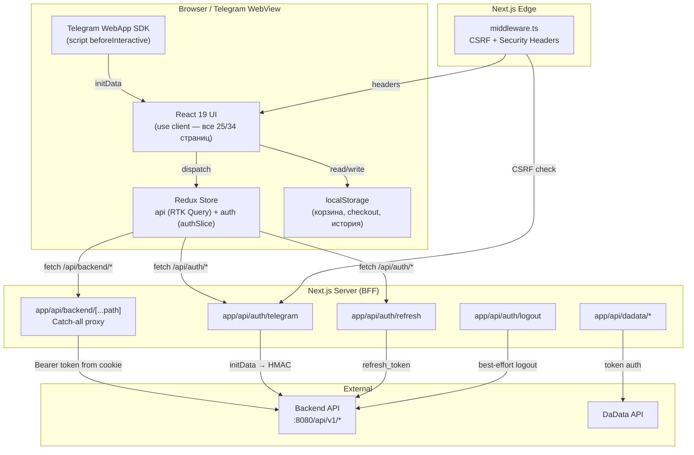
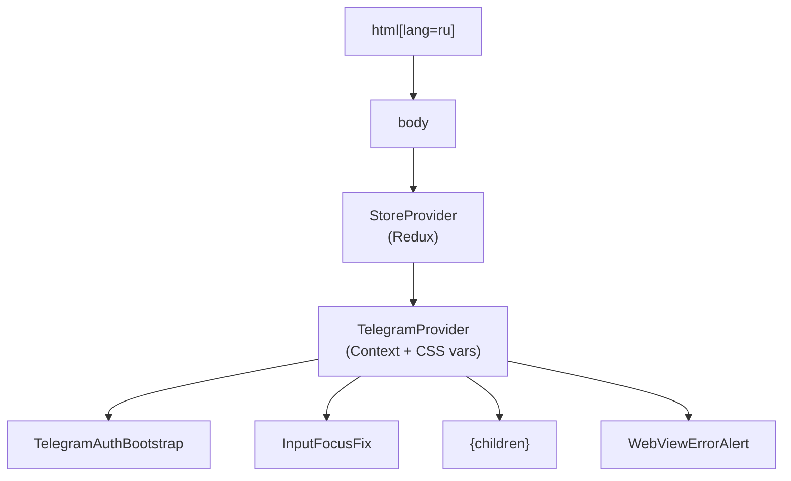
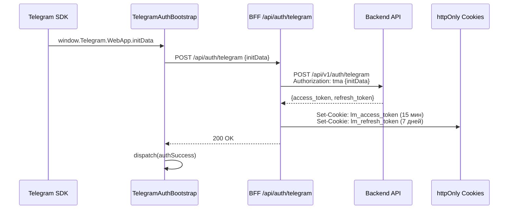

# Архитектурный аудит: Frontend Main (Telegram Mini App)

**Дата:** 2026-04-05
**Компонент:** `frontend-main`
**Стек:** Next.js 16 + React 19 + TypeScript + Redux Toolkit
**Объем кодовой базы:** ~170 исходных файлов, 34 страницы (App Router)

---

## 1. Архитектура: общая диаграмма



## 2. Дерево провайдеров



**Файл:** `app/layout.tsx`

## 3. Поток данных (Data Flow)

### 3.1 Аутентификация



### 3.2 API-запросы через BFF

```
RTK Query endpoint → fetch(/api/backend/catalog/products)
    → middleware.ts (CSRF + headers)
    → app/api/backend/[...path]/route.ts
        → читает lm_access_token из cookies
        → fetch(BACKEND_API_BASE_URL/api/v1/catalog/products, {Authorization: Bearer ...})
        → таймаут 25 секунд (AbortController)
    → ответ клиенту (без утечки внутренних URL)
```

### 3.3 Автообновление токена (Mutex)

```
401 от backend → baseQueryWithReauth (lib/store/api.ts:51)
    → проверка: есть ли уже refreshPromise?
        → Да: ожидание существующего Promise
        → Нет: POST /api/auth/refresh → refreshPromise
    → при успехе: повтор исходного запроса
    → при ошибке: dispatch(sessionExpired())
```

**Файл:** `lib/store/api.ts`, строки 36-77

## 4. Анализ по модулям

### 4.1 State Management (Redux Toolkit + RTK Query)

| Файл | Назначение | Статус |
|------|------------|--------|
| `lib/store/store.ts` | configureStore, makeStore() | OK |
| `lib/store/api.ts` | createApi, baseQueryWithReauth | КРИТИЧЕСКАЯ ПРОБЛЕМА |
| `lib/store/authSlice.ts` | Auth FSM: idle→loading→authenticated/expired/error | OK |
| `lib/store/hooks.ts` | useAppDispatch, useAppSelector | OK |

### 4.2 Telegram SDK

| Файл | Назначение | Статус |
|------|------------|--------|
| `lib/telegram/types.ts` (1209 строк) | Bot API 9.x типы | OK, качественные типы |
| `lib/telegram/core.ts` | Утилиты, проверка версий | OK |
| `lib/telegram/TelegramProvider.tsx` | Context, CSS vars, события | OK |
| `lib/telegram/hooks/*` (25+ хуков) | MainButton, BackButton, Haptic и т.д. | OK |

### 4.3 Auth Layer

| Файл | Назначение | Статус |
|------|------------|--------|
| `lib/auth/cookies.ts` | Cookie-константы, logout | OK |
| `lib/auth/cookie-helpers.ts` | Server-side cookie management | OK |
| `lib/auth/debug.ts` | Browser debug auth для разработки | OK, protected from prod |
| `app/api/auth/telegram/route.ts` | Telegram auth BFF | OK |
| `app/api/auth/refresh/route.ts` | Token refresh BFF | OK |
| `app/api/auth/logout/route.ts` | Logout BFF | OK |

### 4.4 BFF Proxy

| Файл | Назначение | Статус |
|------|------------|--------|
| `app/api/backend/[...path]/route.ts` | Catch-all proxy | OK, безопасный |
| `app/api/dadata/suggest/address/route.ts` | DaData suggestions | OK |
| `app/api/dadata/clean/address/route.ts` | DaData clean | OK |

### 4.5 Middleware

| Файл | Назначение | Статус |
|------|------------|--------|
| `middleware.ts` | CSRF + Security headers | OK |

## 5. Найденные проблемы

### CRITICAL (блокирующие)

#### C-1: RTK Query endpoints пустые — нет data fetching

**Файл:** `lib/store/api.ts`, строка 83
```typescript
endpoints: () => ({}),
```

Tag types объявлены (`User`, `Products`, `Product`, `Categories`, `Brands`), но **ни один endpoint не определен**. RTK Query создан с полной инфраструктурой reauth, но фактически не используется ни одной страницей.

**Все страницы работают с hardcoded пустыми массивами:**

| Страница | Файл | Проблема |
|----------|-------|----------|
| Home | `app/page.tsx:13-14` | `recentProducts: never[] = []`, `recommendedProducts: never[] = []` |
| Product | `app/product/[id]/page.tsx` | Данные продукта = null/пустые |
| Search | `app/search/page.tsx` | Нет реального API-вызова |
| Catalog | `app/catalog/page.tsx` | Нет загрузки категорий |
| Favorites | `app/favorites/page.tsx` | Пустые данные |

**Влияние:** Приложение не загружает данные с сервера. Весь data layer — мертвый код.
**Рекомендация:** P0 — Определить RTK Query endpoints с использованием `api.injectEndpoints()` для каждого доменного модуля (catalog, user, favorites, cart).

---

#### C-2: useCart — полный stub

**Файл:** `components/blocks/cart/useCart.ts`, строки 38-59
```typescript
export function useCart(): UseCartReturn {
  const toggleFavorite = useCallback((_id: string | number) => {}, []);
  const removeItem = useCallback(async (_id: string | number) => {}, []);
  // ... все методы — no-op
  return { items: EMPTY_ARRAY, totalQuantity: 0, subtotalRub: 0, ... };
}
```

Корзина **не работает**. Все методы (добавление, удаление, изменение количества) — пустые функции.

**Влияние:** Ключевая бизнес-функция (корзина) отсутствует.
**Рекомендация:** P0 — Реализовать корзину через RTK Query (или Redux slice + localStorage синхронизация).

---

#### C-3: useItemFavorites — полный stub

**Файл:** `lib/hooks/useItemFavorites.ts`, строки 7-23
```typescript
export function useItemFavorites(_itemType: "product" | "brand") {
  // TODO: connect to API
  return { favorites: EMPTY_ARRAY, toggleFavorite, isLoading: false, ... };
}
```

**Влияние:** Избранное не работает.
**Рекомендация:** P0 — Реализовать через RTK Query endpoint.

---

### MAJOR (серьезные архитектурные проблемы)

#### M-1: God-компоненты — нарушение Single Responsibility

| Файл | Строк | Проблема |
|------|-------|----------|
| `app/checkout/page.tsx` | **1645** | 3 inline-модалки, валидация Luhn, localStorage persistence, useAnimatedPresence hook, формы |
| `app/search/page.tsx` | **1159** | Inline ApiProduct interface, фильтры, сортировка, весь UI |
| `app/product/[id]/page.tsx` | **790** | Inline interfaces, маппинг-функции, бизнес-логика |
| `components/layout/Footer.tsx` | **448** | 6 inline SVG-иконок, localStorage чтение корзины |

**Рекомендация:** P1 — Декомпозировать каждый God-компонент:
- `checkout/page.tsx` → выделить модалки в отдельные компоненты, валидацию в `lib/validation/`, хук useAnimatedPresence в `lib/hooks/`
- `search/page.tsx` → выделить фильтры в `components/blocks/search/SearchFilters.tsx`
- `product/[id]/page.tsx` → interfaces в `lib/types/`, маппинг в utility-функции
- `Footer.tsx` → SVG-иконки в `components/ui/icons/`

---

#### M-2: Дублирование ApiProduct interface

Два РАЗНЫХ inline-определения `ApiProduct` в разных файлах:

- `app/product/[id]/page.tsx`, строки 28-51 — 24 поля
- `app/search/page.tsx`, строки 32-57 — 26 полей (частично отличаются)

Поля пересекаются на ~80%, но не идентичны. Это приведет к рассинхронизации при изменении API.

**Рекомендация:** P1 — Единый тип в `lib/types/catalog.ts`. Существующий `Product` interface там уже есть, но не используется этими страницами.

---

#### M-3: Несогласованное использование clsx vs cn()

Проект определяет `cn()` утилиту в `lib/format/cn.ts`, но она используется не везде:

| Импорт | Файлов |
|--------|--------|
| `import cx from "clsx"` | **15 файлов** (product/*, profile/*, favorites/*, home/*) |
| `import cn from "clsx"` (прямой, без враппера) | **3 файла** (checkout, trash, checkout/pickup) |
| `import { cn } from "@/lib/format/cn"` (правильный) | **~10 файлов** (search, footer и т.д.) |
| `import clsx from "clsx"` | **1 файл** (profile/reviews) |

4 разных способа импорта одной утилиты в одном проекте.

**Рекомендация:** P2 — Унифицировать: везде использовать `import { cn } from "@/lib/format/cn"`. Добавить ESLint правило `no-restricted-imports` для `clsx`.

---

#### M-4: 100% клиентских страниц — отсутствие серверных компонентов

**25 из 34 страниц** (все с контентом) помечены `"use client"`. Остальные 9 — служебные (loading, error, not-found, layout).

Это значит:
- Нет SSR/streaming для контента
- Нет SEO (для Telegram Mini App это допустимо, но...)
- Увеличенный JS bundle на клиенте
- Невозможность использовать React Server Components для data fetching

**Рекомендация:** P2 — Для страниц каталога и продуктов рассмотреть server components с `fetch()` на сервере, передавая данные клиентским компонентам через props. Это уменьшит TTI и bundle size.

---

#### M-5: Корзина в localStorage вместо Redux

**Файл:** `components/layout/Footer.tsx`, строки 10-34

Footer напрямую читает `localStorage["loyaltymarket_cart_v1"]` для отображения badge. Checkout (`app/checkout/page.tsx`) также использует 5 ключей localStorage:
- `loyaltymarket_checkout_selected_ids_v1`
- `loyaltymarket_checkout_promo_v1`
- `loyaltymarket_checkout_recipient_v1`
- `loyaltymarket_checkout_customs_v1`
- `loyaltymarket_checkout_card_v1`

При этом useCart — stub, и redux store не знает о корзине. Двойной источник правды.

**Рекомендация:** P1 — Единый источник данных корзины: Redux slice с persist middleware (redux-persist или кастомный).

---

#### M-6: Дублирование Window augmentation

Два файла объявляют одинаковые глобальные типы Window:

- `lib/telegram/types.ts` (конец файла) — полное объявление `Window.Telegram`
- `lib/types/telegram-globals.d.ts` — дублирует `Window.__LM_TG_*` + `Window.Telegram`

**Рекомендация:** P2 — Удалить `telegram-globals.d.ts`, оставить единственное объявление в `lib/telegram/types.ts`.

---

#### M-7: Отсутствие route-level layouts

Единственный layout — `app/layout.tsx` (корневой).

Нет промежуточных layout для:
- `/profile/*` (7 подстраниц) — общий header, навигация
- `/checkout/*` (2 подстраницы) — общий flow
- `/catalog/*` (2 подстраницы) — общая навигация

**Рекомендация:** P2 — Создать `app/profile/layout.tsx`, `app/checkout/layout.tsx` для shared UI.

---

#### M-8: Почти полное отсутствие loading.tsx / error.tsx

| Файл | Есть |
|------|------|
| `app/error.tsx` | Да (глобальный) |
| `app/catalog/loading.tsx` | Да |
| `app/catalog/[category]/loading.tsx` | Да |
| `app/invite-friends/loading.tsx` | Да |
| Остальные 30+ маршрутов | **Нет** |

**Рекомендация:** P2 — Добавить `loading.tsx` как минимум для: product, search, checkout, profile, favorites.

---

### MINOR (незначительные, но заслуживающие внимания)

#### m-1: WebViewErrorAlert — текст на узбекском вместо русского

**Файл:** `components/blocks/telegram/WebViewErrorAlert.tsx`, строка 26
```tsx
Telegram WebApp topilmadi. Ilovani Telegram ichida oching.
```

Приложение `lang="ru"`, весь UI на русском, но это сообщение на узбекском.

**Рекомендация:** P3 — Заменить на: `"Telegram WebApp не найден. Откройте приложение в Telegram."`

---

#### m-2: NEXT_PUBLIC_API_BASE_URL не задокументирован

**Файл:** `lib/store/api.ts`, строка 10
```typescript
const baseUrl = process.env.NEXT_PUBLIC_API_BASE_URL || "/api/backend";
```

Эта переменная не указана в `.env.example` и `CLAUDE.md`. Fallback к `/api/backend` работает, но переменная может случайно обойти BFF proxy, если задать URL бэкенда напрямую.

**Рекомендация:** P3 — Удалить `NEXT_PUBLIC_API_BASE_URL` или задокументировать с предупреждением.

---

#### m-3: Error и not-found страницы с inline styles

**Файлы:** `app/error.tsx`, `app/not-found.tsx`

Используют `style={{ ... }}` вместо CSS Modules, что нарушает паттерн проекта.

**Рекомендация:** P3 — Перенести стили в CSS Module файлы.

---

#### m-4: types/ui.ts не экспортируется из barrel

**Файл:** `lib/types/index.ts` экспортирует `api`, `auth`, `catalog`, `user` — но не `ui.ts`.
`ProductCardData` из `lib/types/ui.ts` недоступен через `@/lib/types`.

**Рекомендация:** P3 — Добавить `export * from "./ui"` в `lib/types/index.ts`.

---

#### m-5: Константа EMPTY_SET объявлена в 3 местах

- `lib/hooks/useItemFavorites.ts:3` — `new Set<number | string>()`
- `app/product/[id]/page.tsx:2` — `new Set<number>()`
- `app/search/page.tsx:2` — `new Set<number | string>()`

**Рекомендация:** P3 — Вынести в shared utility.

---

#### m-6: lib/errors.ts не используется

**Файл:** `lib/errors.ts` определяет `AppError`, `ApiError`, `NetworkError`.

Нигде в проекте эти классы не импортируются. BFF proxy обрабатывает ошибки inline. RTK Query использует встроенную `FetchBaseQueryError`.

**Рекомендация:** P3 — Либо интегрировать в BFF proxy и RTK Query error handling, либо удалить.

---

## 6. Обнаруженные анти-паттерны

| # | Анти-паттерн | Где | Влияние |
|---|-------------|-----|---------|
| 1 | **God Component** | checkout (1645), search (1159), product (790) | Невозможность тестирования, сложность чтения и поддержки |
| 2 | **Dead Code** | RTK Query (api.ts), lib/errors.ts, tagTypes | Путаница для новых разработчиков, ложное ощущение инфраструктуры |
| 3 | **Stub Functions** | useCart, useItemFavorites | Приложение кажется работающим, но функционал отсутствует |
| 4 | **Shotgun Surgery** | ApiProduct определен inline в 2 файлах | Изменение API требует правок в нескольких местах |
| 5 | **Inconsistent Abstraction** | 4 способа импорта clsx/cn | Нарушение командных соглашений |
| 6 | **Primitive Obsession** | localStorage ключи разбросаны по файлам | Нет централизованного управления persistence |
| 7 | **Feature Envy** | Footer читает localStorage напрямую | Footer знает о структуре данных корзины |
| 8 | **All Client Components** | 25/34 страниц — "use client" | Потеря преимуществ RSC, увеличенный bundle |

## 7. Что сделано хорошо

| # | Аспект | Описание |
|---|--------|----------|
| 1 | **BFF Proxy** | Чистая реализация catch-all proxy с фильтрацией заголовков, таймаутом, безопасной обработкой ошибок (нет утечки внутренних URL) |
| 2 | **Mutex Reauth** | Корректная коалиция concurrent 401 → single refresh request, предотвращение token stampede |
| 3 | **Telegram SDK** | Отличные типы (1209 строк Bot API 9.x), 25+ хуков, CSS-переменные, feature detection |
| 4 | **CSRF Protection** | Edge middleware проверяет Origin на POST /api/auth/*, security headers для iframe |
| 5 | **Auth Flow** | Правильное разделение: httpOnly cookies, server-only BACKEND_API_BASE_URL, debug mode protected from production |
| 6 | **TypeScript Strict** | strict: true в tsconfig, хорошая типизация в lib/ |
| 7 | **Cookie Management** | Secure, HttpOnly, SameSite=Lax, правильные TTL (15мин access, 7д refresh) |
| 8 | **Provider Tree** | Логичный порядок: Store → Telegram → Auth Bootstrap |
| 9 | **Component Library** | BottomSheet с порталами, focus trap, keyboard handling, scroll lock |
| 10 | **Error Safety** | BFF proxy не пробрасывает stack traces или внутренние URL клиенту |

## 8. Рекомендации (по приоритету)

### P0 — Блокеры (без этого приложение не работает)

| # | Действие | Оценка сложности |
|---|----------|-----------------|
| 1 | Определить RTK Query endpoints для catalog, user, cart, favorites | 3-5 дней |
| 2 | Реализовать useCart через RTK Query или Redux slice | 2-3 дня |
| 3 | Реализовать useItemFavorites через RTK Query endpoint | 1-2 дня |
| 4 | Подключить страницы к реальному data fetching | 3-5 дней |

### P1 — Архитектурные улучшения

| # | Действие | Оценка сложности |
|---|----------|-----------------|
| 5 | Декомпозировать checkout/page.tsx (модалки, валидация, хуки) | 2-3 дня |
| 6 | Декомпозировать search/page.tsx (фильтры, результаты) | 1-2 дня |
| 7 | Декомпозировать product/[id]/page.tsx (типы, маппинг) | 1 день |
| 8 | Единый источник данных корзины (убрать прямой доступ к localStorage) | 1-2 дня |
| 9 | Единый ApiProduct тип в lib/types/catalog.ts | 0.5 дня |

### P2 — Качество кода

| # | Действие | Оценка сложности |
|---|----------|-----------------|
| 10 | Унифицировать clsx/cn импорты + ESLint правило | 0.5 дня |
| 11 | Добавить route-level layouts (profile, checkout) | 1 день |
| 12 | Добавить loading.tsx для основных маршрутов | 0.5 дня |
| 13 | Удалить дублирование telegram-globals.d.ts | 0.5 часа |
| 14 | Рассмотреть server components для catalog/product | 2-3 дня |

### P3 — Мелочи

| # | Действие | Оценка сложности |
|---|----------|-----------------|
| 15 | Исправить текст WebViewErrorAlert на русский | 5 мин |
| 16 | Удалить или задокументировать NEXT_PUBLIC_API_BASE_URL | 15 мин |
| 17 | Перенести inline styles в CSS Modules (error, not-found) | 30 мин |
| 18 | Экспортировать ui.ts из barrel | 5 мин |
| 19 | Удалить или интегрировать lib/errors.ts | 30 мин |

## 9. Матрица зрелости

| Аспект | Оценка | Комментарий |
|--------|--------|-------------|
| BFF / API Proxy | 9/10 | Отличная реализация |
| Аутентификация | 9/10 | Корректный flow, mutex reauth |
| Telegram SDK | 9/10 | Полные типы, обширные хуки |
| Security | 8/10 | CSRF, headers, cookie security |
| State Management | 3/10 | Инфраструктура есть, данных нет |
| Data Fetching | 1/10 | Полностью отсутствует |
| Component Architecture | 4/10 | God-компоненты, отсутствие декомпозиции |
| Code Consistency | 5/10 | 4 варианта clsx, дубли типов |
| Error Handling | 5/10 | BFF — хорошо, страницы — никак |
| Routing / Layouts | 4/10 | Нет промежуточных layouts, мало loading.tsx |
| TypeScript Usage | 7/10 | strict: true, но inline interfaces в страницах |
| Testing | 0/10 | Нет тестов, нет test runner |

## 10. Итоговая оценка

# 4.5 / 10

### Обоснование

**Инфраструктурный слой (BFF, auth, Telegram SDK) — отличного качества (8-9/10).** Видна экспертиза в безопасности, правильной работе с токенами, Telegram WebApp SDK. Код чистый, типизированный, хорошо структурированный.

**Прикладной слой (страницы, компоненты, data fetching) — критически незрелый (1-4/10).** RTK Query endpoints пустые, корзина и избранное — stubs, все данные hardcoded. God-компоненты на 1000+ строк, дублирование типов, несогласованность стилей.

**Проект находится в состоянии: "фундамент построен, здание не возведено".** Инфраструктура готова к production, но feature layer требует полной реализации. Основной risk — God-компоненты, которые будут сопротивляться рефакторингу по мере добавления реальных данных.

### Первоочередные шаги

1. Определить RTK Query endpoints (catalog, cart, favorites, user)
2. Подключить страницы к реальным данным
3. Декомпозировать checkout, search, product страницы **до** подключения данных
4. Унифицировать типы и импорты

---

*Аудит выполнен путем полного чтения всех ~170 исходных файлов проекта.*
